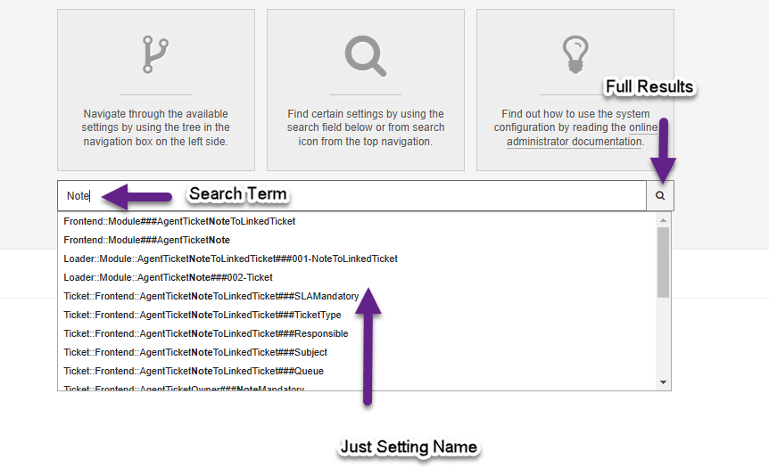
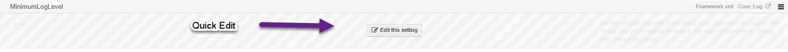
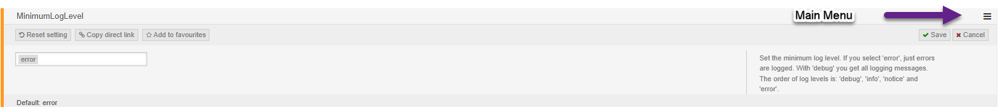

Configure Your System
#####################
.. _PageNavigation admin_system_configuration_index:

The software configuration is mostly done using entity relationship, ACLs, processes and web services. More comlex configuration is done using the system configuration module. Here a system administrator can make system wide changes like mail sending, logging, module level permissions, menu structure, automated processing, etc.

It's best if you learn the concept of URL hacking, and use the front-end action of the URL, to find settings affecting the frontend. As you grow, you will learn to navigate using the navigation tree, and later search more complex using search terms and filters.

Searching
=========

Entering a search term in the system configuration will first return results which contain the search term in the setting name. If you then hit enter, or choose the magnifying glass, the returned results will include setting where the search term was additionally found in the description (English text only) or the setting value.

System Configuration Actions Menu
=================================

This menu provides you with some quick options.

Deployment
  Deploy any modified settings. This menu can also be used to deploy settings made by someone else.
Settings I'm currently editing
  Open any and all settings currently marked as locked for editing by your user.
Favorites
  List all settings marked a favorites by your user.
Import/Export
  Import settings from or export settings to a YAML file.

Tree Navigation
================

.. image:: images/sys_config_nav.png
   :alt:  Image Sys Config Navigation

Navigation Group
****************
If you have an add-on installed, it will be possible to select a filtered view of the available setting. This limits the navigation tree, to just settings from the selected add-on. This allows you to also filter to just Znuny framework settings, once a module is installed.

Tree Structure
**************
The tree structure allows you to drill down to specific settings. The number next to the tree item, is not a recursive count of available options. You should open the tree to the last branch to be sure you've seen everything.

Editing Settings
================

You can choose a quick edit to change the setting. 

The full menu offers you extra options.

* Disable/Enable
  When not required, it's possible to enable or disable settings with this link.
* Reset setting
  Reset the default setting.
* Copy direct link
  Copy a direct link to this setting (great for documentation).
* Add to favorites
  Settings which you may visit more often, or want to remember for a short period of time, can be bookmarked.