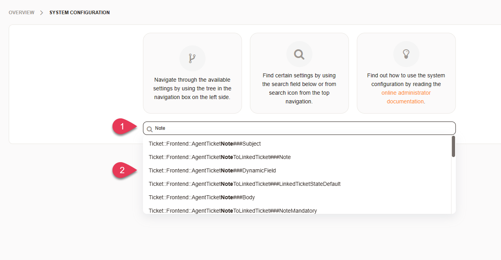
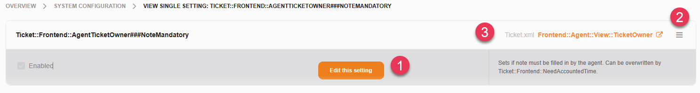
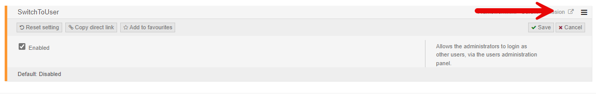
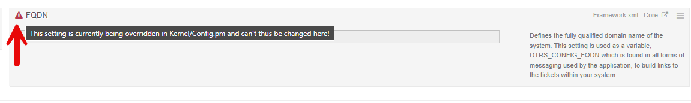
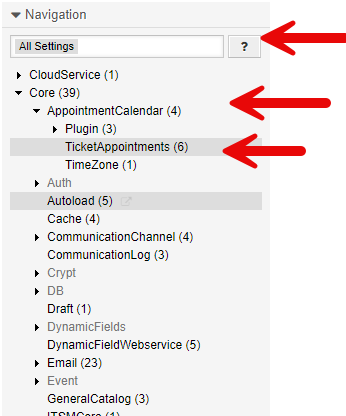
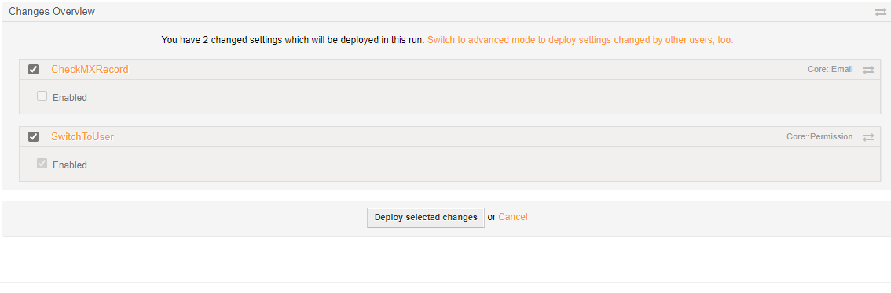
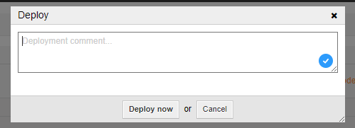
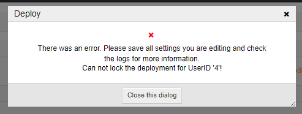

.. _PageNavigation admin_index_systemconfiguration:

System Configuration
####################

Configuring a Znuny is done via :ref:`pagenavigation annexes_entity_management_index`, plus all the add-on and framework settings found here. Whereas the aforementioned :ref:`pagenavigation annexes_entity_management_index`, allows administrators to make settings for the basic usage like queues, states, email addresses, etc. The system configuration allows the administrator to fine tune settings which are system-wide. These include, but are not limited to:

- Visible fields in screens
- Module permissions and availability
- Outgoing email
- Paths, variables and binaries
- State type defaults
- Support Languages
- Working Calendars
- Customer User Self-Registration
- Storage Backends
- Indexes
- Logging
- Add-on settings
- Many more

Generally, we reference settings as we go along in the administrator manual. Therefore, we will not cover all the settings here. More so, you should understand the system configuration tool, how to navigate and search, backup and deploy.

.. _PageNavigation admin_systemconfiguration_search:

System Configuration Search
****************************

The first thing you will see, when you access the menu (and that which is focused with the cursor by default), is the search area. You can search for:

- Setting Names
- Setting Descriptions
- Setting Values

    Search options

When searching for a setting name, there is an assumed prefix and suffix of '*' and the search is case-insensitive. Wildcards in the search term like *N\*te* do not work. Searching for *Note* for example, will return any setting beginning with *Note*, having *Note* in the setting name, or ending with *Note*. Only the settings found with the search term in the name will be displayed as a result. Selecting a setting, will direct you to the single setting view, and just hitting enter will perform a search returning all settings matching any of the above listed values.

.. _PageNavigation admin_systemconfiguration_edit:

System Configuration Edit
*************************

When editing an individual entry, you can quickly edit by hovering over the setting and:

    Edit options

1. Quick edit
2. Full menu
3. Jump to configuration group

Editing Modes
=============

There are different editing modes provided. This has mostly affect on the :ref:`pagenavigation admin_systemconfiguration_sidebar`. 

Single Setting Modes
~~~~~~~~~~~~~~~~~~~~

To access this mode, you must select a configuration item from the list when :ref:`searching <pagenavigation admin_systemconfiguration_search>` or use a link copied from the :ref:`menu <pagenavigation admin_systemconfiguration_menu_options>`. In this mode, you can only return to the overview in the actions' sidebar.

.. _PageNavigation admin_systemconfiguration_multiple_settings_mode:

Multiple Settings Mode
~~~~~~~~~~~~~~~~~~~~~~

This mode is entered, by hitting enter when :ref:`searching <pagenavigation admin_systemconfiguration_search>` or jumping to a configuration group from the :ref:`menu <pagenavigation admin_systemconfiguration_menu_options>` of any single setting. In this mode, you will not be able to use the navigation from the :ref:`pagenavigation admin_systemconfiguration_sidebar`.

.. _PageNavigation admin_systemconfiguration_group_settings_mode:

Group Settings Mode
~~~~~~~~~~~~~~~~~~~

When using the navigation from the :ref:`pagenavigation admin_systemconfiguration_sidebar`. This mode provides you all the options from the :ref:`pagenavigation admin_systemconfiguration_sidebar`. 

.. _PageNavigation admin_systemconfiguration_menu_options:

Menu options
============

By clicking on the full menu, you have the options:

    Full Edit Menu

1. Disable/Enable
2. Reset
3. Copy direct link
4. Add to favorites

.. note::

    Not all settings can be disabled.

Secured Settings
================

Some settings should be only set by users with access to the shell. These include, but are not limited to, the following.

- FQDN
- SystemID
- Database Settings

Securing a setting can be done by adding it to the main configuration file ``Kernel/Config.pm``. If this is the case, the setting will indicate that it is not writable.

    Secured Setting

Setting Types
=============

There are different types of settings in the system configuration. Here are the most common

String
    Editing this, is just as easy as any input field. Settings are not validated by default; therefore, you should use care when entering values.

These can include:

- Directory paths
- Files
- Strings
- Textarea
- YAML
- Password
- VacationDaysOneTime
- VacationDays

Dropdown
    Dropdown selections use entity validation of Perl modules or database entities to ease configuration wherever possible.

These can include:

- Select
- Entity
- TimeZone
- PerlModule

Input selection
    Fields where there are options.

These can include:

- Date
- DateTime
- WorkingHours

Checkbox
    Selecting a checkbox will enable or disable a setting.
Complex
    Many of these use *+* or *-* (inner and outer) to enter key/value pairs, or complete new blocks of key/value pairs.

These can include:

- FrontendNavigation
- FrontendRegistration
- PerlModule

.. note:: Entity Validation

    The following entities are validated by the system configuration.

    - Group
    - Priority
    - Queue
    - Role
    - Service
    - SLA
    - State
    - SystemAddress
    - Type
    - User
    - Valid
    - Webservice

.. note:: Hashes and Hash Arrays

    These require special knowledge of the required structure to prevent causing errors is the system, and should be modified only when you understand the array requirements.

.. _PageNavigation admin_systemconfiguration_sidebar:

System Configuration Sidebar
*****************************

In the sidebar, as with most configuration modules (see :ref:`pagenavigation annexes_entity_management_index`), there is a sidebar. In the sidebar, you can 

- Take actions
- Navigate settings

    System Configuration Sidebar

The actions' menu offers you the opportunity to do the following.

- Deploy settings
- Show settings currently locked for editing
- View favorite settings
- Import or export settings

Sidebar Actions
================

.. _PageNavigation admin_systemconfigruation_deploy:

Deploying Settings
~~~~~~~~~~~~~~~~~~

When editing a setting (see :ref:`pagenavigation admin_systemconfiguration_edit`), it is deployed to the database. The database settings must then be deployed to ``Kernel/Config/Files/ZZZAAuto.pm`` to be applied.

    Review Screen

Deploy settings from the review screen.

1. Select which settings should not be deployed (if needed)
2. Deploy

    
    System Configuration Deployment

Each deployment is protocol led in the database, and when confirming deployment, a comment can be entered to protocol the reason for the deployment.

Locked Settings
~~~~~~~~~~~~~~~

If during a deployment you have locked settings, you will see the following warning.

    
    System Configuration Deployment warning

Using the menu *Settings I'm currently editing*, you can view any settings locked to your user. These are settings which you opened for editing and did not save.

.. note:: 

    A deployment is not possible until all locked settings are resolved. Settings, being edited by another user, will not prevent a deployment.

**Settings locked to other admins:**

Settings may be locked by another administrator. In this case, you will see this. It's not possible to edit this setting at the same time. A user with access to the shell can unlock this using the :ref:`pagenavigation console_index` (Admin::Config::UnlockAll).

Favorite Settings
~~~~~~~~~~~~~~~~~

Settings marked favorite in the :ref:`pagenavigation admin_systemconfiguration_menu_options` can be accessed with a simple click on the *My favorite settings* button.

Import and Export Settings
~~~~~~~~~~~~~~~~~~~~~~~~~~

It is possible to import and export your modified settings. Importing a settings file, will redirect you to the :ref:`pagenavigation admin_systemconfigruation_deploy` screen where you can choose which settings to deploy.

.. warning:: 

    All settings will be saved to the database as modified. Take care which settings are in the file, before you import. The export file is in YAML format, and can easily be edited, to remove unwanted settings before upload.

Sidebar Navigation
==================

Next to :ref:`pagenavigation admin_systemconfiguration_search`, it's possible to navigate through the system configuration options. If add-ons are installed, you can use the dropdown navigation to select which settings you want to navigate through.

- A specific add-on
- Znuny (Framework Settings)
- All settings

Selecting a group of options from the navigation tree will put you in :ref:`pagenavigation admin_systemconfiguration_group_settings_mode`. 

Additional Actions
===================

When in the :ref:`pagenavigation admin_systemconfiguration_group_settings_mode`, you can still see the navigation menu, in others this is not possible.

.. figure:: images/admin_system_configuration_additional_actions.png
    :alt: Additional Edit Actions

    Additional Edit Actions

Help Menu
~~~~~~~~~~

In :ref:`pagenavigation admin_systemconfiguration_group_settings_mode` and :ref:`pagenavigation admin_systemconfiguration_multiple_settings_mode`, you will see the dynamic actions' menu, a help menu appears with a legend of colors and hotkeys available for use.

There are colors for:

- Currently edited by me.
- Modified but not yet deployed.
- Currently edited by another user.
- Different from its default value.

System Configuration Hot Keys
^^^^^^^^^^^^^^^^^^^^^^^^^^^^^

ENTER
    Save current setting.
ESC
    Cancel editing the current setting.

Dynamic Actions
~~~~~~~~~~~~~~~

In :ref:`pagenavigation admin_systemconfiguration_group_settings_mode` and :ref:`pagenavigation admin_systemconfiguration_multiple_settings_mode`, you will see the dynamic actions' menu. Here you can:

- Filter for settings
- Enable all settings for editing
- Save all open settings
- Cancel all open settings
