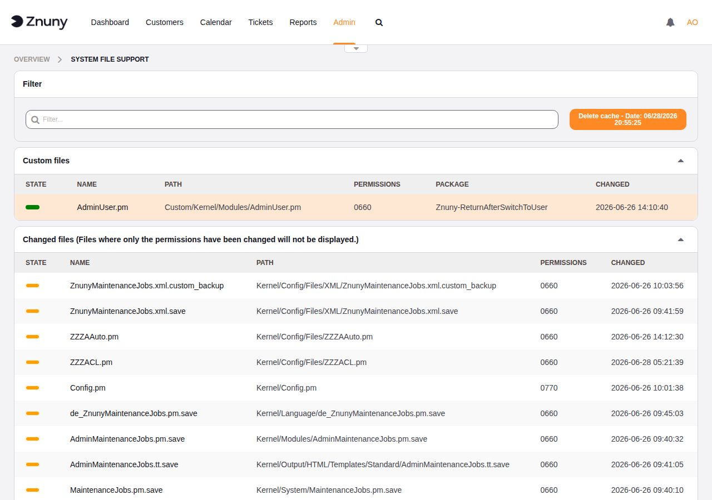
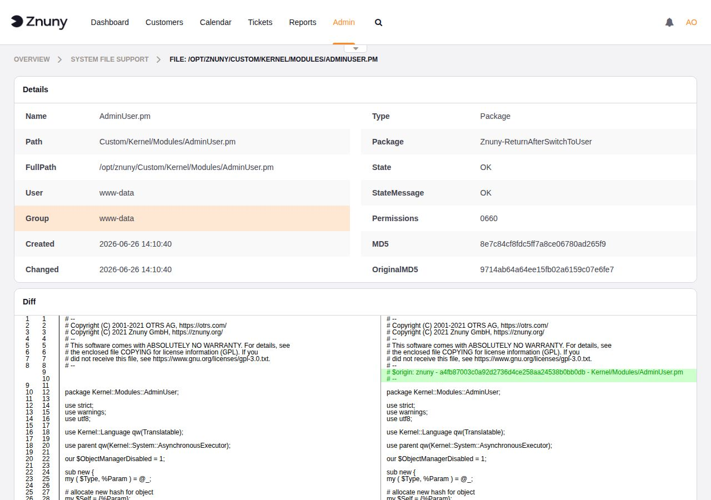

.. meta::
   :description: Use System File Support to identify custom, modified, and package-managed files across your Znuny installation.
   :keywords: znuny system files, custom files, changed files, package files, file integrity, system file support

.. _PageNavigation admin_systemfiles_index:

System File Support
###################

**Admin → System File Support**

The System File Support module provides a complete inventory of the files in your Znuny installation, organized into three categories: files you have customized, files that differ from their installed state, and files delivered by installed packages.

Results are cached for 24 hours. Use the **Delete cache** button in the filter bar to force an immediate refresh.

Overview
********

Navigate to **Admin → System File Support** to view all three file widgets on one page. The filter field at the top narrows results across all widgets by name or path.

   System File Support — overview with Custom and Changed file widgets

Custom Files
============

The **Custom files** widget lists every file found under the ``Custom/`` directory of your Znuny installation. These are files you have placed there deliberately — typically overrides of core Znuny modules that survive package upgrades.

.. list-table::
   :header-rows: 1
   :widths: 18 82

   * - Column
     - Description
   * - State
     - Deployment status indicator: green means the file is active; other colors indicate a problem.
   * - Name
     - Filename.
   * - Path
     - Path relative to the Znuny installation root.
   * - Permissions
     - Octal file permissions (e.g. ``0660``).
   * - Package
     - Name of the installed package that owns this file, if any.
   * - Changed
     - Timestamp of the last modification.

Changed Files
=============

The **Changed files** widget lists files that differ from their original installed state as recorded by MD5 checksums in the ARCHIVE file. Files where only permissions have changed are excluded.

For each changed file, Znuny fetches the original version from the Znuny GitHub repository and renders a side-by-side diff in the file detail view, letting you review exactly what was modified locally.

.. list-table::
   :header-rows: 1
   :widths: 18 82

   * - Column
     - Description
   * - State
     - Change indicator: orange means the file content differs from its original.
   * - Name
     - Filename.
   * - Path
     - Path relative to the Znuny installation root.
   * - Permissions
     - Octal file permissions.
   * - Changed
     - Timestamp of the last modification.

Package Files
=============

The **Package files** widget lists all files installed by packages, grouped by package name. Each file shows its deployment state, making it straightforward to spot files that are missing, corrupted, or whose checksum no longer matches the package manifest.

.. list-table::
   :header-rows: 1
   :widths: 18 82

   * - Column
     - Description
   * - State
     - Deployment state: **OK** means the file matches the package manifest; **Problem** means the file is missing or the checksum does not match.
   * - Name
     - Filename.
   * - Path
     - Path relative to the Znuny installation root.
   * - Permissions
     - Octal file permissions.
   * - Package
     - Name of the package that installed the file.
   * - Changed
     - Timestamp of the last modification.

File Detail View
****************

Click any filename in any widget to open the file detail view.

   File detail view — metadata table and side-by-side diff

The **Details** table shows:

.. list-table::
   :header-rows: 1
   :widths: 20 80

   * - Field
     - Description
   * - Name
     - Filename.
   * - Path
     - Path relative to the installation root.
   * - FullPath
     - Absolute filesystem path.
   * - User
     - OS user that owns the file.
   * - Group
     - OS group that owns the file.
   * - Created
     - File creation timestamp.
   * - Changed
     - Last modification timestamp.
   * - Type
     - File classification: ``Custom``, ``Changed``, or ``Package``.
   * - Package
     - Package name, if the file is package-managed.
   * - State
     - Current deployment state (``OK`` or ``Problem``).
   * - StateMessage
     - Human-readable explanation of the state.
   * - Permissions
     - Octal file permissions.
   * - MD5
     - MD5 checksum of the current file on disk.
   * - OriginalMD5
     - MD5 checksum of the file as originally installed.

Below the metadata table, a **Diff** section shows a side-by-side comparison of the current file against the original. Changed or added lines are highlighted so every local modification is immediately visible.

Cache Management
****************

System File Support caches its scan results for 24 hours to avoid repeated filesystem reads on each page load. The **Delete cache** button in the filter bar displays the date and time the cache was last built and forces an immediate refresh when clicked.
