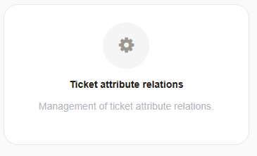
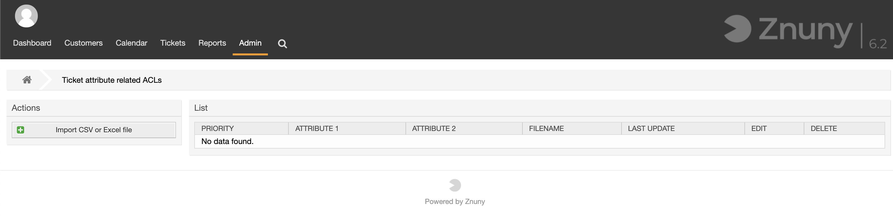
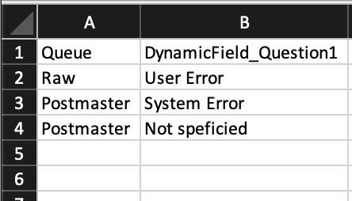
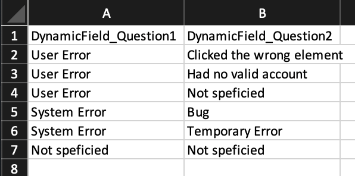
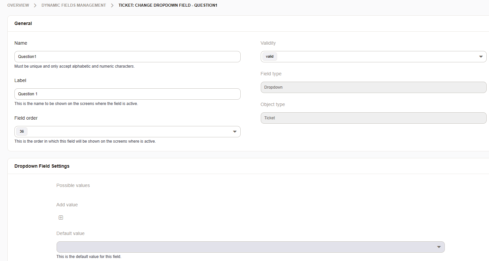
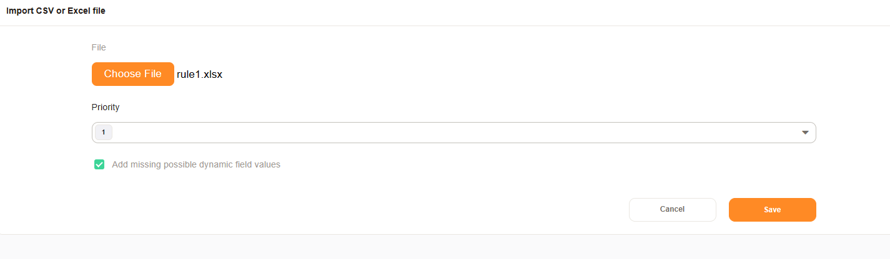
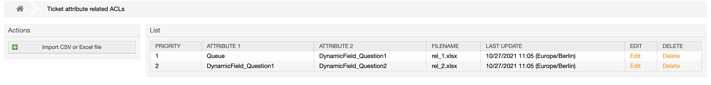
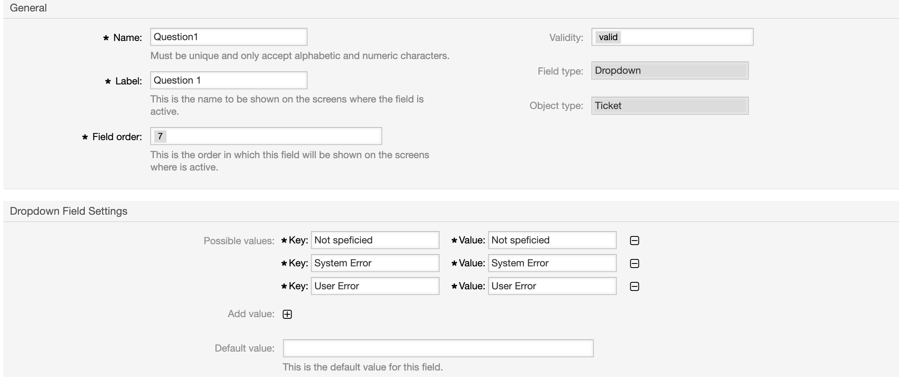
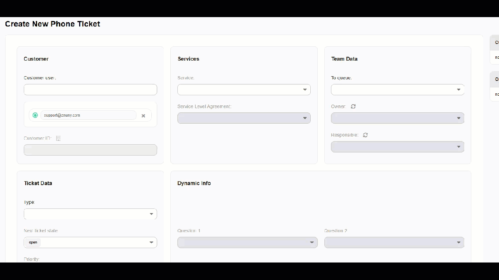
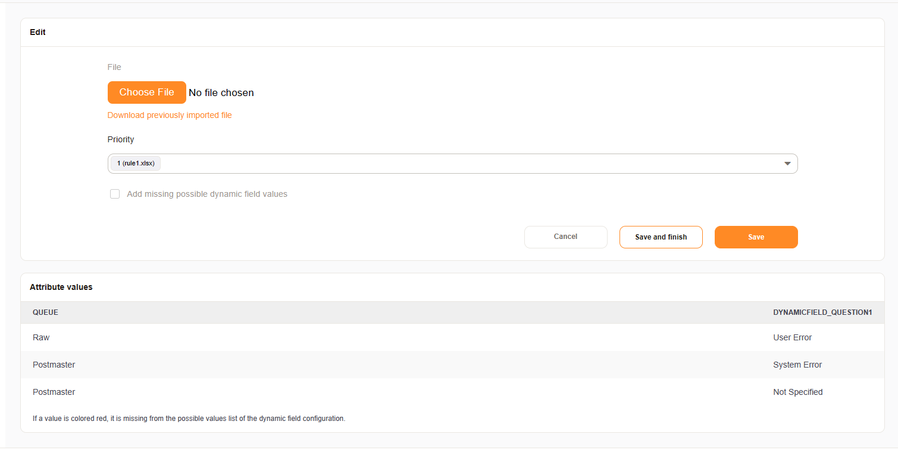

Ticket Attribute Relations
##########################

.. note:: Implemented in Version 6.2. Thie feature is also available as add-on for Znuny LTS.

Ticket Attribute Relations is a feature for create and manage relations between all kind of ticket attributes. The dependencies are managed via CSV/XLSX files and can be used to create relations/dependencies between ticket attributes.

Supported attributes:

- Queue - Name of the queue
- DynamicField_xxx - Dropdown and Multiselect dynamic field, only for object type ticket
- State - state
- Priority - priority
- Type - ticket type
- Lock - ticket lock
- CustomerID - customer id
- CustomerUserID - customer user id
- Owner - login name of the owner
- Responsible - login name of the responsible
- Service - service
- SLA - service level agreement

This module can be found in the admin area:

When you select the attribute relations module, a list of relations
and an button for uploading relations is shown. 

Add new relation
********************************************

In order to add a new relation, an Excel sheet must first be created.
In our example we want to restrict a Dynamic Field after the Queue selection.
The selection of the Dynamic Field then influences the selection of a second field.

In our example the Queue influences the selection of the Dynamic Field "Question1".
The appropriate structure in Excel is as follows:

The field "Question1" then influences the selection of the field "Question2".

The appropriate structure in Excel is as follows:

Dynamic Field Question1 and Question2 are selection fields, without options. 

Missing entries can created automatically from the Excel sheet.

.. note:: You need to create a document for each relation. Our example needs two Excel sheets.

Upload the Excel/CSV relations files and set the checkmark for "add missing possible dynamic field values".

.. note:: The priority sets the execution order for your rules. You can change it later, if needed.

After the import is complete your relations are shown in the overview. 

The Dynamic Field values were populated during the import.

The result is an generated ACL which can be used everywhere 
the three fields are displayed. For example in 
the Phone-Ticket screen (AgentTicketPhone).

Manage existing relations
********************************************

Existing relations can be modified or deleted.

If you select an existing relation you can:

- Download the current relation file
- Update the relation file
- Change the priority
- List/Check the current values

.. note:: If values are colored in red, those values are missing in the Dynamic Field.

