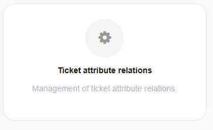
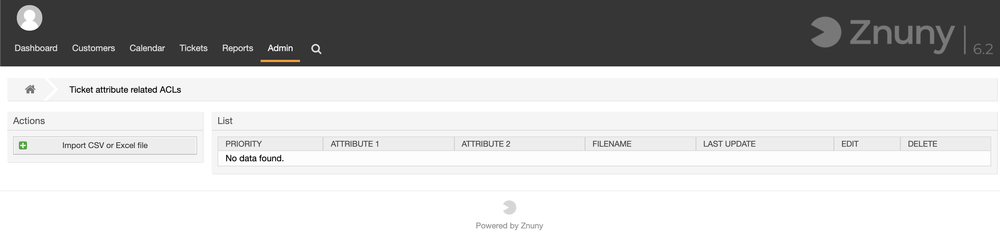
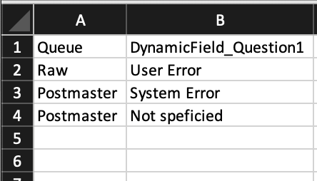
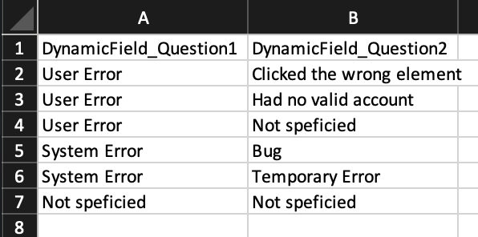
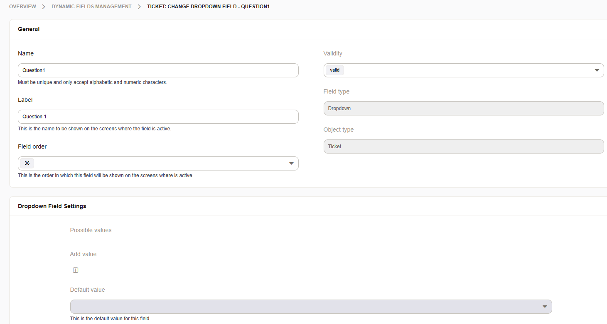
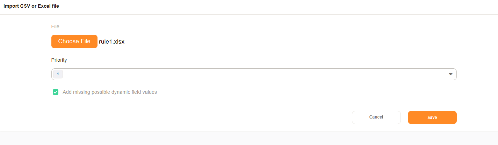
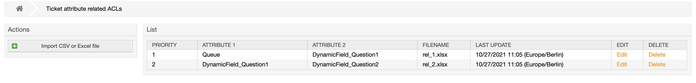
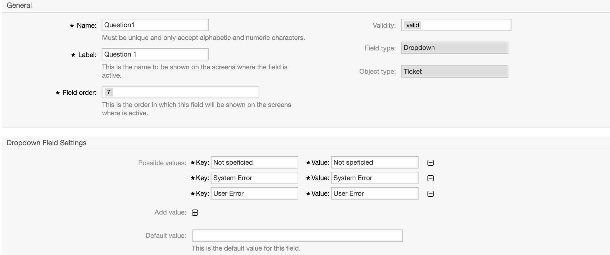
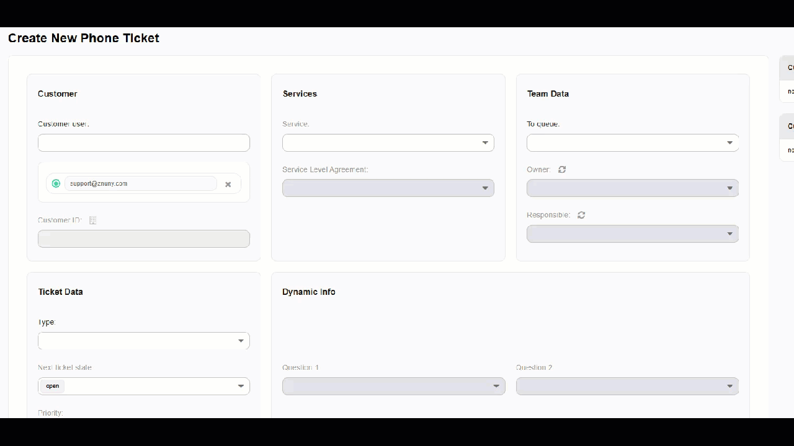
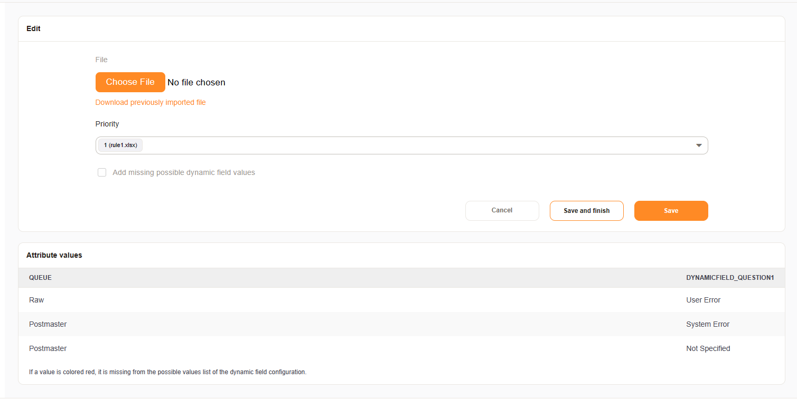

.. meta::
   :description: Define Znuny ticket attribute relations via CSV or XLSX and link queues, dynamic fields, states, priorities, types, owners, services and SLAs for dependent selections.
   :keywords: ticket attribute relations, znuny dependencies, csv relations, xlsx upload, dependent fields, cascading dropdowns, ticket relations, console import

Ticket Attribute Relations
##########################

Ticket Attribute Relations is a feature for create and manage relations between all kind of ticket attributes. The dependencies are managed via CSV/XLSX files and can be used to create relations/dependencies between ticket attributes.

Supported attributes:

- Queue - Name of the queue
- DynamicField_xxx - Dropdown and Multiselect dynamic field, only for object type ticket
- State - state
- Priority - priority
- Type - ticket type
- Lock - ticket lock
- CustomerID - customer id
- CustomerUserID - customer user id
- Owner - login name of the owner
- Responsible - login name of the responsible
- Service - service
- SLA - service level agreement

File format
********************************************

Each relation file connects exactly two attributes. The first row holds the
two attribute names from the list above. Every following row is one allowed
combination: when an agent selects the value in the first column, the value
in the second column is offered for the second attribute. Repeat the first
value in as many rows as it has allowed values.

The following rules apply to the file:

- The file must end in ``.csv`` or ``.xlsx``.
- A CSV file must use a semicolon (``;``) as the separator. A
  comma-separated file is read as a single column and is rejected with the
  error *Given ticket attribute relations data must have two columns*.
  Values that contain a semicolon must be enclosed in double quotes.
- Save CSV files as UTF-8. A byte order mark, as added by spreadsheet
  programs, is removed automatically.
- For an XLSX file only the first worksheet and the columns A and B are read.
  Rows where one of the two cells is empty are skipped.
- Dynamic fields are written as ``DynamicField_`` followed by the field
  name, for example ``DynamicField_Question1``.
- Queues are written with their full name as shown in the queue overview,
  for example ``Misc::Hardware`` for a sub-queue.
- Dynamic field values are the keys of the possible values.
- If the second attribute is a dynamic field, its empty value is offered in
  addition to the listed values, so the file does not need rows with empty
  values. This requires the field option *Add empty value* to be enabled
  and is controlled by the System Configuration setting
  ``Core::TicketAttributeRelations::AlwaysPossibleNone`` (enabled by
  default).
- The filename identifies the relation. Uploading or importing a file with
  the same name again replaces the data of the existing relation instead of
  creating a second one.

Admin interface
********************************************

This module can be found in the admin area:

When you select the attribute relations module, a list of relations
and an button for uploading relations is shown. 

Add new relation
================

In order to add a new relation, an Excel sheet must first be created.
In our example we want to restrict a Dynamic Field after the Queue selection.
The selection of the Dynamic Field then influences the selection of a second field.

In our example the Queue influences the selection of the Dynamic Field "Question1".
The appropriate structure in Excel is as follows:

The same relation as a CSV file
(:download:`queue_question1.csv <files/queue_question1.csv>`):

.. code-block:: text

   Queue;DynamicField_Question1
   Raw;User Error
   Postmaster;System Error
   Postmaster;Not specified

The field "Question1" then influences the selection of the field "Question2".

The appropriate structure in Excel is as follows:

The same relation as a CSV file
(:download:`question1_question2.csv <files/question1_question2.csv>`):

.. code-block:: text

   DynamicField_Question1;DynamicField_Question2
   User Error;Clicked the wrong element
   User Error;Had no valid account
   User Error;Not specified
   System Error;Bug
   System Error;Temporary Error
   Not specified;Not specified

Because ``DynamicField_Question1`` is the second attribute of the first file
and the first attribute of the second file, the two relations build a chain.
The relation for the queue must therefore have a lower priority number than
the relation for ``Question1``.

Dynamic Field Question1 and Question2 are selection fields, without options. 

Missing entries can created automatically from the Excel sheet.

.. note:: You need to create a document for each relation. Our example needs two Excel sheets.

Upload the Excel/CSV relations files and set the checkmark for "add missing possible dynamic field values".

.. note:: The priority sets the execution order for your rules. You can change it later, if needed.

After the import is complete your relations are shown in the overview. 

The Dynamic Field values were populated during the import.

The result is an generated ACL which can be used everywhere 
the three fields are displayed. For example in 
the Phone-Ticket screen (AgentTicketPhone). The relations take effect in
the screens listed in the System Configuration setting
``Core::TicketAttributeRelations::ACLActions``.

Manage existing relations
=========================

Existing relations can be modified or deleted.

If you select an existing relation you can:

- Download the current relation file
- Update the relation file
- Change the priority
- List/Check the current values

.. note:: If values are colored in red, those values are missing in the Dynamic Field.

Import via console command
********************************************

Relation files can also be imported without the admin interface, for
example to deploy the same relations to several systems or to update them
from a script. Run the command as the Znuny user from the Znuny home
directory:

.. code-block:: bash

   bin/znuny.Console.pl Admin::TicketAttributeRelations::Import [--priority ...] [--dynamic-field-config-update] filepath

``filepath``
   Path to the CSV or XLSX file. The file must be readable by the Znuny
   user. The file uses the format described in the section *File format*.

``--priority``
   Position of the relation in the evaluation order. Without this option a
   new relation is added at the end of the list, and an existing relation
   keeps its current priority. Priorities are renumbered after each import,
   so they always run from 1 without gaps.

``--dynamic-field-config-update``
   Adds every value from the file that is missing in a dynamic field's
   possible values. This is the same as the option *add missing possible
   dynamic field values* in the admin interface. Existing possible values are
   never removed.

The command checks whether a relation with the same filename already exists.
Only the filename is compared, not the directory. If one exists, its data is
replaced with the content of the file. Otherwise a new relation is created.
This means a relation that was uploaded in the admin interface can be
updated from the command line and the other way around, as long as the
filename stays the same.

To import the example from the section *Add new relation*:

.. code-block:: bash

   bin/znuny.Console.pl Admin::TicketAttributeRelations::Import --priority 1 --dynamic-field-config-update /path/to/queue_question1.csv
   bin/znuny.Console.pl Admin::TicketAttributeRelations::Import --priority 2 --dynamic-field-config-update /path/to/question1_question2.csv

If the file cannot be found or parsed, the command prints the error and
exits with a non-zero exit code, so it can be used in deployment scripts.
