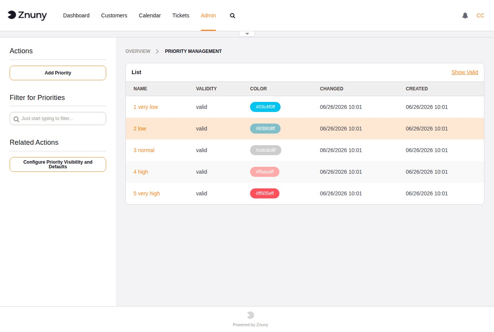

.. meta::
   :description: Configure Znuny ticket priorities — understand how priority affects ticket sorting and escalation, and manage the priority list in the admin interface.
   :keywords: znuny ticket priority, priority management, ticket urgency, priority colour, alphabetical sorting

.. _PageNavigation admin_ticketclassification_priority:

Ticket Priorities
#################

A priority expresses the urgency of a ticket. It affects how tickets sort in queue overviews and, when no SLA is configured, which escalation times apply. Each ticket carries exactly one priority at a time; agents can change it at any point.

The five built-in priorities use a numeric prefix (``1 very low`` through ``5 very high``) because ticket screens sort the priority list **alphabetically**. The prefix is what enforces urgency order. Any custom priority you add must follow the same convention — for example, ``3a medium-high`` — or it will appear out of alphabetical order in ticket screens and may confuse agents.

Invalidating a priority hides it from ticket screens without affecting historical tickets. Priorities cannot be deleted.

.. seealso::

   :ref:`Priorities <PageNavigation concepts_priorities_index>` in the Concepts section for the full list of defaults, colours, and workflow automation options.

The overview lists all priorities with their name, colour, and validity.

Creating and Editing a Priority
*********************************

+----------+------------------------------------------------------------------+
| Field    | Description                                                      |
+==========+==================================================================+
| Name     | Required. Display name shown in ticket screens.                  |
+----------+------------------------------------------------------------------+
| Color    | Pick from the colour palette. The selected colour appears as a   |
|          | swatch in the priority list and can highlight tickets in agent   |
|          | overviews.                                                       |
+----------+------------------------------------------------------------------+
| Validity | Required. Set to *Invalid* to hide this priority from ticket     |
|          | screens without deleting it.                                     |
+----------+------------------------------------------------------------------+
