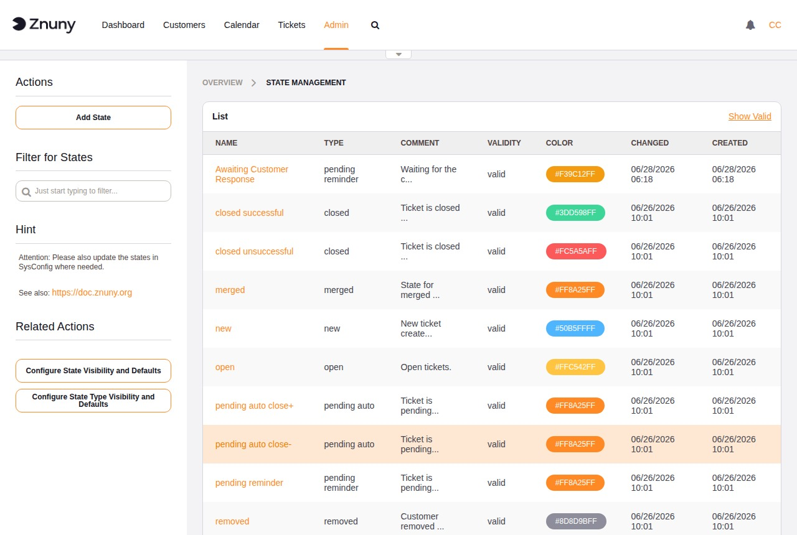

.. meta::
   :description: Configure Znuny ticket states — understand state types and their runtime behavior, manage the state list, and know which built-in states must not be deleted.
   :keywords: znuny ticket state, state type, pending state, closed state, ticket lifecycle

.. _PageNavigation admin_ticketclassification_state:

Ticket States
#############

States represent the lifecycle stage of a ticket. Every ticket is in exactly one state at any time. The **state type** assigned to each state is the key admin concept: it determines runtime behavior — which queue views the ticket appears in, whether a pending timer fires, and whether the ticket transitions automatically.

When creating a custom state, choosing the right state type is the most important decision. The table below describes what each type does at runtime.

.. seealso::

   :ref:`Ticket States <PageNavigation concepts_states_index>` in the Concepts section for typical lifecycle flows and guidance on which state type fits common use cases.

State Type Reference
********************

+--------------------+----------------------------------------------------------+
| State type         | Behaviour                                                |
+====================+==========================================================+
| new                | Ticket has not yet been worked on. Appears in the        |
|                    | *New Tickets* view in agent queues. Not user-selectable  |
|                    | once agent communication has taken place.                |
+--------------------+----------------------------------------------------------+
| open               | Ticket is being actively worked on.                      |
+--------------------+----------------------------------------------------------+
| closed             | Ticket is resolved and no longer active. Excluded from   |
|                    | default agent queue views.                               |
+--------------------+----------------------------------------------------------+
| pending reminder   | Ticket is waiting. A reminder notification fires at the  |
|                    | configured pending time; the state does not change       |
|                    | automatically.                                           |
+--------------------+----------------------------------------------------------+
| pending auto       | Ticket is waiting. At the configured pending time, the   |
|                    | ticket automatically transitions to a target state       |
|                    | (configured separately per state).                       |
+--------------------+----------------------------------------------------------+
| removed            | Ticket is archived. Hidden from normal queue views but   |
|                    | not permanently deleted.                                 |
+--------------------+----------------------------------------------------------+
| merged             | Ticket has been merged into another ticket. The merged   |
|                    | ticket is read-only and links to the target ticket.      |
+--------------------+----------------------------------------------------------+

.. important::

   The built-in states (*new*, *open*, *closed successful*, *closed
   unsuccessful*, *merged*, *removed*, and the pending states) are
   required for core system behaviour and must not be deleted. If a
   built-in state is no longer needed in ticket screens, set its validity
   to *Invalid* rather than deleting it.

The overview lists all states with their name, type, comment, colour, and validity.

Creating and Editing a State
*****************************

+------------+-------------------------------------------------------------------+
| Field      | Description                                                       |
+============+===================================================================+
| Name       | Required. Display name shown in ticket screens.                   |
+------------+-------------------------------------------------------------------+
| State type | Required. Controls the runtime behaviour of tickets in this       |
|            | state. See the state type reference above.                        |
+------------+-------------------------------------------------------------------+
| Comment    | Optional. Internal note about the purpose of this state.          |
+------------+-------------------------------------------------------------------+
| Color      | Pick from the colour palette to visually distinguish this state   |
|            | in ticket lists and views.                                        |
+------------+-------------------------------------------------------------------+
| Validity   | Required. Set to *Invalid* to hide this state from ticket screens |
|            | without deleting it.                                              |
+------------+-------------------------------------------------------------------+
