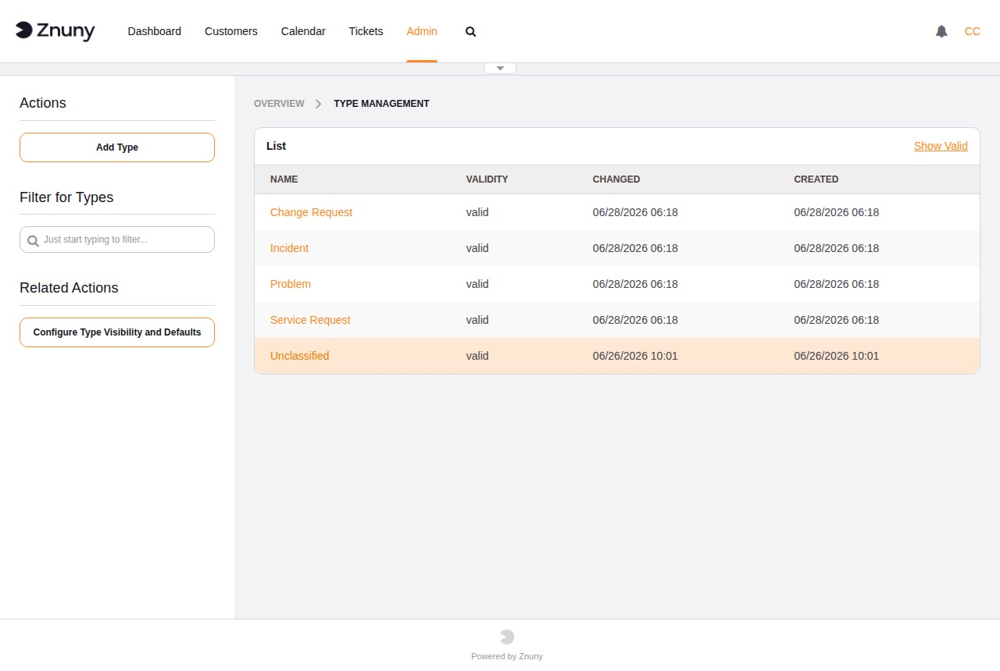

.. meta::
   :description: Configure Znuny ticket types — enable the type feature, understand the built-in Unclassified type, and manage types in the admin interface.
   :keywords: znuny ticket type, ticket category, ticket type management, Ticket::Type sysconfig

.. _PageNavigation admin_ticketclassification_type:

Ticket Types
############

Types classify tickets by nature or required handling process — for example, distinguishing incidents from service requests or change requests. They feed ACLs, process management transitions, Generic Agent conditions, and statistics.

The type field is **disabled by default**. Enable it by setting ``Ticket::Type`` to *Yes* in system configuration. Once enabled:

* ``Ticket::Type::Default`` sets the fallback type for screens that do not explicitly present a type selector.
* The built-in *Unclassified* type exists so that every ticket always has a valid type value after the feature is turned on.

.. seealso::

   :ref:`Ticket Types <PageNavigation concepts_types_index>` in the Concepts section for recommended type names, workflow examples, and best practices.

The overview lists all types with their name, validity, and last-changed date.

Creating and Editing a Type
*****************************

+----------+------------------------------------------------------------------+
| Field    | Description                                                      |
+==========+==================================================================+
| Name     | Required. Display name shown in ticket screens.                  |
+----------+------------------------------------------------------------------+
| Validity | Required. Set to *Invalid* to hide this type from ticket screens |
|          | without deleting it.                                             |
+----------+------------------------------------------------------------------+
