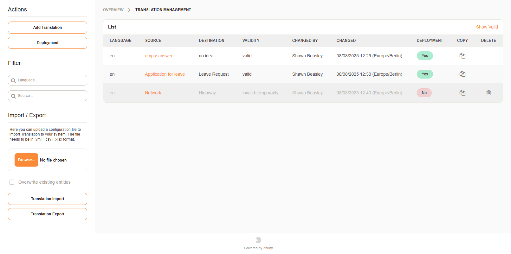

.. meta::
   :description: Customize Znuny translations for interface labels, ticket states, priorities, dynamic field values, template names and process data per configured language.
   :keywords: znuny translation, custom translation, terminology, interface translation, language override, kernel language, localized ui

.. _PageAdminTranslationIndex:

Translating Terminology
#######################

It's possible to translate terminology used in the system. This is done by configuring the source and translation of a term for a configured language.

Under Admin -> Translation you can add new terms and their translations. The system will then use these translations in the user interface, based on the user's preferred language.

.. seealso:: 

    :ref:`pagenavigation agentinterface_personalsettings_index` 

.. important:: 
    
    Files found under directories like `Kernel/Language/` are still used for translation in addition to the changes made here. The translation module is used to add or change custom translations and will be found under the directory above, after deployment.

**What is translated?**

The translation module allows you to translate:

Interface elements such as:

* Buttons
* Labels
* Descriptions
 
Ticket data such as:

* States
* Priorities
* Dynamic Field List Values
* Template Names

Process data such as:

* Names of dialogs and activities
* Descriptions, short and long, of all elements.

**Overview**

   Overview of translations

Here you can:

* Add terms.
* Edit terms.
* Delete terms.
* Copy terms to another language.
* Deploy terms to make them effective.
* View existing terms and their translations.
* Identify terms that need deployment.
* Filter for terms by source term or destination language.
* Hide invalid terms.
* Export terms to a file for backup or sharing.
* Import terms from a file to add or update translations.

Create or edit a term
*********************

1. Navigate to Admin -> Translation.
2. Click on "Add Term" to create a new term or select an existing term to edit.
3. Select the target language from the dropdown menu "Language"
4. Fill in the term in the "Source" field and its translation in the "Destination" field.
5. Save your changes.
6. Deploy the changes to make them effective.

.. important:: 
    
    Only invalid or invalid-temporary terms can be deleted.

Create a Copy
*************

Clicking on copy allows the administrator to copy the term to another language. This is useful if you want to translate a term into multiple languages without having to re-enter the source term. Just change the language and add a new destination term.

.. note:: Console Commands

    There are console commands for import and export.

    ``bin/znuny.Console.pl Admin::Translation::Export`` and ``bin/znuny.Console.pl Admin::Translation::Import`` use *--help* to see the options.
