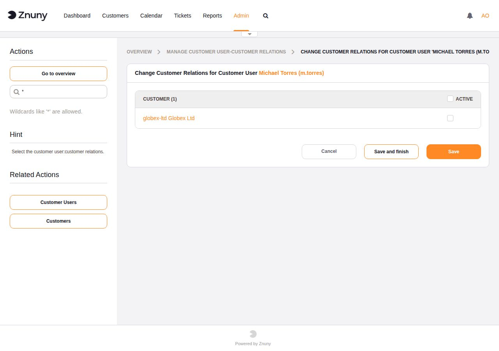
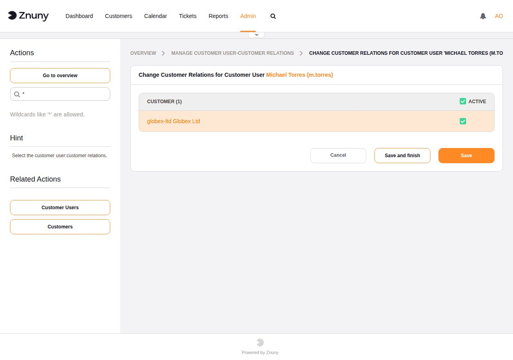
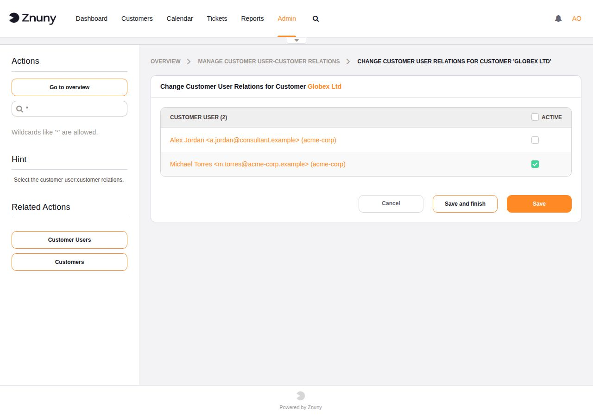

.. meta::
   :description: Assign Znuny customer users to additional customer companies — grant multi-company ticket visibility for contractors, sub-organisations, and shared-service users.
   :keywords: znuny customer user customer, multi-company, additional customer, customer relation, ticket visibility, customer portal access

.. _PageNavigation admin_usermanagement_customer_user_customer_index:

Multi-Company Access for Customer Users
########################################

By default, a customer user belongs to exactly one customer company — the
one set in their account. This module lets you assign a customer user to
**additional** customer companies without changing their primary company
record.

When is this needed?
*********************

Common scenarios where one customer user needs access to multiple companies:

- A contractor or consultant who raises and tracks tickets on behalf of
  several client organisations.
- A holding-company contact who manages tickets across multiple
  subsidiaries, each with its own Customer ID.
- A shared-service user whose primary company is a corporate parent but
  who also needs visibility into a regional entity's tickets.

Without this mapping, a customer user logging into the customer portal can
only see tickets that belong to their primary Customer ID. With additional
relations active, the customer portal shows tickets from **all** of their
assigned companies.

Prerequisites
*************

No system configuration changes are required. The module is available as
soon as at least one customer company (Customer) and one customer user exist
in the system. Assignments take effect immediately without a cache flush.

.. note::

   This module only manages **additional** company relations. The primary
   company is always set on the customer user record itself via
   :ref:`Customer Users <PageNavigation admin_usermanagement_customer_users_index>`.

Using the Module
*****************

Navigate to **Admin → Customer Users ↔ Customers**. Search for a customer
user by name or use ``*`` to list all. Click the user to open their company
assignment page.

Tick the checkbox next to each company you want to add, then click
**Save and finish** or **Save**.

The same relation can be managed from the **company side**: click
**Customers** in the sidebar, search for a customer company, and assign
or remove individual customer users from there.

- Selecting from the **customer user side** shows all companies and lets
  you assign that user to any of them.
- Selecting from the **customer company side** shows all customer users
  and lets you assign any of them to that company.

Tickets created under an additionally assigned company are visible to the
customer user in the customer portal alongside their primary company's
tickets.

Two Approaches to Multi-Company Access
***************************************

Znuny supports two independent ways to grant a customer user access to
multiple companies. Choose based on where your customer user data lives.

**Admin module — database-stored relations**

Use the **Customer Users ↔ Customers** admin module described above.
Relations are stored in the Znuny database and managed through the web
interface. This is the right approach when:

- Customer users are maintained directly in Znuny (not from an external
  directory).
- You want to manage exceptions or temporary access without touching the
  backend configuration.

**Backend mapping — data-source-driven**

The customer user backend (LDAP or database) supports a ``UserCustomerIDs``
field that maps to an attribute or column containing a **comma-separated
list of Customer IDs**. When this field is populated in the data source,
Znuny reads the additional companies directly from there — no database
relations need to be maintained in Znuny at all.

To enable this, uncomment and configure the ``UserCustomerIDs`` mapping in
your backend configuration:

.. code-block::

    [ 'UserCustomerIDs', Translatable('CustomerIDs'), 'second_customer_ids', 1, 0, 'var', '', 1, undef, undef ],

Replace ``second_customer_ids`` with the LDAP attribute or database column
that holds the comma-separated Customer IDs for your environment.

This approach is preferred when:

- Customer users are sourced from LDAP, Active Directory, or an external
  database.
- Company memberships are already managed in the directory and should not
  be duplicated in Znuny.
- You want onboarding and offboarding to flow from the directory without
  admin intervention in Znuny.

.. note::

   Both approaches can coexist. If a customer user has relations set in
   both the admin module and the backend mapping, Znuny merges them —
   the user sees tickets from all assigned companies regardless of which
   mechanism granted the access.

.. seealso::

   :ref:`pagenavigation admin_usermanagement_user_backends` — customer user backend configuration.

Relation to CustomerIDReadOnly
*******************************

Most agent ticket screens have a SysConfig setting named
``CustomerIDReadOnly`` (for example,
``Ticket::Frontend::AgentTicketCustomer###CustomerIDReadOnly``). When this
is set to **1** (the default), the Customer ID field in that screen is
read-only — agents cannot manually change which company a ticket belongs to.

With ``CustomerIDReadOnly`` enabled, the **Customer Users ↔ Customers**
module becomes the only way for an administrator to grant a customer user
access to tickets from a company other than their primary one. Without this
module, and with read-only Customer IDs, a customer user is permanently
restricted to their primary company's tickets.

If ``CustomerIDReadOnly`` is disabled (set to **0**), agents can freely
reassign a ticket to any Customer ID. The two approaches serve different
access models:

- **Read-only Customer ID** (default) — company assignment is an admin
  responsibility; use this module to manage cross-company access.
- **Editable Customer ID** — agents control company assignment per ticket;
  this module is less critical but still useful for customer portal
  visibility.

.. seealso::

   - :ref:`Manage Customer Users <PageNavigation admin_usermanagement_customer_users_index>`
   - :ref:`Manage Customers <PageNavigation admin_usermanagement_index>`
