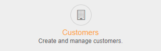
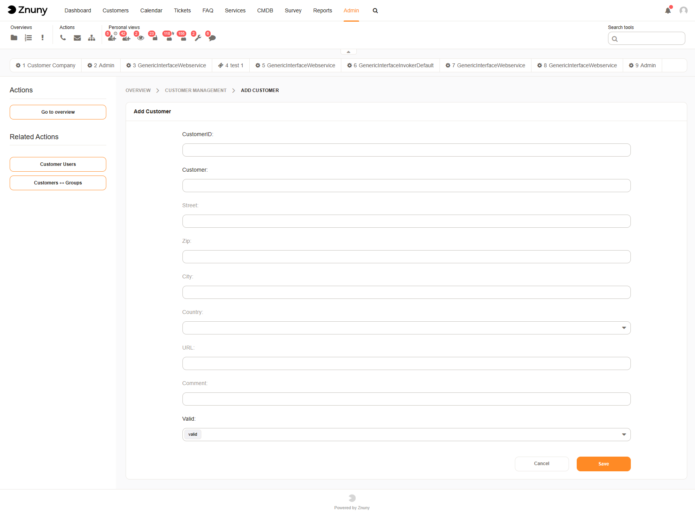
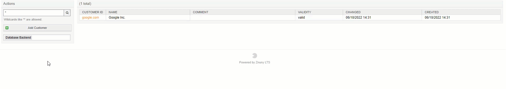
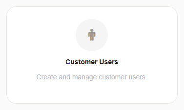
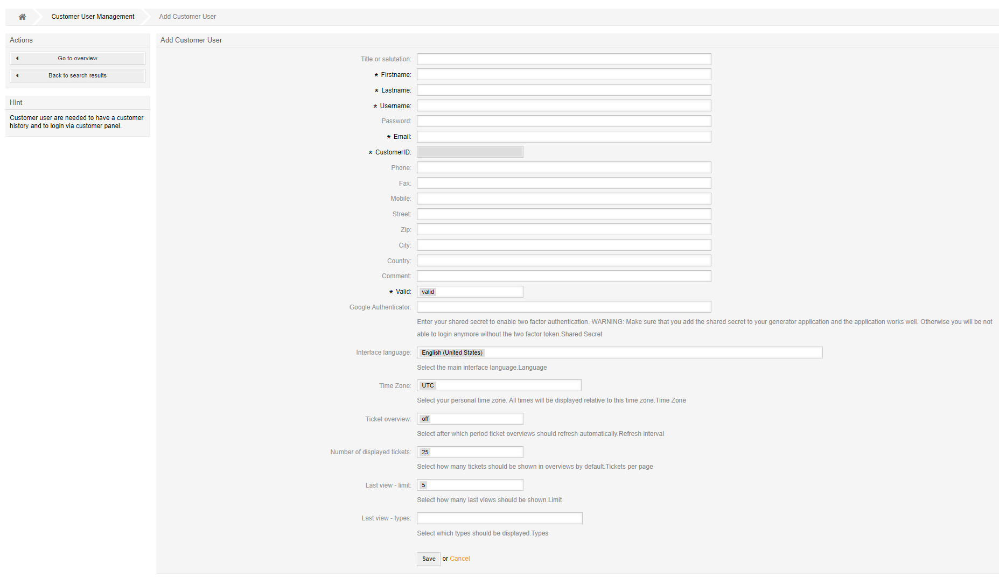

Manage Customers (Customer User)
################################
.. _PageNavigation usermangement_customer_users_index:

Customer users belong to a customer (organization, department, etc.). A customer is required before any customer user can be added.

Adding A Customer
*****************

Navigate to the administration menu, and clicking on the badge:

A customer record requires:

* Customer ID
* Customer Name

All other information is optional, as configured by your administrator. 

If multiple writeable backends are available, choose the backend before clicking **Add Customer**.

Add A Customer User
*******************

After adding customers seen above you may then choose to add a customer user.

Navigate to the administration menu, and clicking on the badge:

Depending on the configuration of custom user data mapping your form for entering customer user data may differ. Here is the example of the default user form.

.. seealso:: 

    :ref:`Add A Customer User As An Agent <PageNavigation agentinterface_dashboards_index>`
