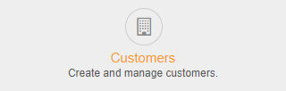
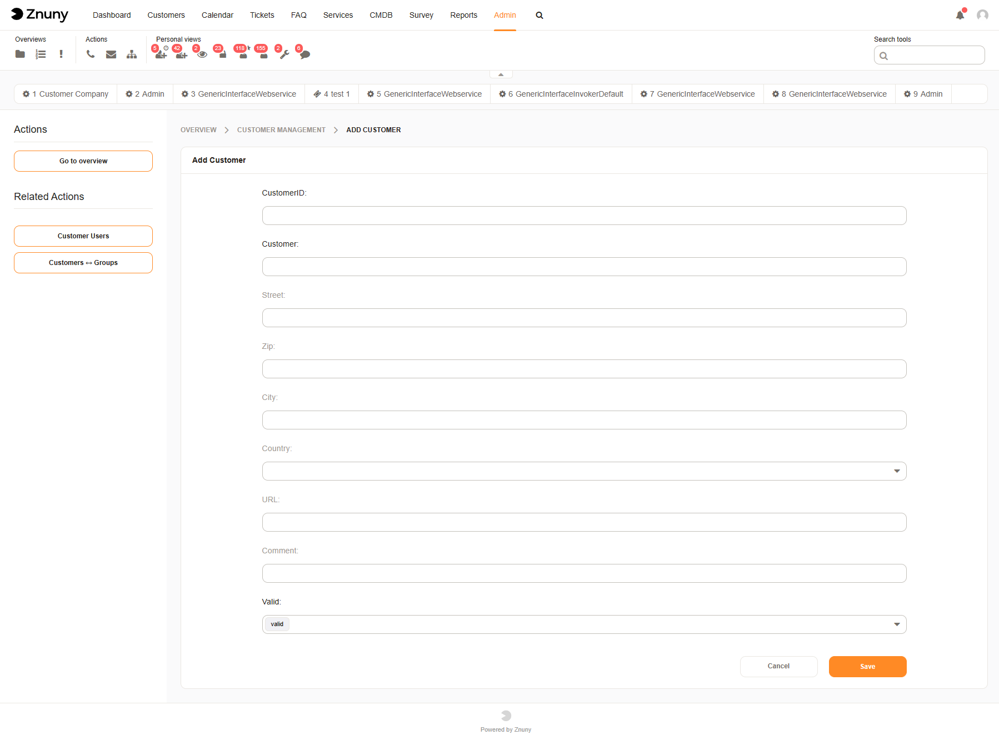
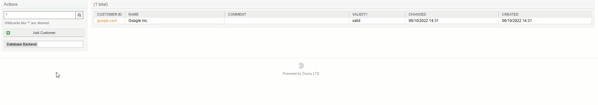
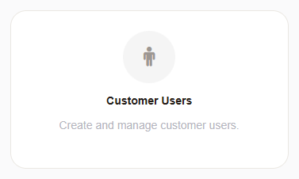
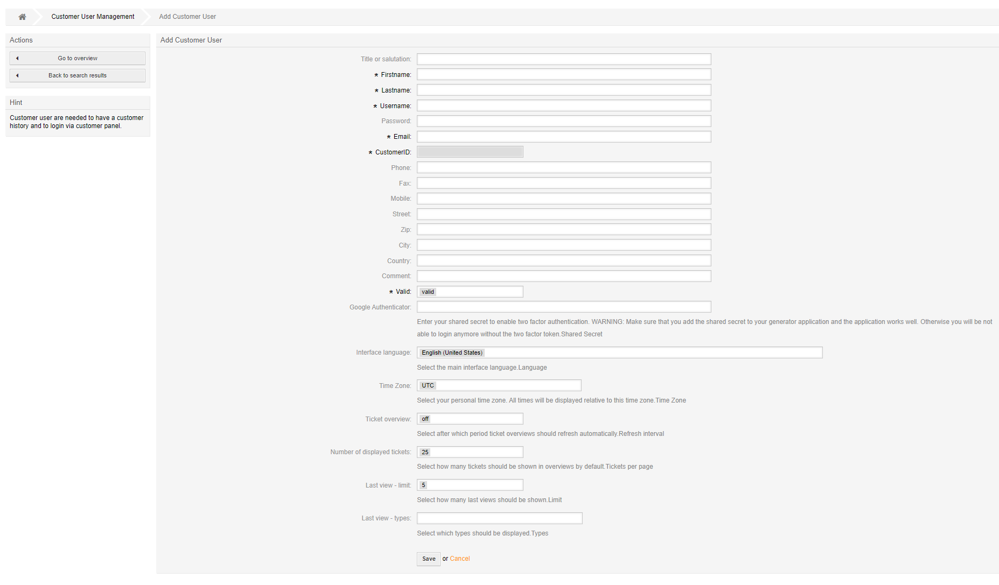
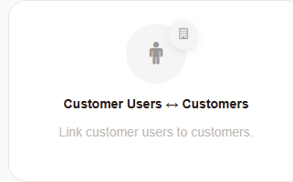
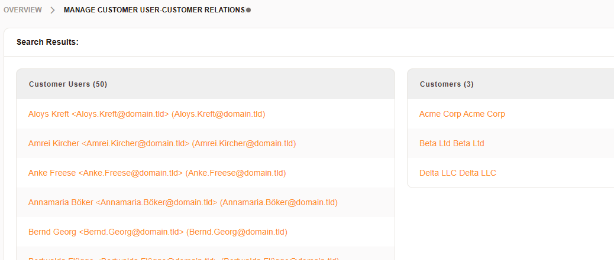
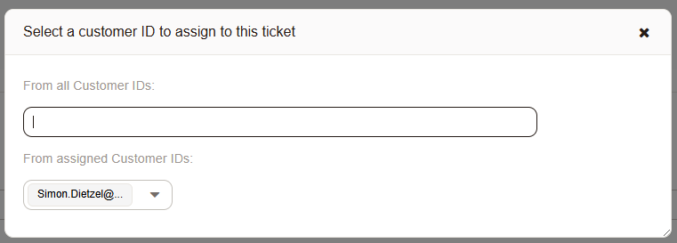

.. _PageNavigation usermangement_customer_users_index:

Manage Customers (Customer User)
################################

Customer users belong to a customer (organization, department, etc.). A customer is required before any customer user can be added.

Adding A Customer
*****************

Navigate to the administration menu, and clicking on the badge:

A customer record requires:

* Customer ID
* Customer Name

All other information is optional, as configured by your administrator. 

If multiple writeable backends are available, choose the backend before clicking **Add Customer**.

Add A Customer User
*******************

After adding customers seen above you may then choose to add a customer user.

Navigate to the administration menu, and clicking on the badge:

Depending on the configuration of custom user data mapping your form for entering customer user data may differ. Here is the example of the default user form.

.. seealso:: 

    :ref:`Add A Customer User As An Agent <PageNavigation agentinterface_dashboards_index>`

Assign Multiple Customer IDs
****************************

**What is CustomerIDs?**

The CustomerIDs field allows a Customer User to be associated with multiple Customers.
This is useful when a single user (e.g., a consultant, supplier, or contractor) works with multiple companies and needs access to their tickets.
It is an array field in the customer user mapping meaning a customer user can have multiple CustomerIDs.

**How it Works**

Normally, a Customer User is assigned a CustomerID, linking them to one company.
By using CustomerIDs, you can extend this so that a user is linked to multiple companies.
This ensures that the user can view and interact with tickets from all the customers they are assigned to.

**Example Use Case**

*Scenario:* John Doe (john.doe@consultant.com) works with Acme Corp. Delta LLC and Beta Ltd..

Instead of limiting him to one company, we assign:

CustomerID = Acme_Corp

CustomerIDs = [Beta_Ltd, Delta_LLC]

Now, John Doe can access tickets from all three customers in the Znuny customer portal.

**Configuration & Implementation**

The CustomerIDs attribute is not enabled by default in Znuny.
You can enable it in the customer user backend (e.g., LDAP, database).

Alternatively, It can be managed through the administration panel.

   Customer to Customer User Administration Module

1. Navigate to **Admin** -> **Customer Users** <-> **Customers**.
In the overview.

  Customer User to Customer Relationship Overview
  
2. Select a customer user to assign it to multiple customers, or a customer to assign multiple customer users to a customer.
3. Click "Save and Finish"

**System Configuration**

In order for an agent to assign the secondary CustomerID to the ticket, the CustomerID field must be editable. This is done in these configuration settings.

Ticket Actions **People** -> **Customer**
  Ticket::Frontend::AgentTicketCustomer::CustomerIDReadOnly
Email Ticket
  Ticket::Frontend::AgentTicketEmail::CustomerIDReadOnly
Telephone TIcket
  Ticket::Frontend::AgentTicketPhone::CustomerIDReadOnly
Process Ticket
  Ticket::Frontend::AgentTicketProcess::CustomerIDReadOnly

Once activated, you can assign the ticket to a secondary customerID of a customer user.

1. Select .. image:: images/select_customer_user_icon.PNG

2. Assign one of the customer users predefined customers, or any registered (\* primarily for unregistered customer users) customer.

.. seealso:: 

    More on customers in our concepts chapter :ref:`pagenavigation concepts_customers_index`  