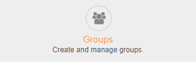
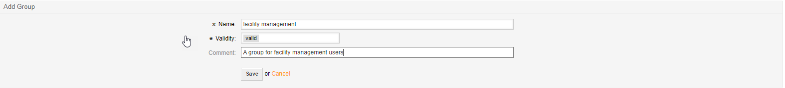
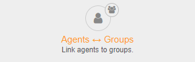
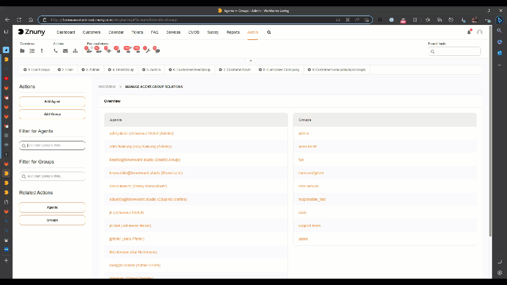
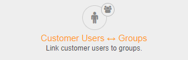
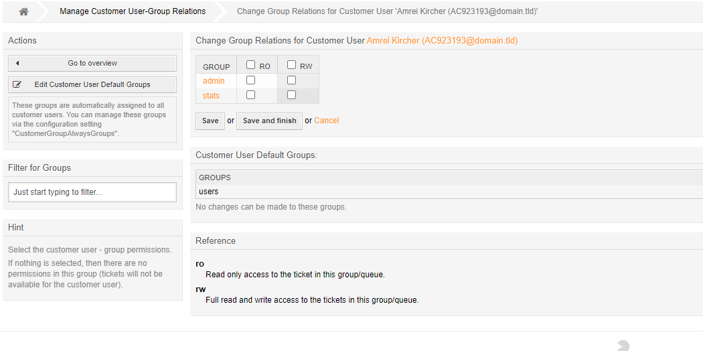
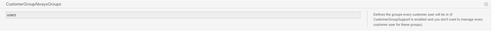

.. _PageNavigation admin_groups_index:

Manage Groups
#############

Adding a group is the one of the first things to do in a new system, or when creating a new team within the system. A group is needed in the queue settings screen, and for role or user assignment, and should be the first entity you create.

Navigate to the administration menu, and click on the badge:

.. note::
    Groups are additionally used by modules such as the FAQ, or ITSM modules, or other features. Settings are found within the module administration screens or the system configuration. These groups may and will be delivered directly by many packages.

Adding A Group
==============

Assign A User To A Group
========================

Groups may be used without a role, but this does not scale well making permissions management hard to maintain.

Navigate to the administration menu, and click on the badge:

Select a user to add this user to multiple groups, or select a group to add multiple users to this group.

.. note::

    Filtering to get the desired results can be useful.

Assign A Customer User To A Group
=================================

Assigning customer users to a group is also possible. This feature has to be activated within the system configuration. 

``CustomerGroupSupport``

Navigate to the administration menu, and click on the badge:

Customer users have read only (ro) or read write (rw) access to a resource. This will allow the users to access specific modules, like categories in the FAQ, and also limit updating, creating, or viewing tickets.

.. note::

    Role assignment is not currently implemented for customer users.

Customer User Default Groups
~~~~~~~~~~~~~~~~~~~~~~~~~~~~

Navigate to the administration menu, and click on the badge:

You may also set the default customer user groups using the button under actions menu on the left. This redirects you to the system configuration. All customer userss will have these groups per default.

.. seealso::

    Read all about :ref:`permissions <PageNavigation annexes_permissions>`.
    
