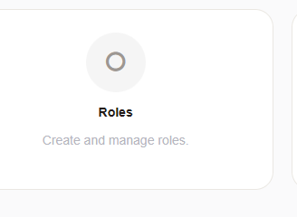
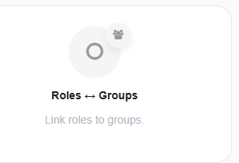

Manage Roles
############
.. _PageNavigation roles_index:

As previously mentioned, groups are resources and roles are permissions to those resources. Assigning a user to a role, and assigning the roles to a group, provides more efficient user management. If at any time your permissions concept should change, all that is necessary to do is to reassign the permissions to the roles, or create new roles for a user.

After you've created your first groups, create a list of roles for your organization. Now we will assign these to the roles accordingly.

Navigate to the administration menu, and click on the badge:

Assign Roles To Groups
**********************

Assign one or more roles to one or more groups.

Navigate to the administration menu, and click on the badge:

Assign Users To Roles
*********************

Assign one or more users to one or more roles.

Navigate to the administration menu, and click on the badge:

.. seealso:: :ref:`Entity Management <PageNavigation annexes_entity_management_index>` 

Once you have roles in your system
