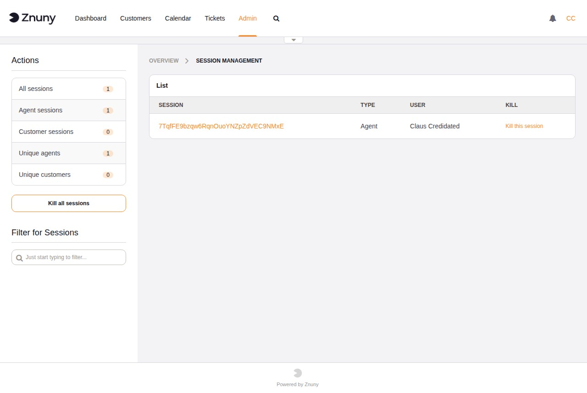
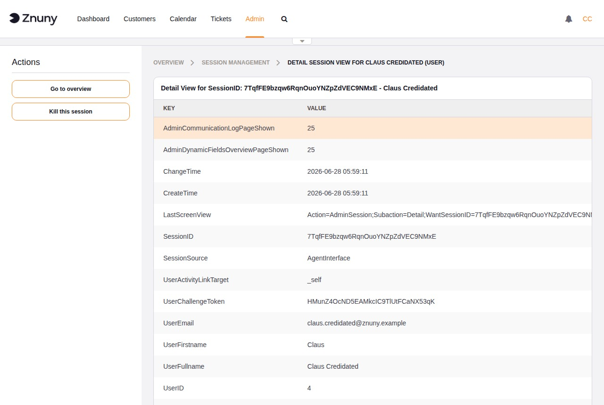

.. meta::
   :description: Monitor and manage active Znuny agent and customer sessions — view session details, terminate individual sessions, and configure session timeout limits via SysConfig.
   :keywords: znuny session management, active sessions, kill session, session timeout, agent sessions, customer sessions, AdminSession

.. _PageNavigation admin_usermanagement_session_index:

Session Management
##################

The Session Management module gives administrators a real-time view of all active sessions in the system. From here you can inspect individual sessions and forcibly terminate them when needed — for example when an agent account has been compromised or a user left without logging out.

Navigate to **Admin → Session Management** to open the module.

Session Overview
****************

The sidebar counts are updated each time the page loads:

All sessions
   Total number of active sessions across all user types.
Agent sessions
   Sessions originating from the agent interface.
Customer sessions
   Sessions originating from the customer portal.
Unique agents
   Number of distinct agent logins with at least one active session.
Unique customers
   Number of distinct customer user logins with at least one active session.

The session list in the main area shows the **Session ID**, **Type** (Agent or Customer), **User**, and a **Kill** link for each active session. Use the **Filter for Sessions** search box in the sidebar to narrow the list by session ID or user name.

Terminating Sessions
********************

To end a single session, click **Kill this session** next to the entry in the list. The session is invalidated immediately and the user is logged out on their next request.

To end all active sessions at once, click **Kill all sessions** in the sidebar. Use this with care — it will log out every currently active agent and customer user.

Session Detail
**************

Click the session ID link to open the detail view for that session. The detail view displays all data stored in the session record, including login time, last page visited, user identity fields, and any preference values cached in the session.

Useful fields in the detail view:

CreateTime / ChangeTime
   When the session was first created and when it was last updated.
SessionSource
   Identifies whether the session came from the ``AgentInterface`` or the customer portal.
LastScreenView
   The URL the user visited most recently — helpful for troubleshooting access issues.
UserID / UserFullname / UserEmail
   Identity of the user who owns this session.

Session Limits and Timeouts
****************************

Session lifetime and concurrency limits are configured in **Admin → System Configuration**. The relevant settings are:

``SessionMaxTime``
   Maximum session lifetime in seconds regardless of activity. Default: ``57600`` (16 hours). After this time the session is invalidated and the user must log in again.

``SessionMaxIdleTime``
   Maximum idle time in seconds. Default: ``7200`` (2 hours). A session inactive for longer than this value is automatically invalidated.

``AgentSessionLimit``
   Maximum number of concurrent agent sessions system-wide. Default: ``100``.

``AgentSessionPerUserLimit``
   Maximum number of concurrent sessions per agent login. Default: ``20``.

``CustomerSessionLimit``
   Maximum number of concurrent customer sessions system-wide. Default: ``100``.

``CustomerSessionPerUserLimit``
   Maximum number of concurrent sessions per customer user login. Default: ``20``.

.. note::

   Reducing ``SessionMaxIdleTime`` is an effective way to automatically clean up abandoned sessions without requiring manual intervention through this module.
