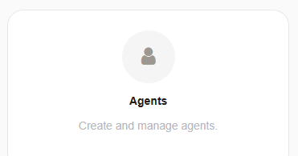
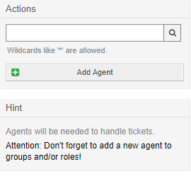
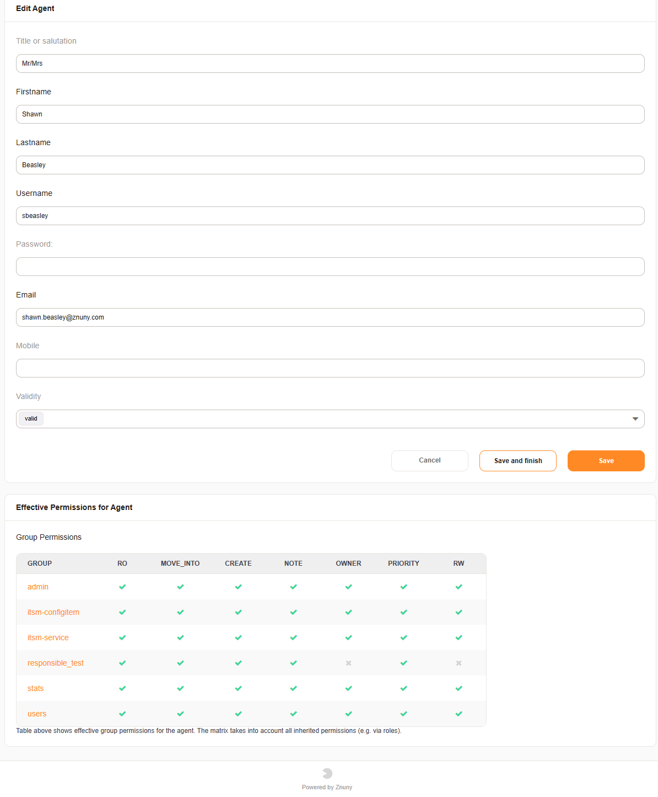
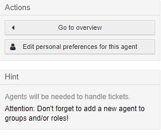
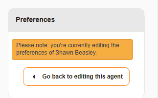

Manage Users (Agents)
#####################
.. _PageNavigation admin_usermanagement_users_index:

Manage users preferences, add new users to database sources, or invalidate users who are no longer allowed access to the system by navigating to the administration menu, and clicking on the badge:

.. seealso::

    The :ref:`Admin Console <PageNavigation console_admin>` for adding users over the command-line interface.

Adding A New User
*****************

Added users manually to the system using this module. Regardless of the data source agents musts be exist in the database table. 

There are two ways to accomplish this:

* Synchronize from a directory server
* Manually enter agent data

Select the Add Agent button:

Enter the required information as seen below:

* First Name
* Last Name
* Login
* Email Address

.. note::

    It's possible to add additional information to an agent for use in notifications. These are stored as personal preferences.

.. important::

    After adding a user, your system will redirect you to the Agent <-> Groups or Agent <-> Roles administration module, depending on your setup.

Edit A User
***********

When editing a user, you can also view the cumulative group permissions for the user at the bottom of the screen. Editing personal preferences is also possible on the left hand side in the actions menu.

.. note:: 
    
    If you are editing another users preferences, you will see a notification.

