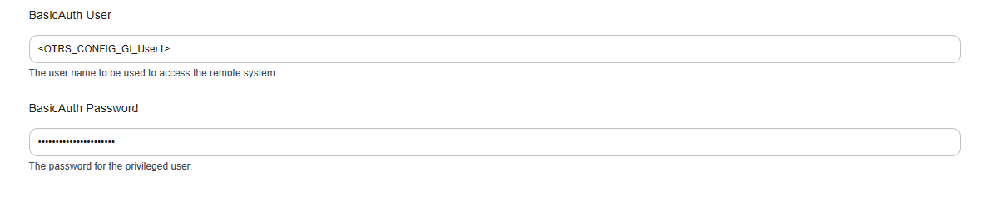

General Configuration
#####################
.. _Webservices Configuration:

Some information is specific to all web services, and we will discuss the parts of a web service here in more detail.

Adding A Webservice
*******************

Each service requires an endpoint. The endpoint is determined by 

* Configured ``FQDN``
* Configured ``ScriptAlias``
* Web Service Name

A default endpoint for a webservice named Service would be:

``https://znuny.example.com/otrs/nph-genericinterface.pl/Webservice/Service``

For REST, we will create a routing later in the transport section.

For SOAP, the name of the Operation or Invoker will be the SOAP Action.

General Settings
****************

The general settings are:

Name
	The name of the webservice. This will be the endpoint.
Description
	A short description for the administrator about the purpose of the web service.
Remote system
	Appeared to input the name of the remote system using the web service. Not required and not as part of the configuration.
Debug threshold
	The level of debug information to be locked to the generic interface locking system.
Valid
	The validity of the web service.

Type Of Webservice
******************

The software can act as a consumer (:ref:`Invoker <PageNavigation admin_webservices_invoker_index>`) or provider (:ref:`Requester <PageNavigation admin_webservices_provider_index>`)

You must choose:

Network Transport
	Choose ``HTTP::REST`` or ``HTTP::SOAP``.
Error Handling Module
	Choose an error handling module.
Operation
	Choose the operation module for use by the consumer of the service.
Invoker
	Choose the invoker module used to consume a webservice.

Payload Options
***************

.. _Setting XSLT force array:

XSLT Force Array Tags
*********************

There is a new config option "force array for tags" for the outgoind request data when using XSLT mappings. This option defines which XML elements will be converted to arrays when the data is converted to JSON. By default, this happens only when the same element occurs more than once on the same level. This is needed because some web services expect arrays in the request.
Multiple element names can be used.

Without this setting:

.. code-block:: XML

	<data>
	  <label>my Label</label>
	  <entry>lorem</entry>
	  <entry>ipsum</entry>
	</data>

..

becomes

.. code-block:: JSON

	{
	   "label": "my Label",
	   "entry": [
	      "lorem",
	      "ipsum"
	   ]
	}

..

With the value **label** for this setting the JSON will look like this:

.. code-block:: JSON

	{
	   "label": [
	      "my Label"
	   ],
	   "entry": [
	      "lorem",
	      "ipsum"
	   ]
	}

..

A practical use for this can be found in the outgoing XSLT mapping of the :ref:`MS Teams example<Example Web Service MS Teams>`.

System Configuration Data In Web Service Configuration
******************************************************

Setting defined in the System Configuration can be used in the web service configuration. There are two ways to use them. 
One possibility is to use the values in certain settings like the transport setting etc.

It is now possible to use smart tags of type CONFIG in the web service cnfiguration. These tags contain values from system configurations. This allows it easier to handle passwords outside of the webservice configuration.

In addition to the network transport configuration, this is also possible directly in XSLT. It can also be used for user names and passwords, but also for default values such as queues, stats, etc.

.. code-block:: XML

	<?xml version="1.0" encoding="UTF-8"?>
	<xsl:transform version="1.0" xmlns:xsl="http://www.w3.org/1999/XSL/Transform" xmlns:date="http://exslt.org/dates-and-times" extension-element-prefixes="date">
	  <xsl:output method="xml" encoding="utf-8" indent="yes"/>
	  <xsl:template match="RootElement">
	    <xsl:copy>
	      <User>&lt;OTRS_CONFIG_Webservice::User&gt;</User>
	      <Password>&lt;OTRS_CONFIG_Webservice::Password&gt;</Password>
	    </xsl:copy>
	  </xsl:template>
	</xsl:transform>

..

This feature is used with the :ref:`Mattermost example<Example Web Service Mattermost>` to have the system configuration `ProductName` in the mapping available.

.. tip::  Keep often used settings like usernames, passwords, hostname, etc in the system configuration and share web service configurations between staging systems.

	Why? E.g. to change credentials used in multiple web services by modifying a single setting.

