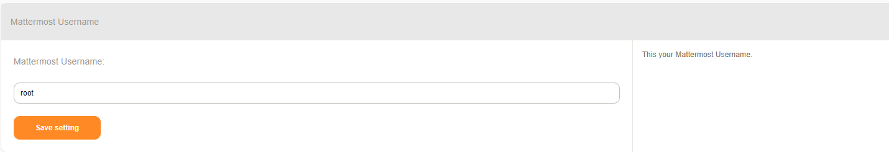
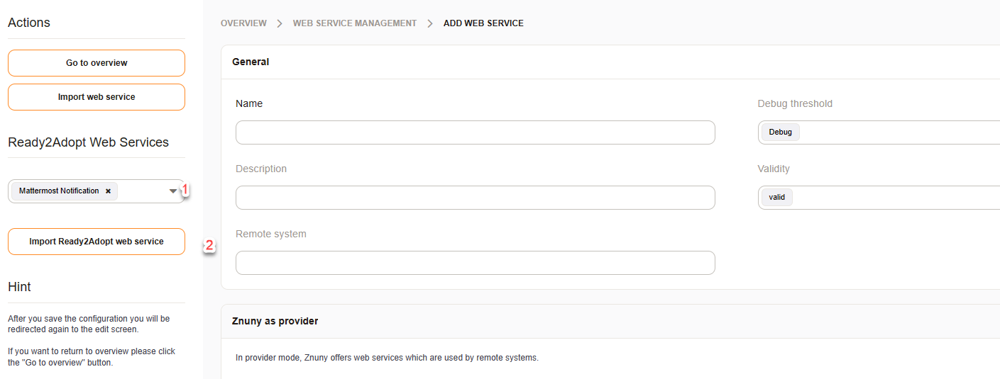
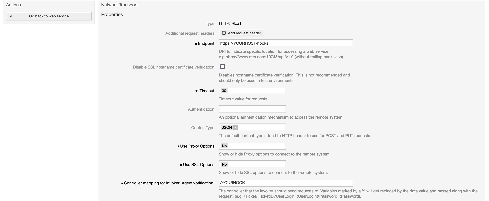
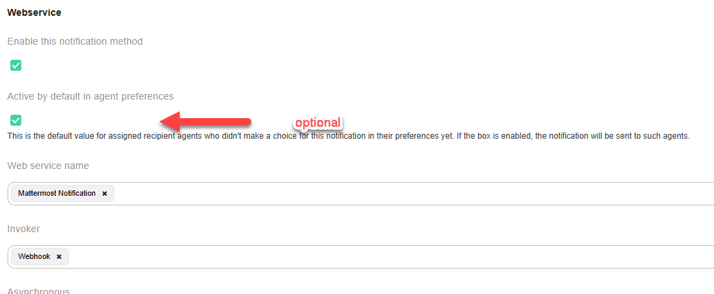

.. _Example Web Service Mattermost:

Mattermost
##########

Example configuration for a web service to notify agents about new tickets by using the generic ticket invoker and the Web Service Transport for ticket notifications.

Requirements
~~~~~~~~~~~~

Before you start, you need a webhook. See the Mattermost manual [#f1]_ how to create one. Keep the Webhook URL.

Enable the setting ``PreferencesGroups###MattermostUsername`` in the system configuration and agent's are able to maintain their Mattermost username in the user preferences:

Import and Configuration
~~~~~~~~~~~~~~~~~~~~~~~~

Open the Web Service Management in the from the Admin Overview and click on `Add Web Service`.

Select `Mattermost notification` and click on the button below to import the predefined web service.

Now the webhook URL needs to be added to the web service. Click on the name of the web service and configure the network transport of the Requester section:

.. image:: images/webservice_requester_section.png
         :width: 100%
         :alt: Enter the network transport configuration

Replace `YOURHOST` in the Endpoint setting with the hostname of the webhook and `YOURHOOK` of the controller endpoint with the corresponding part of the webhook:

Both settings together must match your webhook. If the webhook looks like this: ``https://mattermost.znuny.org/hooks/qjx7yo62hskgzdp17stjn5m5r5o`` then YOURHOST is ``mattermost.znuny.org`` and YOURHOOK ``qjx7yo62hskgzdp17stjn5m5r5o``.

Ticket notification
~~~~~~~~~~~~~~~~~~~

By adding the new created web service to an existing notification we finalize this example. Open the existing ticket notification `Ticket create notification` and scroll down block `Web Service` of the section `Notification Methods`. Select your web service and the invoker, check asynchronous and save your changes:

Insights
~~~~~~~~

The used XSLT for the outbound mapping contains some interesting parts:

.. code-block:: XML
    :linenos:

    <?xml version="1.0" encoding="UTF-8"?>
    <xsl:transform version="1.0" xmlns:xsl="http://www.w3.org/1999/XSL/Transform" xmlns:date="http://exslt.org/dates-and-times" extension-element-prefixes="date">
        <xsl:output method="xml" encoding="utf-8" indent="yes"/>
        <xsl:template match="RootElement">
            <xsl:copy>
                <username>&lt;OTRS_CONFIG_ProductName&gt;</username>
                <icon_url>https://www.znuny.org/favicon.ico</icon_url>
                <channel>@<xsl:value-of select="//Recipient/MattermostUsername" /></channel>
                <text>A new ticket has been created in queue&#x20;**<xsl:value-of select="//Ticket/Queue" />**&#x20;with the title&#x20;**<xsl:value-of select="//Ticket/Title" />**.</text>
            </xsl:copy>
        </xsl:template>
    </xsl:transform>

..

- In line 6 we use a new feature, system configuration values. Scalar values can be accessed via `<OTRS_CONFIG_ConfigurationName>`. It's XML so the `<` and `>` needs to be encoded.
- The agent's Mattermost username is taken from the incoming date in line 8. Check the web service debugger and discover which values are available. The node `Recipient` contains nearly everything about the agent oder customer.

.. rubric:: Links to external documentation

.. [#f1] https://docs.mattermost.com/developer/webhooks-incoming.html#simple-incoming-webhook
.. [#f2] https://developers.mattermost.com/integrate/incoming-webhooks/

