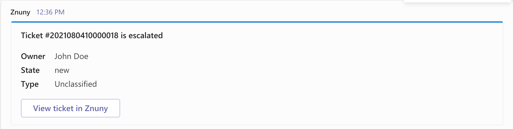
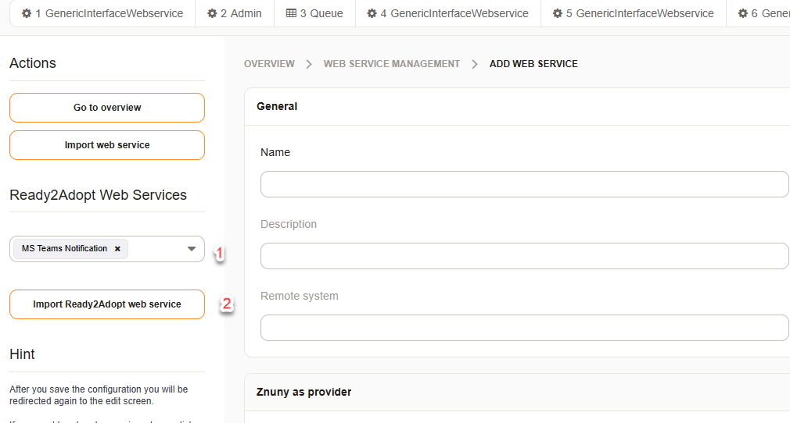
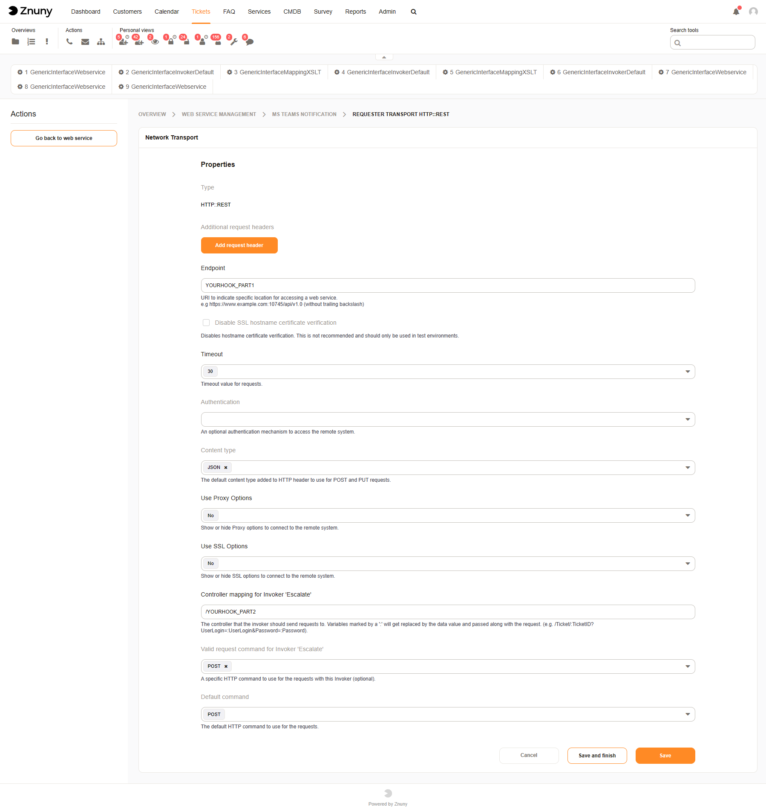
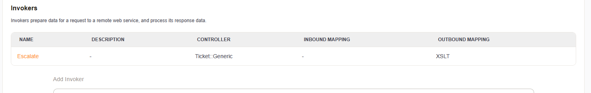
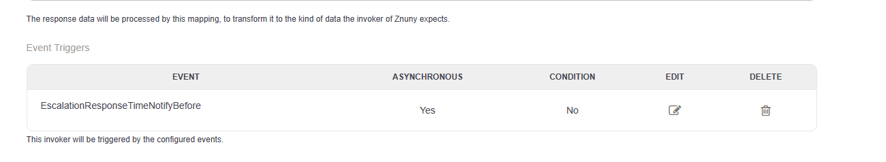
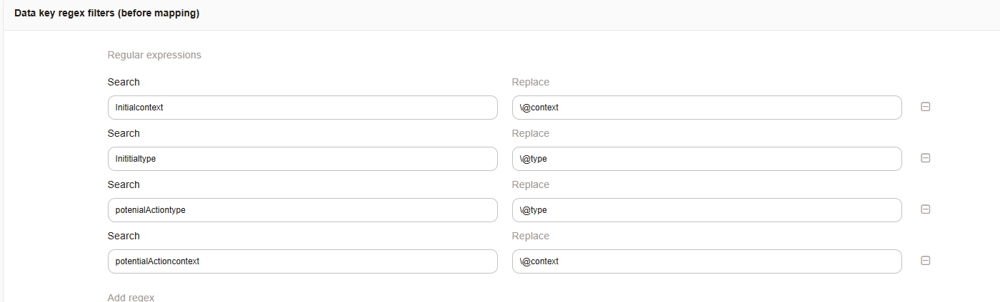

.. _Example Web Service MS Teams:

MS Teams
########

This configuration adds a web service which can be triggered e.g. with an event.  We create a Office 365 Connector card (MessageCard) that shows up in a MS Teams Chat.

We used the documentation [#f2]_ to "design" our card.

Requirements
~~~~~~~~~~~~

And again, we need a Webhook URL. Check the manual [#f1]_ how get get one. Keep the URL ready for later, it's needed for the transport configuration of the requester.

Import and Configuration
~~~~~~~~~~~~~~~~~~~~~~~~

Open the Web Service Management in the from the Admin Overview and click on `Add Web Service`.

Select `MS Teams Notification` and click on the button below to import the predefined web service.

Now the webhook URL needs to be added to the transport if the requester. Click on the name of the web service and configure the network transport of the Requester section:

Split the webhook URL in two parts, the 2nd part is everything after the last **/**.

Replace `YOURHOOK_PART1` in the setting Endpoint with first part of the splitted webhook and `YOURHOOK_PART2` with the second part. Both parts together must be equal to the generated webhook.

Execute the web service
~~~~~~~~~~~~~~~~~~~~~~~

Now we need to add an event when the invoker should be executed. Click on the name of the predefined invoker `Escalate`.

The next step is to choose the wanted event, in our example NotificationEscalation and check the box for Asynchronous too. Click the **+** and **Save and finish**.

Insights
~~~~~~~~

The used XSLT for the outbound mapping contains some interesting parts:

.. code-block:: XML
    :linenos:

    <?xml version="1.0" encoding="UTF-8"?>
    <xsl:transform version="1.0" xmlns:xsl="http://www.w3.org/1999/XSL/Transform" xmlns:date="http://exslt.org/dates-and-times" extension-element-prefixes="date">
        <xsl:output method="xml" encoding="utf-8" indent="yes"/>
        <xsl:template match="RootElement">
            <xsl:copy>
                <themeColor>0076D7</themeColor>
                <Initialtype>MessageCard</Initialtype>
                <Initialcontext>http://schema.org/extensions</Initialcontext>
                
Ticket <xsl:value-of select="//Ticket/TicketNumber" /> is escalated

                <sections>
                    <activityTitle>Ticket #<xsl:value-of select="//Ticket/TicketNumber" />&#160;is escalated</activityTitle>
                    <markdown>true</markdown>
                    <facts><Name>Owner</Name><Value><xsl:value-of select="//Ticket/OwnerData/UserFullname"/></Value></facts>
                    <facts><Name>State</Name><Value><xsl:value-of select="//Ticket/State"/></Value></facts>
                    <facts><Name>Type</Name><Value><xsl:value-of select="//Ticket/Type"/></Value></facts>
                </sections>
                <potentialAction>
                    <potentialActiontype>ViewAction</potentialActiontype>
                    <potentialActioncontext>http://schema.org</potentialActioncontext>
                    <name>View ticket in Znuny</name>
                    <target>&lt;OTRS_CONFIG_HttpType&gt;://&lt;OTRS_CONFIG_FQDN&gt;/&lt;OTRS_CONFIG_ScriptAlias&gt;/index.pl?Action=AgentTicketZoom;TicketID=<xsl:value-of select="//Ticket/TicketID" /></target>
                </potentialAction>
            </xsl:copy>
        </xsl:template>
    </xsl:transform>

..

- In line 21 we use system configuration setting to create the link to the ticket detail view.

- The XML elements `sections`, `target` and `potentialAction` (line 10, 17, 21) are configured to be converted to an array with the setting **Force array for tags**.

- Since the MessageCard JSON needs keys with an @ as prefix and we can't use them in the XSLT mapping we use a little trick: we use our own elements and rename them after the mapping with the regular expresssions.

.. rubric:: Links to external documentation

.. [#f1] https://docs.microsoft.com/en-us/microsoftteams/platform/webhooks-and-connectors/how-to/add-incoming-webhook
.. [#f2] https://docs.microsoft.com/en-us/microsoftteams/platform/task-modules-and-cards/cards/cards-reference
.. [#f3] https://docs.microsoft.com/en-us/microsoftteams/platform/webhooks-and-connectors/how-to/connectors-using?tabs=cURL
