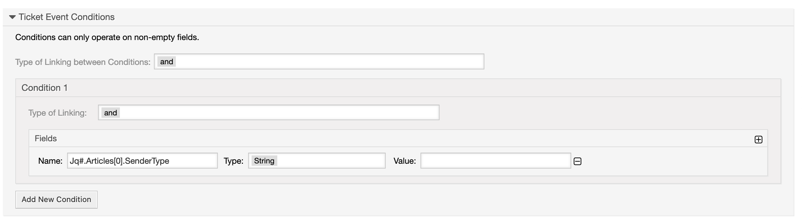

Invokers
########
.. _PageNavigation admin_webservices_invoker_index:

Ticket::Generic
****************

This invoker prepares the ticket which is used in the operations of a requester.

Request data
============
Depending on the event which calls the invoker the data might differ.
Summarized, the invoker provides:

- The complete ticket data with all articles, but without attachments.
- For article related events the new article with all attachments is included. `Article` contains the complete article data.
- For ticket attributes like queue, service, type, responsible, owner, customer etc. are nearly all details available. Check the :ref:`invoker example data<Invoker example data>` for more details.
- Attachments are Base64 encoded.
- On update events there might be the data structure `OldTicketData` available.

Response handling
=================

By modifying the response with inbound mapping, e.g. with XSLT, it is possible to change ticket data.

.. note:: Only the affected ticket can be changed.

The resulting data requires this format:

.. code-block:: XML

  <Element>Value</Element>

..

These element are available, if not mentioned value is the new value:

- OTRS_TicketDynamicFieldSet_FieldName1
- OTRS_TicketTitleUpdate
- OTRS_TicketServiceSet
- OTRS_TicketTypeSet
- OTRS_TicketQueueSet
- OTRS_TicketSLASet
- OTRS_TicketCustomerSet - The value contains the CustomerID and CustomerUserID, separated with a **;**
- OTRS_TicketStateSet
- OTRS_TicketOwnerSet
- OTRS_TicketResponsibleSet
- OTRS_TicketPrioritySet
- OTRS_TicketHistoryAdd - Requires subelements HistoryType and HistoryComment
- OTRS_TicketArticleAdd - Supports subelements IsVisibleForCustomer, Body, Subject, MimeType, From, SenderType, Charset, HistoryType, HistoryComment and many more. Check the `API <https://doc.znuny.org/doc/api/otrs/6.0/Perl/Kernel/System/Ticket/Article/Backend/MIMEBase.pm.html>`_ for mode details.

.. code-block:: XML
	:caption: Updating the ticket title with the response body:

	<?xml version="1.0" encoding="UTF-8"?>
	<xsl:transform version="1.0" xmlns:xsl="http://www.w3.org/1999/XSL/Transform"
					xmlns:date="http://exslt.org/dates-and-times" 
					extension-element-prefixes="date">
    	<xsl:output method="xml" encoding="utf-8" indent="yes"/>
    	<xsl:template match="RootElement">
        	<xsl:copy>
            	<OTRS_TicketTitleUpdate>The title is "<xsl:value-of select="//Body" />"</OTRS_TicketTitleUpdate>
        	</xsl:copy>
    	</xsl:template>
	</xsl:transform>
.. 

.. code-block:: XML
	:caption: Add an entry to the ticket history:

	<?xml version="1.0" encoding="UTF-8"?>
	<xsl:transform version="1.0" xmlns:xsl="http://www.w3.org/1999/XSL/Transform"
					xmlns:date="http://exslt.org/dates-and-times"
					extension-element-prefixes="date">
    	<xsl:output method="xml" encoding="utf-8" indent="yes"/>
    	<xsl:template match="RootElement">
        	<xsl:copy>
            	<OTRS_TicketHistoryAdd>
              		<HistoryType>Misc</HistoryType>
              		<HistoryComment>Request successful send</HistoryComment>
            	</OTRS_TicketHistoryAdd>
        	</xsl:copy>
    	</xsl:template>
	</xsl:transform>

..

Jq in event conditions
======================

.. note:: To use this feature Jq and the CPAN Module Jq must be installed.

.. code-block:: shell
	:caption: Example installation for Debian

	sudo apt-get install jq
	sudo cpan Jq
..

This optional feature is usefull to check substructures and also arrays in ticket event conditions. For more detail on valid Jq expressions check the `documentation <https://stedolan.github.io/jq/>`_.

In the conditions, all values can then be accessed which are also sent via the Generic Invoker.

.. code-block:: none

	# Retrieve the SenderType of the first element of the Articles array
	Jq#.Articles[0].SenderType
	jq#.Article.Subject
	jq#.OwnerData.Fullname

Encode binary fields
====================

To handle binary data of the invoker data in the mapping it is possible to encode fields with base64. This configuration is done in the system configuration with the setting **GenericInterface::Invoker::Ticket::Generic::PrepareRequest::Base64EncodedFields**.

- The key is the name if the invoker and the value the required field. Nested structure are written like this: Field1->Field2. Example: `OwnerData->UserAvatarImage`
- In order to encode several contents of different fields per invoker, these fields can be separated with **;**.
- If a field is an array, each element is encoded.
- Fields that do not exist or cannot be base-64 encoded will be ignored without error message.

Example: The body of all articles and the city of the customer company should be base64 encoded:
`Articles->Body;CustomerCompany->CustomerCompanyCity`

.. _Remove fields in ticket invoker:

Remove fields
==============

To prevent certain fields to be populated into the request data it is possible to remove them in the invoker. This is usefull to deal with sensitive data. The system configuration **GenericInterface::Invoker::Ticket::Generic::PrepareRequest::OmittedFields** has the same configuration like the option which encodes fields. Fields that do not exist are ignored without an error message.

Example: The recipients of all articles will be removed:
`Articles->To;Articles->Cc;Articles->Bcc`

Generic::Tunnel
***************

Sometime the event data should only be passed with a requester. This invoker take the data without any modifcation to the mapping section, nothing is changed or added.

.. _Invoker example data:

Example data invoker Ticket::Generic
=====================================

.. code-block:: JSON
	:caption: Invoker data before outbound mapping
	:name: Invoker data before outbound mapping

	{
	  "Event": {
	    "OldTicketData": {
	      "Age": 75446,
	      "PriorityID": 3,
	      "ServiceID": "",
	      "Type": "Unclassified",
	      "Responsible": "root@localhost",
	      "StateID": 6,
	      "ResponsibleID": 1,
	      "ChangeBy": 2,
	      "EscalationTime": 0,
	      "OwnerID": 1,
	      "Changed": "2021-08-03 11:56:34",
	      "RealTillTimeNotUsed": 1628070960,
	      "GroupID": 1,
	      "Owner": "root@localhost",
	      "CustomerID": "Znuny GmbH",
	      "TypeID": 1,
	      "Created": "2021-08-02 14:59:16",
	      "Priority": "3 normal",
	      "UntilTime": 86358,
	      "EscalationUpdateTime": 0,
	      "QueueID": 2,
	      "Queue": "Raw",
	      "State": "pending reminder",
	      "Title": "Znuny says hi!",
	      "CreateBy": 1,
	      "TicketID": 1,
	      "StateType": "pending reminder",
	      "UnlockTimeout": 0,
	      "EscalationResponseTime": 0,
	      "EscalationSolutionTime": 0,
	      "LockID": 1,
	      "ArchiveFlag": "n",
	      "TicketNumber": "2021012710123456",
	      "Lock": "unlock",
	      "SLAID": "",
	      "CustomerUserID": "MM"
	    },
	    "Event": "TicketStateUpdate",
	    "TicketID": "1"
	  },
	  "Ticket": {
	    "Age": 75447,
	    "PriorityID": 3,
	    "QueueData": {
	      "ValidID": 1,
	      "FollowUpLock": 0,
	      "RealName": "Znuny System",
	      "QueueID": 2,
	      "FirstResponseNotify": null,
	      "UpdateTime": null,
	      "Email": "example@test.znuny.org",
	      "ChangeTime": "2021-08-02 14:59:15",
	      "UnlockTimeout": 0,
	      "Calendar": "",
	      "CreateTime": "2021-08-02 14:59:15",
	      "Comment": "All default incoming tickets.",
	      "UpdateNotify": null,
	      "DefaultSignKey": null,
	      "GroupID": 1,
	      "SolutionTime": null,
	      "SolutionNotify": null,
	      "SystemAddressID": 1,
	      "FollowUpID": 1,
	      "SalutationID": 1,
	      "Name": "Raw",
	      "SignatureID": 1,
	      "FirstResponseTime": null
	    },
	    "ServiceID": "",
	    "TypeData": {
	      "ChangeBy": 1,
	      "ChangeTime": "2021-08-02 14:59:15",
	      "ID": 1,
	      "ValidID": 1,
	      "CreateTime": "2021-08-02 14:59:15",
	      "CreateBy": 1,
	      "Name": "Unclassified"
	    },
	    "Type": "Unclassified",
	    "Responsible": "root@localhost",
	    "StateID": 4,
	    "ServiceData": {},
	    "ResponsibleID": 1,
	    "ChangeBy": 2,
	    "ResponsibleData": {
	      "ValidID": 1,
	      "UserRefreshTime": "0",
	      "UserEmail": "root@localhost",
	      "UserID": 1,
	      "UserTicketOverviewSmallPageShown": "25",
	      "UserCreateNextMask": "",
	      "UserFirstname": "Admin",
	      "UserTitle": null,
	      "UserLastname": "OTRS",
	      "AdminCommunicationLogPageShown": "25",
	      "ChangeTime": "2021-08-02 14:59:14",
	      "UserTicketOverviewMediumPageShown": "20",
	      "CreateTime": "2021-08-02 14:59:14",
	      "UserTicketOverviewPreviewPageShown": "15",
	      "UserLastViewsPosition": "Avatar",
	      "UserLogin": "root@localhost",
	      "UserFullname": "Admin OTRS",
	      "UserLoginFailed": "0",
	      "UserLastLoginTimestamp": "2021-08-03 08:35:17",
	      "UserLastLogin": "1627972517",
	      "UserLastViewsLimit": "5",
	      "AdminDynamicFieldsOverviewPageShown": "25"
	    },
	    "EscalationTime": 0,
	    "OwnerID": 1,
	    "Changed": "2021-08-03 11:56:42",
	    "RealTillTimeNotUsed": 0,
	    "DynamicField_ProcessManagementActivityID": null,
	    "OwnerData": {
	      "ValidID": 1,
	      "UserRefreshTime": "0",
	      "UserEmail": "root@localhost",
	      "UserID": 1,
	      "UserTicketOverviewSmallPageShown": "25",
	      "UserCreateNextMask": "",
	      "UserFirstname": "Admin",
	      "UserTitle": null,
	      "UserLastname": "OTRS",
	      "AdminCommunicationLogPageShown": "25",
	      "ChangeTime": "2021-08-02 14:59:14",
	      "UserTicketOverviewMediumPageShown": "20",
	      "CreateTime": "2021-08-02 14:59:14",
	      "UserTicketOverviewPreviewPageShown": "15",
	      "UserLastViewsPosition": "Avatar",
	      "UserLogin": "root@localhost",
	      "UserFullname": "Admin OTRS",
	      "UserLoginFailed": "0",
	      "UserLastLoginTimestamp": "2021-08-03 08:35:17",
	      "UserLastLogin": "1627972517",
	      "UserLastViewsLimit": "5",
	      "AdminDynamicFieldsOverviewPageShown": "25"
	    },
	    "GroupID": 1,
	    "Owner": "root@localhost",
	    "PriorityData": {
	      "ChangeBy": 1,
	      "ChangeTime": "2021-08-02 14:59:15",
	      "ID": 3,
	      "ValidID": 1,
	      "CreateTime": "2021-08-02 14:59:15",
	      "CreateBy": 1,
	      "Name": "3 normal"
	    },
	    "CustomerID": "Znuny GmbH",
	    "TypeID": 1,
	    "Created": "2021-08-02 14:59:16",
	    "Priority": "3 normal",
	    "UntilTime": 0,
	    "EscalationUpdateTime": 0,
	    "QueueID": 2,
	    "Queue": "Raw",
	    "State": "open",
	    "Title": "Znuny says hi!",
	    "CreateBy": 1,
	    "TicketID": 1,
	    "Articles": [
	      {
	        "ContentType": null,
	        "SenderTypeID": "3",
	        "ToRealname": "Your Znuny Helpdesk",
	        "ReplyTo": null,
	        "References": null,
	        "ContentCharset": "",
	        "CreateBy": 1,
	        "SenderType": "customer",
	        "TicketID": 1,
        	"Body": "We welcome you to Znuny, our ticketing solution based on the well-known OTRS ((Community Edition)) which we forked to make things different.\n\nWe are focused on delivering a stable and community influenced software. So if you have something to contribute, whether bug reports, solutions or enhancements, let us know. We will be happy about your participation.\n\nYou can get additional information here:\n\nCommunity forum: https://community.znuny.org/\n\nDocumentation: https://doc.znuny.org/\n\nGitHub: https://github.com/znuny/Znuny\n\nHave fun and enjoy it.\n\nYour Znuny Team\n",
	        "ChangeBy": 1,
	        "ChangeTime": "2021-08-02 14:59:16",
	        "Cc": null,
	        "MimeType": "",
	        "Subject": "Znuny says hi!",
	        "IsVisibleForCustomer": 1,
	        "FromRealname": "Znuny",
	        "CreateTime": "2021-08-02 14:59:16",
	        "InReplyTo": null,
	        "IncomingTime": 1611745200,
	        "Charset": "",
	        "CommunicationChannelID": 1,
	        "Bcc": null,
	        "ArticleNumber": 1,
	        "MessageID": "<007@localhost>",
	        "ArticleID": 1,
	        "To": "Your Znuny Helpdesk <znuny@localhost>",
	        "From": "Znuny <hello@znuny.org>"
	      }
	    ],
	    "StateType": "open",
	    "CustomerCompany": {
	      "ChangeTime": "2021-08-03 11:49:47",
	      "ChangeBy": 2,
	      "ValidID": 1,
	      "CustomerCompanyCity": "Berlin",
	      "CreateTime": "2021-08-03 11:49:47",
	      "CustomerCompanyURL": "",
	      "CustomerCompanyName": "Znuny GmbH",
	      "CustomerCompanyCountry": "Germany",
	      "CustomerID": "Znuny GmbH",
	      "CustomerCompanyStreet": "Marienstraße 18",
	      "CustomerCompanyComment": "",
	      "CustomerCompanyZIP": "10117",
	      "Source": "CustomerCompany",
	      "CreateBy": 2
	    },
	    "Article": {
	      "ContentType": null,
	      "ToRealname": "Your Znuny Helpdesk",
	      "SenderTypeID": "3",
	      "ReplyTo": null,
	      "References": null,
	      "ContentCharset": "",
	      "CreateBy": 1,
	      "SenderType": "customer",
	      "TicketID": 1,
      	"Body": "We welcome you to Znuny, our ticketing solution based on the well-known OTRS ((Community Edition)) which we forked to make things different.\n\nWe are focused on delivering a stable and community influenced software. So if you have something to contribute, whether bug reports, solutions or enhancements, let us know. We will be happy about your participation.\n\nYou can get additional information here:\n\nCommunity forum: https://community.znuny.org/\n\nDocumentation: https://doc.znuny.org/\n\nGitHub: https://github.com/znuny/Znuny\n\nHave fun and enjoy it.\n\nYour Znuny Team\n",
	      "ChangeBy": 1,
	      "ChangeTime": "2021-08-02 14:59:16",
	      "Cc": null,
	      "MimeType": "",
	      "FromRealname": "Znuny LTS",
	      "Subject": "Znuny says hi!",
	      "IsVisibleForCustomer": 1,
	      "InReplyTo": null,
	      "CreateTime": "2021-08-02 14:59:16",
	      "IncomingTime": 1611745200,
	      "Charset": "",
	      "CommunicationChannelID": 1,
	      "Bcc": null,
	      "MessageID": "<007@localhost>",
	      "ArticleNumber": 1,
	      "ArticleID": 1,
	      "To": "Your Znuny Helpdesk <znuny@localhost>",
	      "From": "Znuny LTS <hello@znuny.org>"
	    },
	    "EscalationResponseTime": 0,
	    "UnlockTimeout": 0,
	    "CreateByData": {
	      "ValidID": 1,
	      "UserRefreshTime": "0",
	      "UserEmail": "root@localhost",
	      "UserID": 1,
	      "UserTicketOverviewSmallPageShown": "25",
	      "UserCreateNextMask": "",
	      "UserFirstname": "Admin",
	      "UserTitle": null,
	      "UserLastname": "OTRS",
	      "AdminCommunicationLogPageShown": "25",
	      "ChangeTime": "2021-08-02 14:59:14",
	      "UserTicketOverviewMediumPageShown": "20",
	      "CreateTime": "2021-08-02 14:59:14",
	      "UserTicketOverviewPreviewPageShown": "15",
	      "UserLastViewsPosition": "Avatar",
	      "UserLogin": "root@localhost",
	      "UserFullname": "Admin OTRS",
	      "UserLoginFailed": "0",
	      "UserLastLoginTimestamp": "2021-08-03 08:35:17",
	      "UserLastLogin": "1627972517",
	      "UserLastViewsLimit": "5",
	      "AdminDynamicFieldsOverviewPageShown": "25"
	    },
	    "DynamicField_ProcessManagementProcessID": null,
	    "EscalationSolutionTime": 0,
	    "LockID": 1,
	    "TicketNumber": "2021012710123456",
	    "ArchiveFlag": "n",
	    "CustomerUser": {
	      "CustomerCompanyCity": "Berlin",
	      "UserCustomerID": "Znuny GmbH",
	      "CustomerCompanyComment": "",
	      "Source": "CustomerUser",
	      "UserTitle": "",
	      "UserZip": "",
	      "UserLastname": "Mustermann",
	      "ChangeBy": 2,
	      "CreateTime": "2021-08-03 11:56:15",
	      "UserLogin": "MM",
	      "UserPhone": "",
	      "UserLanguage": "en",
	      "CustomerID": "Znuny GmbH",
	      "CustomerCompanyValidID": 1,
	      "CustomerCompanyZIP": "10117",
	      "UserMailString": "\"Max Mustermann\" <info@znuny.com>",
	      "UserCountry": "",
	      "UserFullname": "Max Mustermann",
	      "ValidID": 1,
	      "UserRefreshTime": "0",
	      "UserEmail": "info@znuny.com",
	      "UserComment": "",
	      "UserID": "MM",
	      "UserFirstname": "Max",
	      "CustomerCompanyCountry": "Germany",
	      "UserLastViewsTypes": "[]",
	      "UserFax": "",
	      "CreateBy": 2,
	      "ChangeTime": "2021-08-03 11:56:15",
	      "UserShowTickets": "25",
	      "UserStreet": "",
	      "CustomerCompanyURL": "",
	      "CustomerCompanyName": "Znuny GmbH",
	      "UserMobile": "",
	      "UserCity": "",
	      "CustomerCompanyStreet": "Marienstraße 18",
	      "UserLastViewsLimit": "5",
	      "UserTimeZone": "Europe/Berlin"
	    },
	    "Lock": "unlock",
	    "SLAID": "",
	    "CustomerUserID": "MM",
	    "SLAData": {}
	  }
	}

.. 

.. code-block::
	:caption: Data for the event ArticleCreate
	:name: Data for the event ArticleCreate

	{
	  "Event": {
	    "OldTicketData": {
	      "Age": 75446,
	      "PriorityID": 3,
	      "ServiceID": "",
	      "Type": "Unclassified",
	      "Responsible": "root@localhost",
	      "StateID": 6,
	      "ResponsibleID": 1,
	      "ChangeBy": 2,
	      "EscalationTime": 0,
	      "OwnerID": 1,
	      "Changed": "2021-08-03 11:56:34",
	      "RealTillTimeNotUsed": 1628070960,
	      "GroupID": 1,
	      "Owner": "root@localhost",
	      "CustomerID": "Znuny GmbH",
	      "TypeID": 1,
	      "Created": "2021-08-02 14:59:16",
	      "Priority": "3 normal",
	      "UntilTime": 86358,
	      "EscalationUpdateTime": 0,
	      "QueueID": 2,
	      "Queue": "Raw",
	      "State": "pending reminder",
	      "Title": "Znuny says hi!",
	      "CreateBy": 1,
	      "TicketID": 1,
	      "StateType": "pending reminder",
	      "UnlockTimeout": 0,
	      "EscalationResponseTime": 0,
	      "EscalationSolutionTime": 0,
	      "LockID": 1,
	      "ArchiveFlag": "n",
	      "TicketNumber": "2021012710123456",
	      "Lock": "unlock",
	      "SLAID": "",
	      "CustomerUserID": "MM"
	    },
	    "Event": "TicketStateUpdate",
	    "TicketID": "1"
	  },
	  "Ticket": {
	    "Age": 75447,
	    "PriorityID": 3,
	    "QueueData": {
	      "ValidID": 1,
	      "FollowUpLock": 0,
	      "RealName": "Znuny LTS System",
	      "QueueID": 2,
	      "FirstResponseNotify": null,
	      "UpdateTime": null,
	      "Email": "vz1772@test.znuny.com",
	      "ChangeTime": "2021-08-02 14:59:15",
	      "UnlockTimeout": 0,
	      "Calendar": "",
	      "CreateTime": "2021-08-02 14:59:15",
	      "Comment": "All default incoming tickets.",
	      "UpdateNotify": null,
	      "DefaultSignKey": null,
	      "GroupID": 1,
	      "SolutionTime": null,
	      "SolutionNotify": null,
	      "SystemAddressID": 1,
	      "FollowUpID": 1,
	      "SalutationID": 1,
	      "Name": "Raw",
	      "SignatureID": 1,
	      "FirstResponseTime": null
	    },
	    "ServiceID": "",
	    "TypeData": {
	      "ChangeBy": 1,
	      "ChangeTime": "2021-08-02 14:59:15",
	      "ID": 1,
	      "ValidID": 1,
	      "CreateTime": "2021-08-02 14:59:15",
	      "CreateBy": 1,
	      "Name": "Unclassified"
	    },
	    "Type": "Unclassified",
	    "Responsible": "root@localhost",
	    "StateID": 4,
	    "ServiceData": {},
	    "ResponsibleID": 1,
	    "ChangeBy": 2,
	    "ResponsibleData": {
	      "ValidID": 1,
	      "UserRefreshTime": "0",
	      "UserEmail": "root@localhost",
	      "UserID": 1,
	      "UserTicketOverviewSmallPageShown": "25",
	      "UserCreateNextMask": "",
	      "UserFirstname": "Admin",
	      "UserTitle": null,
	      "UserLastname": "OTRS",
	      "AdminCommunicationLogPageShown": "25",
	      "ChangeTime": "2021-08-02 14:59:14",
	      "UserTicketOverviewMediumPageShown": "20",
	      "CreateTime": "2021-08-02 14:59:14",
	      "UserTicketOverviewPreviewPageShown": "15",
	      "UserLastViewsPosition": "Avatar",
	      "UserLogin": "root@localhost",
	      "UserFullname": "Admin OTRS",
	      "UserLoginFailed": "0",
	      "UserLastLoginTimestamp": "2021-08-03 08:35:17",
	      "UserLastLogin": "1627972517",
	      "UserLastViewsLimit": "5",
	      "AdminDynamicFieldsOverviewPageShown": "25"
	    },
	    "EscalationTime": 0,
	    "OwnerID": 1,
	    "Changed": "2021-08-03 11:56:42",
	    "RealTillTimeNotUsed": 0,
	    "DynamicField_ProcessManagementActivityID": null,
	    "OwnerData": {
	      "ValidID": 1,
	      "UserRefreshTime": "0",
	      "UserEmail": "root@localhost",
	      "UserID": 1,
	      "UserTicketOverviewSmallPageShown": "25",
	      "UserCreateNextMask": "",
	      "UserFirstname": "Admin",
	      "UserTitle": null,
	      "UserLastname": "OTRS",
	      "AdminCommunicationLogPageShown": "25",
	      "ChangeTime": "2021-08-02 14:59:14",
	      "UserTicketOverviewMediumPageShown": "20",
	      "CreateTime": "2021-08-02 14:59:14",
	      "UserTicketOverviewPreviewPageShown": "15",
	      "UserLastViewsPosition": "Avatar",
	      "UserLogin": "root@localhost",
	      "UserFullname": "Admin OTRS",
	      "UserLoginFailed": "0",
	      "UserLastLoginTimestamp": "2021-08-03 08:35:17",
	      "UserLastLogin": "1627972517",
	      "UserLastViewsLimit": "5",
	      "AdminDynamicFieldsOverviewPageShown": "25"
	    },
	    "GroupID": 1,
	    "Owner": "root@localhost",
	    "PriorityData": {
	      "ChangeBy": 1,
	      "ChangeTime": "2021-08-02 14:59:15",
	      "ID": 3,
	      "ValidID": 1,
	      "CreateTime": "2021-08-02 14:59:15",
	      "CreateBy": 1,
	      "Name": "3 normal"
	    },
	    "CustomerID": "Znuny GmbH",
	    "TypeID": 1,
	    "Created": "2021-08-02 14:59:16",
	    "Priority": "3 normal",
	    "UntilTime": 0,
	    "EscalationUpdateTime": 0,
	    "QueueID": 2,
	    "Queue": "Raw",
	    "State": "open",
	    "Title": "Znuny says hi!",
	    "CreateBy": 1,
	    "TicketID": 1,
	    "Article" => {
	    	"ArticleID" => 2,
	    	"ArticleNumber" => 2,
	    	"Attachment" => [
	      	{
	          "Content" => "PCFET0NUWVBFsdfgsFGHJdfgw+PGh0bWw+PGhlYWQ+PG1ldGEgaHR0cC1lcXVpdj0iQ29udGVudC1UeXBlIiBjb250ZW50PSJ0ZXh0L2h0bWw7IGNoYXJzZXQ9dXRmLTgisdfgdsfgdsfgdsfgQ+PGJvZHkgc3R5bGU9ImZvbnQtYSxIZWx2ZXRpY2EsQXJpYWwsc2Fucy1zZXJpZjsg	9udC1zaXplOiAxMnB4OyI+dGVzdDwvYm9keT48L2h0bWw+",
	        	"ContentAlternative" => ",
	        	"ContentID" => ",
	        	"ContentType" => "text/html; charset="utf-8"",
	        	"Disposition" => "inline",
	        	"FileID" => "1",
	        	"Filename" => "file-2",
	        	"FilesizeRaw" => "198"
	      	}
	    	],
	    	"Bcc" => "",
	    	"Body" => "Dear Max Mustermann,

				Thank you for your request.

				We will process your request as quickly as possible.

				Your Ticket-Team

				--
				Super Support - Waterford Business Park
				5201 Blue Lagoon Drive - 8th Floor & 9th Floor - Miami, 33126 USA
				Email: hot@example.com - Web: http://www.example.com/
				--

				08/02/2021 14:59 - Znuny LTS wrote:
				We welcome you to Znuny, our ticketing solution based on the well-known OTRS
				((Community Edition)) which we forked to make things different.

				We are focused on delivering a stable and community influenced software. So if you
				have something to contribute, whether bug reports, solutions or enhancements, let
				us know. We will be happy about your participation.

				You can get additional information here:

				Community forum: https://community.znuny.org/

				Documentation: https://doc.znuny.org/

				GitHub: https://github.com/znuny/Znuny

				Have fun and enjoy it.

				Your Znuny Team",
	    	"Cc" => ",
	    	"ChangeBy" => 1,
	    	"ChangeTime" => "2021-07-29 16:04:35",
	    	"Charset" => "utf-8",
	    	"CommunicationChannelID" => 1,
	    	"ContentCharset" => "utf-8",
	    	"ContentType" => "text/plain; charset=utf-8",
	    	"CreateBy" => 1,
	    	"CreateTime" => "2021-07-29 16:04:35",
	    	"From" => "Znuny System <info@znuny.com>",
	    	"FromRealname" => "Znuny System",
	    	"InReplyTo" => "",
	    	"IncomingTime" => 1627567475,
	    	"IsVisibleForCustomer" => 1,
	    	"MessageID" => "",
	    	"MimeType" => "text/plain",
	    	"References" => "",
	    	"ReplyTo" => "",
	    	"SenderType" => "agent",
	    	"SenderTypeID" => "1",
	    	"Subject" => "Ticket#2021012710123456 — Znuny says hi!",
	    	"TicketID" => 65,
	    	"To" => "",
	  	},
	    "Articles": [
	      {
	        "ContentType": null,
	        "SenderTypeID": "3",
	        "ToRealname": "Your Znuny Helpdesk",
	        "ReplyTo": null,
	        "References": null,
	        "ContentCharset": "",
	        "CreateBy": 1,
	        "SenderType": "customer",
	        "TicketID": 1,
        	"Body": "We welcome you to Znuny, our ticketing solution based on the well-known OTRS ((Community Edition)) which we forked to make things different.\n\nWe are focused on delivering a stable and community influenced software. So if you have something to contribute, whether bug reports, solutions or enhancements, let us know. We will be happy about your participation.\n\nYou can get additional information here:\n\nCommunity forum: https://community.znuny.org/\n\nDocumentation: https://doc.znuny.org/\n\nGitHub: https://github.com/znuny/Znuny\n\nHave fun and enjoy it.\n\nYour Znuny Team\n",
	        "ChangeBy": 1,
	        "ChangeTime": "2021-08-02 14:59:16",
	        "Cc": null,
	        "MimeType": "",
	        "Subject": "Znuny says hi!",
	        "IsVisibleForCustomer": 1,
	        "FromRealname": "Znuny LTS",
	        "CreateTime": "2021-08-02 14:59:16",
	        "InReplyTo": null,
	        "IncomingTime": 1611745200,
	        "Charset": "",
	        "CommunicationChannelID": 1,
	        "Bcc": null,
	        "ArticleNumber": 1,
	        "MessageID": "<007@localhost>",
	        "ArticleID": 1,
	        "To": "Your Znuny Helpdesk <znuny@localhost>",
	        "From": "Znuny LTS <hello@znuny.org>"
	      }
	    ],
	    "StateType": "open",
	    "CustomerCompany": {
	      "ChangeTime": "2021-08-03 11:49:47",
	      "ChangeBy": 2,
	      "ValidID": 1,
	      "CustomerCompanyCity": "Berlin",
	      "CreateTime": "2021-08-03 11:49:47",
	      "CustomerCompanyURL": "",
	      "CustomerCompanyName": "Znuny GmbH",
	      "CustomerCompanyCountry": "Germany",
	      "CustomerID": "Znuny GmbH",
	      "CustomerCompanyStreet": "Marienstraße 18",
	      "CustomerCompanyComment": "",
	      "CustomerCompanyZIP": "10117",
	      "Source": "CustomerCompany",
	      "CreateBy": 2
	    },
	    "Article": {
	      "ContentType": null,
	      "ToRealname": "Your Znuny Helpdesk",
	      "SenderTypeID": "3",
	      "ReplyTo": null,
	      "References": null,
	      "ContentCharset": "",
	      "CreateBy": 1,
	      "SenderType": "customer",
	      "TicketID": 1,
      	"Body": "We welcome you to Znuny, our ticketing solution based on the well-known OTRS ((Community Edition)) which we forked to make things different.\n\nWe are focused on delivering a stable and community influenced software. So if you have something to contribute, whether bug reports, solutions or enhancements, let us know. We will be happy about your participation.\n\nYou can get additional information here:\n\nCommunity forum: https://community.znuny.org/\n\nDocumentation: https://doc.znuny.org/\n\nGitHub: https://github.com/znuny/Znuny\n\nHave fun and enjoy it.\n\nYour Znuny Team\n",
	      "ChangeBy": 1,
	      "ChangeTime": "2021-08-02 14:59:16",
	      "Cc": null,
	      "MimeType": "",
	      "FromRealname": "Znuny LTS",
	      "Subject": "Znuny says hi!",
	      "IsVisibleForCustomer": 1,
	      "InReplyTo": null,
	      "CreateTime": "2021-08-02 14:59:16",
	      "IncomingTime": 1611745200,
	      "Charset": "",
	      "CommunicationChannelID": 1,
	      "Bcc": null,
	      "MessageID": "<007@localhost>",
	      "ArticleNumber": 1,
	      "ArticleID": 1,
	      "To": "Your Znuny Helpdesk <znuny@localhost>",
	      "From": "Znuny LTS <hello@znuny.org>"
	    },
	    "EscalationResponseTime": 0,
	    "UnlockTimeout": 0,
	    "CreateByData": {
	      "ValidID": 1,
	      "UserRefreshTime": "0",
	      "UserEmail": "root@localhost",
	      "UserID": 1,
	      "UserTicketOverviewSmallPageShown": "25",
	      "UserCreateNextMask": "",
	      "UserFirstname": "Admin",
	      "UserTitle": null,
	      "UserLastname": "OTRS",
	      "AdminCommunicationLogPageShown": "25",
	      "ChangeTime": "2021-08-02 14:59:14",
	      "UserTicketOverviewMediumPageShown": "20",
	      "CreateTime": "2021-08-02 14:59:14",
	      "UserTicketOverviewPreviewPageShown": "15",
	      "UserLastViewsPosition": "Avatar",
	      "UserLogin": "root@localhost",
	      "UserFullname": "Admin OTRS",
	      "UserLoginFailed": "0",
	      "UserLastLoginTimestamp": "2021-08-03 08:35:17",
	      "UserLastLogin": "1627972517",
	      "UserLastViewsLimit": "5",
	      "AdminDynamicFieldsOverviewPageShown": "25"
	    },
	    "DynamicField_ProcessManagementProcessID": null,
	    "EscalationSolutionTime": 0,
	    "LockID": 1,
	    "TicketNumber": "2021012710123456",
	    "ArchiveFlag": "n",
	    "CustomerUser": {
	      "CustomerCompanyCity": "Berlin",
	      "UserCustomerID": "Znuny GmbH",
	      "CustomerCompanyComment": "",
	      "Source": "CustomerUser",
	      "UserTitle": "",
	      "UserZip": "",
	      "UserLastname": "Mustermann",
	      "ChangeBy": 2,
	      "CreateTime": "2021-08-03 11:56:15",
	      "UserLogin": "MM",
	      "UserPhone": "",
	      "UserLanguage": "en",
	      "CustomerID": "Znuny GmbH",
	      "CustomerCompanyValidID": 1,
	      "CustomerCompanyZIP": "10117",
	      "UserMailString": "\"Max Mustermann\" <info@znuny.com>",
	      "UserCountry": "",
	      "UserFullname": "Max Mustermann",
	      "ValidID": 1,
	      "UserRefreshTime": "0",
	      "UserEmail": "info@znuny.com",
	      "UserComment": "",
	      "UserID": "MM",
	      "UserFirstname": "Max",
	      "CustomerCompanyCountry": "Germany",
	      "UserLastViewsTypes": "[]",
	      "UserFax": "",
	      "CreateBy": 2,
	      "ChangeTime": "2021-08-03 11:56:15",
	      "UserShowTickets": "25",
	      "UserStreet": "",
	      "CustomerCompanyURL": "",
	      "CustomerCompanyName": "Znuny GmbH",
	      "UserMobile": "",
	      "UserCity": "",
	      "CustomerCompanyStreet": "Marienstraße 18",
	      "UserLastViewsLimit": "5",
	      "UserTimeZone": "Europe/Berlin"
	    },
	    "Lock": "unlock",
	    "SLAID": "",
	    "CustomerUserID": "MM",
	    "SLAData": {}
	  }
	}

..