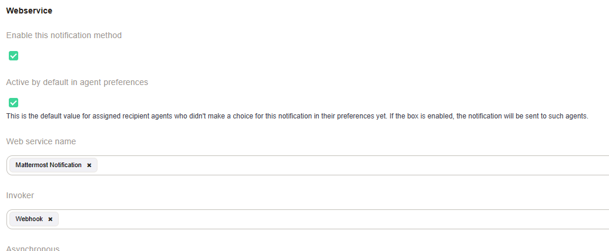
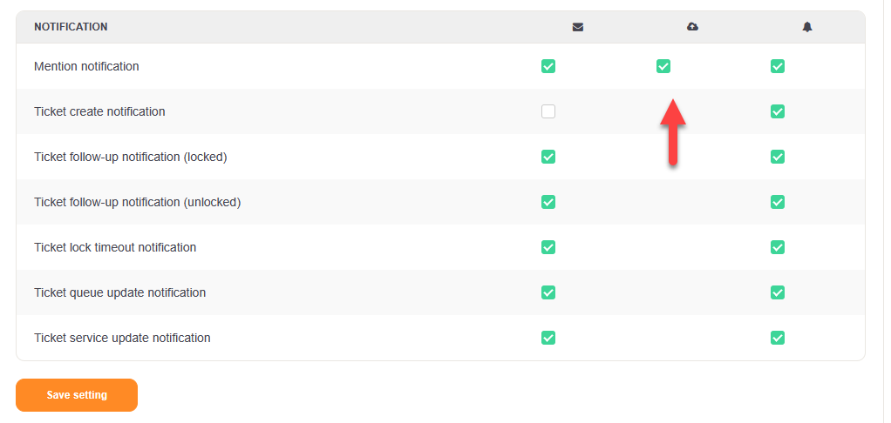

Web Service Notification Transport
##################################

.. _Ticket-Notification Configuration:

Ticket-Notification Configuration
~~~~~~~~~~~~~~~~~~~~~~~~~~~~~~~~~

For ticket notifications is a new transport method available: web service. Your are able to send notifications with anything what can be accessed with a web service. To help everyone with the configuration an example for :ref:`Mattermost<Example Web Service Mattermost>` is available.

Requirements
~~~~~~~~~~~~

- You need a web service with a requester and invoker. The invoker is called for every single notification and recipient. Since we don't know what your service is, we provide you as many data for each recipient.

Configuration
~~~~~~~~~~~~~

Multiple transport methods can be used in one ticket notification, or just e-mail or just a web service. The availabel settings should be easy to understand:

- **Webservice name** List of all available and enabled web services.
- **Invoker name** - List of all invoker of the selected web service.
- **Asynchronous** - How to execute the request, we recommend to use this option always.
- **Additional recipients** - For additional recipients, values from dynamic fields like `<OTRS_TICKET_DynamicField_xxx>` can be used.
- **Article visible for customer** - Creates an article, visibile to the customer, for the notification.

User preferences
****************

In the user preferences, `Notification Settings`, the web service notifications can be activated or deactivated if the notification is configured therefore.

Webservice Notification Request
*******************************

A separate request is executed for each recipient of the ticket notification, regardless of whether it is a regular or an additional recipient. The request contains all data of the invoker (use :ref:`Ticket::Generic <PageNavigation admin_webservices_invoker_index>`). And, as mentioned earlier details about the the recipient. 

Use the debugger to learn more about the data which is passed to the invoker.

.. code-block:: JSON
  :caption: Example JSON data

    "Event": {
      "Recipient": {
        "Realname": "",
        "Type": "Additional",
        "IsVisibleForCustomer": null,
        "UserAdditional": "info@znuny.com"
      },
      "NotificationContentType": "text/html",
      "NotificationSubject": "New Ticket Created: [Ticket#2021012710123456] Znuny says hi!",
      "Attachments": [],
      "UserEmail": "",
      "NotificationBody": "\n<!DOCTYPE html PUBLIC \"-//W3C//DTD XHTML 1.0 Transitional//EN\" \"http://www.w3.org/TR/xhtml1/DTD/xhtml1-transitional.dtd\">\n<html>\n<head>\n    <meta http-equiv=\"Content-Type\" content=\"text/html; charset=UTF-8\">\n</head>\n<body>\n A new ticket [ticket#2021012710123456] Znuny says hi! has been created.\n      \n    test\n     \n\n      \n</body>\n\n</html>\n",
      "UserCustomer": "",
      "TicketNumber": "2021012710123456",
      "UserAdditional": "info@znuny.com",
      "TicketID": "1"
    }
..

The object `Recipient` has always a field `Type`. This can be Agent, Customer or Additional. 

.. code-block:: JSON
  :caption: Example JSON for an agent

    "Event": {
      "Recipient": {
        "AdminCommunicationLogPageShown": "25",
        "AdminDynamicFieldsOverviewPageShown": "25",
        "ChangeTime": "2021-08-03 08:35:51",
        "CreateTime": "2021-08-03 08:35:51",
        "MattermostUsername": "roy",
        "Type": "Agent",
        "UserCreateNextMask": "",
        "UserEmail": "no-reply@test.znuny.com",
        "UserFirstname": "John",
        "UserFullname": "John Doe",
        "UserID": "2",
        "UserLastViewsLimit": "5",
        "UserLastViewsPosition": "Avatar",
        "UserLastname": "Doe",
        "UserLogin": "jd",
        "UserLoginFailed": "1",
        "UserMobile": "",
        "UserPw": "066b8d8eb3cc778d65e9f01202b844020a26a8c838bc7f12e72c446ae8f22345",
        "UserRefreshTime": "0",
        "UserTicketOverviewMediumPageShown": "20",
        "UserTicketOverviewPreviewPageShown": "15",
        "UserTicketOverviewSmallPageShown": "25",
        "UserTitle": "",
        "ValidID": "1"
      },
      "NotificationContentType": "text/html",
      "NotificationSubject": "New Ticket Created: [Ticket#2021012710123456] Znuny says hi!",
      "Attachments": [],
      "UserEmail": "",
      "NotificationBody": "\n<!DOCTYPE html PUBLIC \"-//W3C//DTD XHTML 1.0 Transitional//EN\" \"http://www.w3.org/TR/xhtml1/DTD/xhtml1-transitional.dtd\">\n<html>\n<head>\n    <meta http-equiv=\"Content-Type\" content=\"text/html; charset=UTF-8\">\n</head>\n<body>\n A new ticket [ticket#2021012710123456] Znuny says hi! has been created.\n      \n    test\n     \n\n      \n</body>\n\n</html>\n",
      "UserCustomer": "",
      "TicketNumber": "2021012710123456",
      "UserAdditional": "info@znuny.com",
      "TicketID": "1"
    }
..
