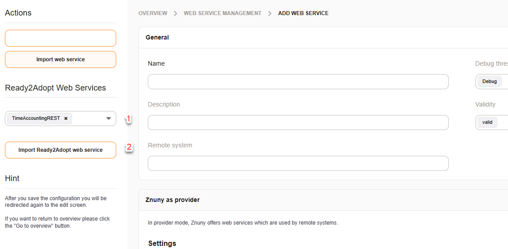

Provider
########
.. _PageNavigation admin_webservices_provider_index:

HTTP-Header Authentication 
**************************

To prevent revealing of information like passwords, usernames, etc, in the URL for HTTPD methods like GET it is possible to transfer the authentication fields in custom HTTP header. 

These headers are:

- X-OTRS-Header-UserLogin
- X-OTRS-Header-CustomerUserLogin
- X-OTRS-Header-SessionID
- X-OTRS-Header-Password
- X-OTRS-Header-ImpersonateAsUser

.. note:: The authentication feature `ImpersonateAsUser` is not included in this version.

Searching for a ticket
**********************

A ticket search operation is available wich provides an array of IDs.

Example Ticket Search Request
=============================

Request

.. code-block:: none

	curl -X POST \
	'https://zunny.exapmle.com/otrs/nph-genericinterface.pl/Webservice/Ticket/search' \
        --header 'Accept: */*' \
        --header 'User-Agent: Thunder Client (https://www.thunderclient.com)' \
        --header 'Content-Type: application/json' \
        --data-raw '{
          "Title": "%Hi%",
          "UserLogin": "tester",
          "Password": "tester"
        }'

Answer

.. code-block:: none

	{
		"TicketID":[
			"1",
			"324",
			"18"
		]
	}

TicketSearch Operation API
===========================

.. code-block:: none

    my $Result = $OperationObject->Run(
        # ticket number (optional) as STRING or as ARRAYREF
        TicketNumber => '%123546%',
        TicketNumber => ['%123546%', '%123666%'],
        # ticket title (optional) as STRING or as ARRAYREF
        Title => '%SomeText%',
        Title => ['%SomeTest1%', '%SomeTest2%'],
        Queues   => ['system queue', 'other queue'],
        QueueIDs => [1, 42, 512],
        # use also sub queues of Queue|Queues in search
        UseSubQueues => 0,
        # You can use types like normal, ...
        Types   => ['normal', 'change', 'incident'],
        TypeIDs => [3, 4],
        # You can use states like new, open, pending reminder, ...
        States   => ['new', 'open'],
        StateIDs => [3, 4],
        # (Open|Closed) tickets for all closed or open tickets.
        StateType => 'Open',
        # You also can use real state types like new, open, closed,
        # pending reminder, pending auto, removed and merged.
        StateType    => ['open', 'new'],
        StateTypeIDs => [1, 2, 3],
        Priorities  => ['1 very low', '2 low', '3 normal'],
        PriorityIDs => [1, 2, 3],
        Services   => ['Service A', 'Service B'],
        ServiceIDs => [1, 2, 3],
        SLAs   => ['SLA A', 'SLA B'],
        SLAIDs => [1, 2, 3],
        Locks   => ['unlock'],
        LockIDs => [1, 2, 3],
        OwnerIDs => [1, 12, 455, 32]
        ResponsibleIDs => [1, 12, 455, 32]
        WatchUserIDs => [1, 12, 455, 32]
        # CustomerID (optional) as STRING or as ARRAYREF
        CustomerID => '123',
        CustomerID => ['123', 'ABC'],
        # CustomerIDRaw (optional) as STRING or as ARRAYREF
        # CustomerID without QueryCondition checking.
        # The param CustomerID will be ignored when CustomerIDRaw is set.
        # The raw values will be quoted and combined with 'OR' for the query.
        CustomerIDRaw => '123 + 345',
        CustomerIDRaw => ['123', 'ABC','123 && 456','ABC % efg'],
        # CustomerUserLogin (optional) as STRING as ARRAYREF
        CustomerUserLogin => 'uid123',
        CustomerUserLogin => ['uid123', 'uid777'],
        # create ticket properties (optional)
        CreatedUserIDs     => [1, 12, 455, 32]
        CreatedTypes       => ['normal', 'change', 'incident'],
        CreatedTypeIDs     => [1, 2, 3],
        CreatedPriorities  => ['1 very low', '2 low', '3 normal'],
        CreatedPriorityIDs => [1, 2, 3],
        CreatedStates      => ['new', 'open'],
        CreatedStateIDs    => [3, 4],
        CreatedQueues      => ['system queue', 'other queue'],
        CreatedQueueIDs    => [1, 42, 512],
        # DynamicFields
        #   At least one operator must be specified. Operators will be connected with AND,
        #       values in an operator with OR.
        #   You can also pass more than one argument to an operator: ['value1', 'value2']
        DynamicField_FieldNameX => {
            Empty             => 1,                       # will return dynamic fields without a value
                                                          #     set to 0 to search fields with a value present.
            Equals            => 123,
            Like              => 'value*',                # "equals" operator with wildcard support
            GreaterThan       => '2001-01-01 01:01:01',
            GreaterThanEquals => '2001-01-01 01:01:01',
            SmallerThan       => '2002-02-02 02:02:02',
            SmallerThanEquals => '2002-02-02 02:02:02',
        },
        # article stuff (optional)
        MIMEBase_From    => '%spam@example.com%',
        MIMEBase_To      => '%service@example.com%',
        MIMEBase_Cc      => '%client@example.com%',
        MIMEBase_Subject => '%VIRUS 32%',
        MIMEBase_Body    => '%VIRUS 32%',
        # attachment stuff (optional, applies only for ArticleStorageDB)
        AttachmentName => '%anyfile.txt%',
        # use full article text index if configured (optional, default off)
        FullTextIndex => 1,
        # article content search (AND or OR for From, To, Cc, Subject and Body) (optional)
        ContentSearch => 'AND',
        # content conditions for From,To,Cc,Subject,Body
        # Title,CustomerID and CustomerUserLogin (all optional)
        ConditionInline => 1,
        # articles created more than 60 minutes ago (article older than 60 minutes) (optional)
        ArticleCreateTimeOlderMinutes => 60,
        # articles created less than 120 minutes ago (article newer than 60 minutes) (optional)
        ArticleCreateTimeNewerMinutes => 120,
        # articles with create time after ... (article newer than this date) (optional)
        ArticleCreateTimeNewerDate => '2006-01-09 00:00:01',
        # articles with created time before ... (article older than this date) (optional)
        ArticleCreateTimeOlderDate => '2006-01-19 23:59:59',
        # tickets created more than 60 minutes ago (ticket older than 60 minutes)  (optional)
        TicketCreateTimeOlderMinutes => 60,
        # tickets created less than 120 minutes ago (ticket newer than 120 minutes) (optional)
        TicketCreateTimeNewerMinutes => 120,
        # tickets with create time after ... (ticket newer than this date) (optional)
        TicketCreateTimeNewerDate => '2006-01-09 00:00:01',
        # tickets with created time before ... (ticket older than this date) (optional)
        TicketCreateTimeOlderDate => '2006-01-19 23:59:59',
        # ticket history entries that created more than 60 minutes ago (optional)
        TicketChangeTimeOlderMinutes => 60,
        # ticket history entries that created less than 120 minutes ago (optional)
        TicketChangeTimeNewerMinutes => 120,
        # tickets changed more than 60 minutes ago (optional)
        TicketLastChangeTimeOlderMinutes => 60,
        # tickets changed less than 120 minutes ago (optional)
        TicketLastChangeTimeNewerMinutes => 120,
        # tickets with changed time after ... (ticket changed newer than this date) (optional)
        TicketLastChangeTimeNewerDate => '2006-01-09 00:00:01',
        # tickets with changed time before ... (ticket changed older than this date) (optional)
        TicketLastChangeTimeOlderDate => '2006-01-19 23:59:59',
        # ticket history entry create time after ... (ticket history entries newer than this date) (optional)
        TicketChangeTimeNewerDate => '2006-01-09 00:00:01',
        # ticket history entry create time before ... (ticket history entries older than this date) (optional)
        TicketChangeTimeOlderDate => '2006-01-19 23:59:59',
        # tickets closed more than 60 minutes ago (optional)
        TicketCloseTimeOlderMinutes => 60,
        # tickets closed less than 120 minutes ago (optional)
        TicketCloseTimeNewerMinutes => 120,
        # tickets with closed time after ... (ticket closed newer than this date) (optional)
        TicketCloseTimeNewerDate => '2006-01-09 00:00:01',
        # tickets with closed time before ... (ticket closed older than this date) (optional)
        TicketCloseTimeOlderDate => '2006-01-19 23:59:59',
        # tickets with pending time of more than 60 minutes ago (optional)
        TicketPendingTimeOlderMinutes => 60,
        # tickets with pending time of less than 120 minutes ago (optional)
        TicketPendingTimeNewerMinutes => 120,
        # tickets with pending time after ... (optional)
        TicketPendingTimeNewerDate => '2006-01-09 00:00:01',
        # tickets with pending time before ... (optional)
        TicketPendingTimeOlderDate => '2006-01-19 23:59:59',
        # you can use all following escalation options with this four different ways of escalations
        # TicketEscalationTime...
        # TicketEscalationUpdateTime...
        # TicketEscalationResponseTime...
        # TicketEscalationSolutionTime...
        # ticket escalation time of more than 60 minutes ago (optional)
        TicketEscalationTimeOlderMinutes => -60,
        # ticket escalation time of less than 120 minutes ago (optional)
        TicketEscalationTimeNewerMinutes => -120,
        # tickets with escalation time after ... (optional)~
        TicketEscalationTimeNewerDate => '2006-01-09 00:00:01',
        # tickets with escalation time before ... (optional)
        TicketEscalationTimeOlderDate => '2006-01-09 23:59:59',
        # search in archive (optional, default is not to search in archived tickets)
        SearchInArchive => 'AllTickets',    # 'AllTickets' (normal and archived) or 'ArchivedTickets' (only archived)
        # OrderBy and SortBy (optional)
        OrderBy => 'Down',  # Down|Up
        SortBy  => 'Age',   # Owner|Responsible|CustomerID|State|TicketNumber|Queue|Priority|Age|Type|Lock
                            # Changed|Title|Service|SLA|PendingTime|EscalationTime
                            # EscalationUpdateTime|EscalationResponseTime|EscalationSolutionTime
                            # DynamicField_FieldNameX
                            # TicketFreeTime1-6|TicketFreeKey1-16|TicketFreeText1-16
        # OrderBy and SortBy as ARRAY for sub sorting (optional)
        OrderBy => ['Down', 'Up'],
        SortBy  => ['Priority', 'Age'],
        },
    );
    $Result = {
        Success      => 1,                                # 0 or 1
        ErrorMessage => '',                               # In case of an error
        Data         => {
            TicketID => [ 1, 2, 3, 4 ],
        },
    };

Sending e-mails 
***************

When an article is created with the operation **TicketCreate** or **TicketUpdate** can now additionally be sent via e-mail.

The following parameters are available for this purpose:

.. code-block:: none
	
	ArticleSend => 1,
	To          => 'email@example.com',  # E-mail address to which the item should be sent.
	Cc          => 'email2@example.com', # Optional 
	Bcc         => 'email3@example.com', # Optional

Signing or encrypting with S/MIME or PGP is also possible:

.. code-block:: none

	# Signing and encryption, only used when ArticleSend is set to 1
	'Sign' => {
		'Type'    => 'PGP',
		'SubType' => 'Inline|Detached',
		'Key'     => '81877F5E',
		'Type'    => 'SMIME',
		'Key'     => '3b630c80',
	},
	'Crypt' => {
		'Type'    => 'PGP',
		'SubType' => 'Inline|Detached',
		'Key'     => '81877F5E',
		'Type'    => 'SMIME',
		'Key'     => '3b630c80',
	},

..

.. code-block:: JSON
	:caption: request example

	"Article": {
		"ArticleSend": "1",
		"To": "email@example.com",
		"Body": "We welcome you to Znuny, our ticketing solution...",
		"Charset": "utf-8",
		"CommunicationChannelID": "1",
		"ContentType": "text/plain; charset=utf-8",
		"IsVisibleForCustomer": "1",
		"MimeType": "text/plain",
		"Subject": "Znuny says hi!"
	}

..

Time Accounting operation
*************************

This operation returns the accounted times which a specific agent has entered. Besides the start and end date, the credentials of an agent with rw permission for the group `timeaccounting_webservice` are required. The timezone for the start and end date is the same like you system configuration setting for `OTRSTimeZone`.

.. code-block:: JSON
	:caption: request example

	{
		"TimeAccountingStart": "2021-01-01 10:00:00",
  		"TimeAccountingEnd": "2022-01-01 10:00:00",
  		"TimeAccountingUserLogin": "root@localhost",
  		"UserLogin": "user",
  		"Password": "password",
	},

..

.. code-block:: JSON
	:caption: response example

	"TimeAccountingResult": [
	        {
	            "TicketNumber": 	"2021012710123456",
	            "TicketCustomerID": "CustomerUserID"
	            "TicketTitle":  	"Znuny says hi!",
	            "Queue":        	"Raw",
	            "Created":      	"2021-08-05 08:00:00",
	            "TimeUnit":     	"120.00",
	        },
	        {
	            "TicketNumber": 	"2021012710123456",
	            "TicketCustomerID": "CustomerUserID"
	            "TicketTitle":  	"Znuny says hi!",
	            "Queue":        	"Raw",
	            "Created":      	"2021-08-05 08:00:00",
	            "TimeUnit":     	"30.00",
	        },
	    ],

There is a web service ready when you add a new web service. You might choose between REST and SOAP as transport method:

And to bring you up to speed, here's a small client in PowerShell:

.. code-block:: powershell

    $uri  = "https://YOURFQDN/otrs/nph-genericinterface.pl/Webservice/TimeAccountingREST"
    $headers = @{}
    $headers.Add("Accept", "application/json")
    $headers.Add("Content-Type", "application/json")
    
    $Request = @{
        UserLogin = "yourusername"
        Password  = "AverYSavePassW0rD"
        TimeAccountingUserLogin = "theagentlogin"
        TimeAccountingStart = "2021-07-01 00:00"
        TimeAccountingEnd = "2021-08-01 00:00"
    }
    $json = $Request | ConvertTo-Json
    $Response = Invoke-RestMethod -Method Post -Headers $Headers -Uri "$uri/TimeAccountingGet" -Body $json
    
    $Response | ConvertTo-Json | Write-Host

..

OutOfOffice operation
**********************

the operation **User::OutOfOffice** allows you to set and remove the out of office preferences for agents. All you need is a CVS file containing the information. Usually, this is generated with data form other system like MS Exchange, HR systems, etc.

The CSV file requires a specific header with the entries:

- **UserEmail** or **UserLogin** to specify the agent
- **EndTime** or **EndDate**
- **StartTime** or **EndData**
- **Enabled** contains a yes or no to enable or disable the out of office state

The entries should be enclosed by **"** and separated with an **,** 

.. code-block:: 
	:caption: CSV example 1

	"UserEmail","EndTime","StartTime","Enabled"
	"agent_email@your.tld","30.03.2016 01:02:03","20.03.2016 01:02:03","yes"

..

.. code-block:: 
	:caption: CSV example 2

	"UserLogin","EndDate","StartDate","Enabled"
	"agent1","2016-03-30","2016-03-20","yes"

..

Here is an example data for a valid request:

.. code-block:: JSON

	{
	  "OutOfOfficeEntriesCSVString": "UserEmail,OutOfOffice,StartDate,EndDate\r\nroot@localhost,1,,\r\njd@test.znuny.com,1,2021-08-01,2021-07-31\n",
	  "UserLogin": "user",
	  "Password": "password"
	}

...

The user in the request requires rw permission to the group admin.

.. code-block:: Powershell
	:caption: PowerShell example request for this operation

	$uri  = "https://YOURFQDN/otrs/nph-genericinterface.pl/Webservice/OutOfOffice"

	$headers = @{}
	$headers.Add("Accept", "application/json")
	$headers.Add("Content-Type", "application/json")

	$CSV = Get-Content outofoffice.csv -Raw | Out-String

	$Request = @{
	    UserLogin = "root@localhost"
	    Password  = "root"
	    OutOfOfficeEntriesCSVString = $CSV
	}
	$json = $Request | ConvertTo-Json
	$Response = Invoke-RestMethod -Method Post -Headers $Headers -Uri "$uri/OutOfOffice" -Body $json

	$Response | ConvertTo-Json | Write-Host

..
