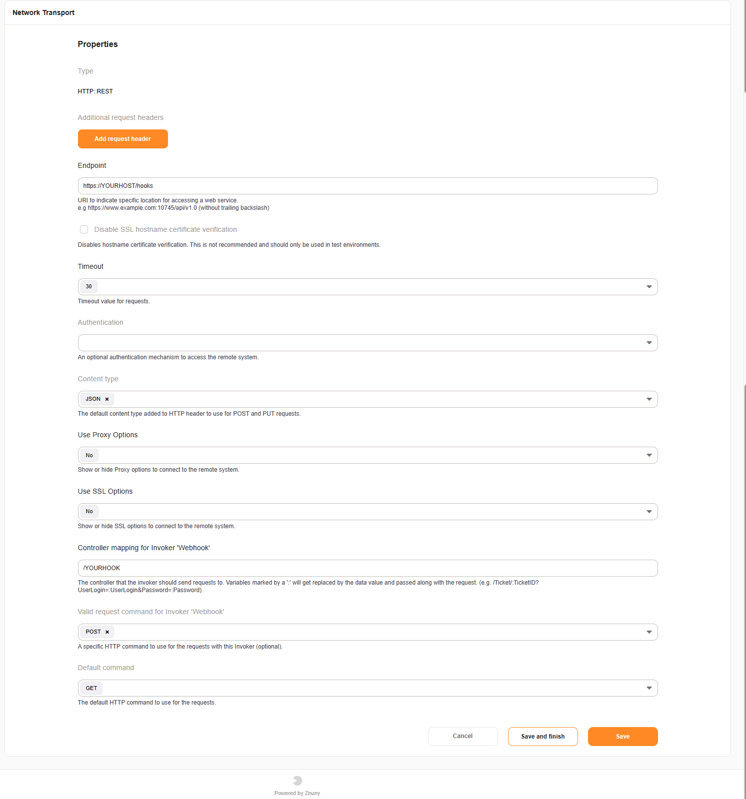

Requester
#########

HTTP::REST options
******************

There are some features added to the HTTP::REST transport:

SSL hostname verification
~~~~~~~~~~~~~~~~~~~~~~~~~

Sometimes it requires to disabled the verification of the hostname for SSL connections. This should setting be only enabled if you're 100% certain.

Content-Type
~~~~~~~~~~~~

By default the outgoing request will be JSON. For special use-cases the request can be transformed into the content-type `application/x-www-form-urlencoded`.
Withversion 6.2 the content-type text/xml is available.

Additional request headers
~~~~~~~~~~~~~~~~~~~~~~~~~~

If needed, custom HTTP headers can be added to the request. They can also overwrite the default headers which are generated, like `Content-Type`. This option might be useful for certain situation where you need additional headers. Authentication with API keys might be on scenario. The value can be a literal, a system configuration (<OTRS_CONFIG_*>) or a combination of both.

