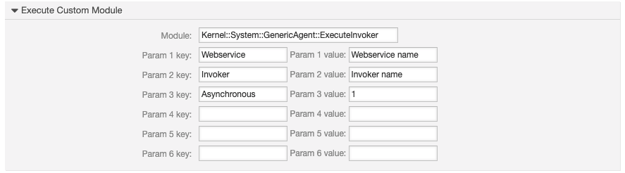

Special Features
################

GenericAgent Module
*******************

Invokers can be called with a GenericAgent custom module. This might be helpful, e.g. if you like to execute an invoker in regular intervals. Like every other GenericAgent this one can be run manually, via automatic or event execution. The module is called for every single ticket which matches the ticket and article filter.

Use **Kernel::System::GenericAgent::ExecuteInvoker** as the module.

.. list-table:: 
   :widths: 15 20 35 5
   :header-rows: 1

   * - Param 
     - Example value
     - Description
     - Mandatory
   * - Webservice
     - Pizzaservice
     - Name of the web service
     - Yes
   * - Invoker
     - OrderPizza
     - Name of the invoker
     - Yes
   * - Asynchronous
     - 1
     - Type of execution
     - No
..

Transition Action ExecuteInvoker
********************************

To execute an invoker from a process the transition action **ExecuteInvoker** can be used.

Find more in the section :ref:`Process Management<TransitionAction ExecuteInvoker>`.

