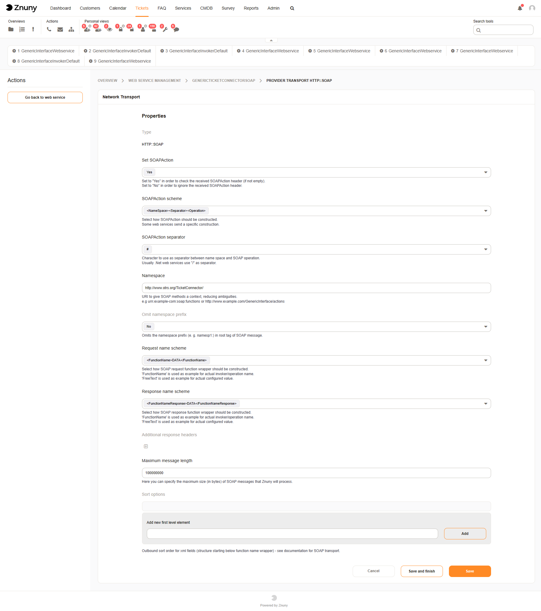
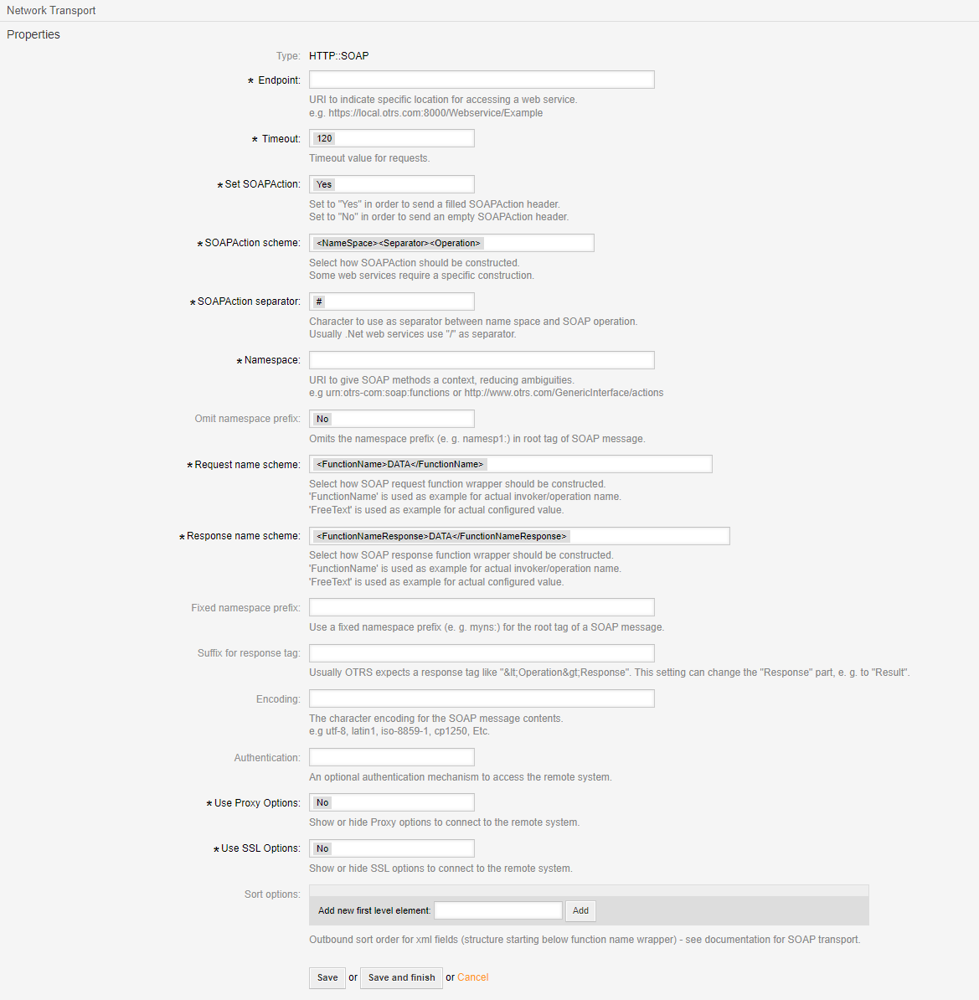
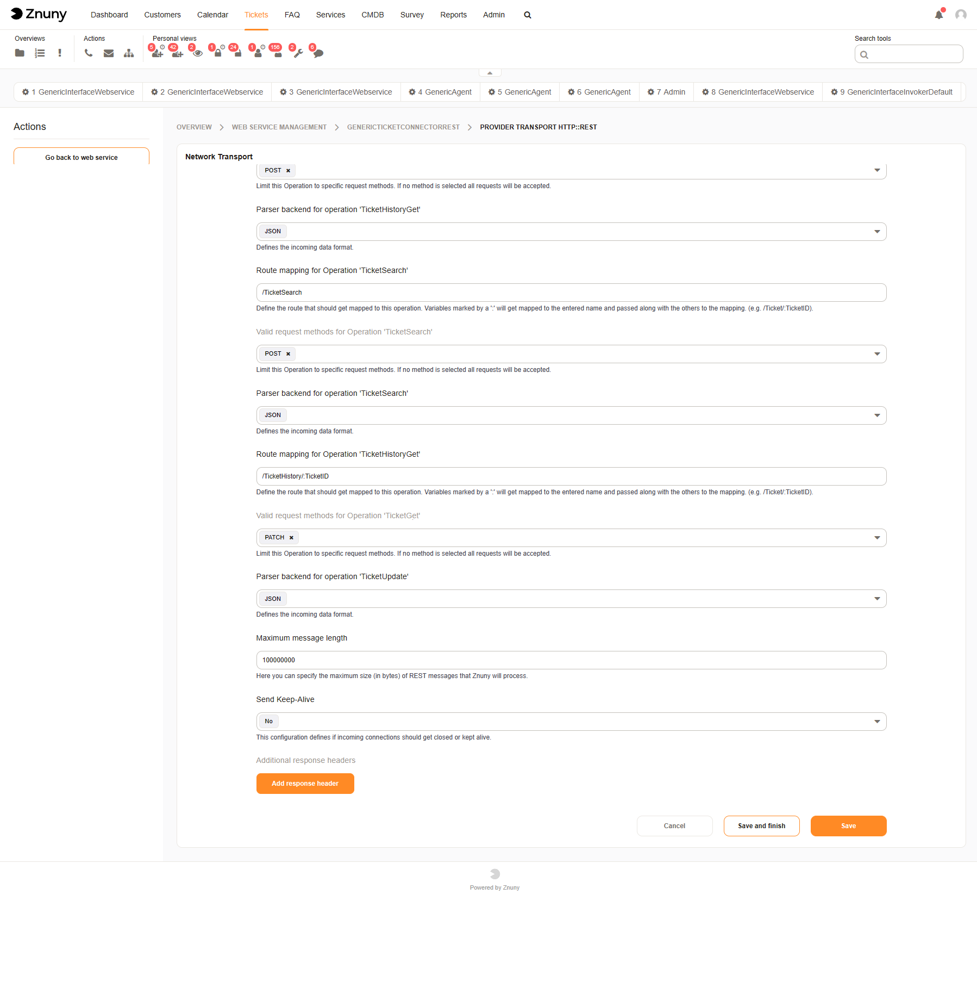

Network Transport Configuration
###############################
.. _PageNavigation admin_webservices_transport_index:

The software supports two different types of transports per default. REST and SOAP. Below you will find the differences in the configuration.

.. note::

    Other transports may be delivered with specific add-ons and customizations. Please refer to the documentation for configuration of these transports as they will differ.

Any single webservice ma have one requester and one invoker transport configuration. These need not use the same protocol.

SOAP
****

Read more about `SOAP <https://de.wikipedia.org/wiki/SOAP>`_ online at Wikipedia.

SOAP Provider Transport
=======================

Set SOAPAction
    Check or ignore the SOAPAction header (if not empty).

SOAPAction scheme:
    Select how SOAPAction should be constructed. Some web services send a specific construction.

SOAPAction separator
    Character to use as separator between name space and SOAP operation. Usually .Net web services use "/" as separator.

Namespace:
    URI to give SOAP methods a context, reducing ambiguities.

.. note::

    An exapmle ``urn:otrs-com:soap:functions`` or ``http://www.otrs.com/GenericInterface/actions``

Omit namespace prefix
    Omits the namespace prefix (e. g. namesp1:) in root tag of SOAP message.

Request name scheme
    Select how SOAP request function wrapper should be constructed.

Response name scheme:
    Select how SOAP response function wrapper should be constructed.

Additional response headers
    Add response header.

Maximum message length
    Here you can specify the maximum size (in bytes) of SOAP messages that Znuny will process.

Sort options
    Outbound sort order for xml fields (structure starting below function name wrapper) - see documentation for SOAP transport.

SOAP Requester Transport
=========================

Name
    The name will be the SOAP Action called.

Description
    Description for the administrator of what the invoker does.

Invoker backend
    This invoker backend module will be called to prepare the data to be sent to the remote system, and to process its response data.

Mapping for outgoing request data
    The data from the invoker of Znuny will be processed by this mapping, to transform it to the kind of data the remote system expects.

Mapping for incoming response data
    The response data will be processed by this mapping, to transform it to the kind of data the invoker of Znuny expects.

Event Triggers
    The event to trigger the invoker.

Add Event Trigger
    Add the event to trigger the request by selecting the event object and event name and click on the "+" button.

.. important::

    Asynchronous event triggers are handled by the Znuny Scheduler Daemon in background (recommended). Synchronous event triggers would be processed directly during the web request.

Add all attachments
    Add all attachments to invoker payload.

REST
****

Read more about `REST <https://en.wikipedia.org/wiki/Representational_state_transfer>`_ online at Wikipedia

REST Provider Transport
=======================

Route mapping for Operation 'GetATicket':
    In this example we use /ticket/:TicketID

.. note::

    This setting first appear when you've configured an operation for use.

    Define the route that should get mapped to this operation. Variables marked by a ':' will get mapped to the entered name and passed along with the others to the mapping. (e.g. /Ticket/:TicketID).

.. important::

    If you rename an operation, this setting will be lost and you must configure it again for the new name.

Valid request methods for Operation 'GetATicket'
    Limit this Operation to specific request methods. If no method is selected all requests will be accepted.

.. note::

    This setting first appear when you've configured an operation for use.

Parser backend for operation 'GetATicket'
    Defines the incoming data format.

.. note::

    This setting first appear when you've configured an operation for use.

Maximum message length
    Here you can specify the maximum size (in bytes) of REST messages that Znuny will process.

Send Keep-Alive
    This configuration defines if incoming connections should get closed or kept alive.

Additional request headers
    Add request header(s)

REST Requester Transport
========================

.. image:: images/rest_transport_requester.png
    :alt: Image REST requester Transport

Endpoint
    URI to indicate specific location for accessing a web service.

.. note::
    
    An example: ``https://www.otrs.com:10745/api/v1.0`` (do not use a trailing backslash)

Disable SSL hostname certificate verification
    Disables hostname certificate verification. This is not recommended and should only be used in test environments.

Timeout
    Timeout value for requests.

Authentication
    An optional authentication mechanism to access the remote system.

Content type
    The default content type added to HTTP header to use for POST and PUT requests.

Use Proxy Options
    Show or hide Proxy options to connect to the remote system.

Use SSL Options
    Show or hide SSL options to connect to the remote system.

Controller mapping for Invoker 'UpdateAThirdParty`
    The controller that the invoker should send requests to. Variables marked by a ':' will get replaced by the data value and passed along with the request. (e.g. /Ticket/:TicketID?UserLogin=:UserLogin&Password=:Password).

Valid request command for Invoker 'UpdateAThirdParty'
    A specific HTTP command to use for the requests with this Invoker (optional).

Default command
    The default HTTP command to use for the requests.

SSL Options
~~~~~~~~~~~

Client Certificate
    The full path and name of the SSL client certificate file (must be in PEM, DER or PKCS#12 format).

.. note::

    An example ``/opt/otrs/var/certificates/SOAP/certificate.pem``

Client Certificate Key
    The full path and name of the SSL client certificate key file (if not already included in certificate file).

.. note::

    An example ``/opt/otrs/var/certificates/SOAP/key.pem``

Client Certificate Key Password
    The password to open the SSL certificate if the key is encrypted.

Certification Authority (CA) Certificate
    The full path and name of the certification authority certificate file that validates SSL certificate.

.. note::

    An example ``/opt/otrs/var/certificates/SOAP/CA/ca.pem``

Certification Authority (CA) Directory
    The full path of the certification authority directory where the CA certificates are stored in the file system.

.. note::

    An example ``/opt/otrs/var/certificates/SOAP/CA``

Authentication Options
======================
.. _PageNavigation admin_webservices_transport_authentication:

For SOAP, you can use HTTPBasic Auth, and provide a user name and password.

For REST, you can additionally use a JWT Token.

JSON Web Token (JWT) Authentication Settings
~~~~~~~~~~~~~~~~~~~~~~~~~~~~~~~~~~~~~~~~~~~~

Supported Algorithms
^^^^^^^^^^^^^^^^^^^^

* RS256
* RS384
* RS512

TTL
    TTL (time to live) in seconds for the Token. This value will be used to calculate the expiration time which will be available in placeholders ExpirationDateTimestamp and ExpirationDateString.

Payload
    Payload for JWT.

.. note::

    Key Value Pairs

    These must be semi-colon separated.
    
    Key1=Value1;Key2=Value2;Key3=Value3

Available Placeholders
    Placeholders can be used in the payload. These must be prefixed with OTRS_JWT.

.. note::

  * ExpirationDateTimestam
  * ExpirationDateString

  Additionally if X.509 certificate support is present, you may use the following placeholders: 
  
  * CertSubject
  * CertIssuer
  * CertSerial
  * CertNotBefore
  * CertNotAfter
  * CertEmail
  * CertVersion

.. note::

    Placeholder usage example: Key1=<OTRS_JWT_ExpirationDateTimestamp>

Additional header data
    Additional header data for JWT.

.. note::

    Key Value Pairs

    These must be semi-colon separated.
    
    Key1=Value1;Key2=Value2;Key3=Value3

.. note::

  * ExpirationDateTimestam
  * ExpirationDateString

  Additionally if X.509 certificate support is present, you may use the following placeholders: 
  
  * CertSubject
  * CertIssuer
  * CertSerial
  * CertNotBefore
  * CertNotAfter
  * CertEmail
  * CertVersion

.. note::

    Placeholder usage example: Key1=<OTRS_JWT_ExpirationDateTimestamp>
