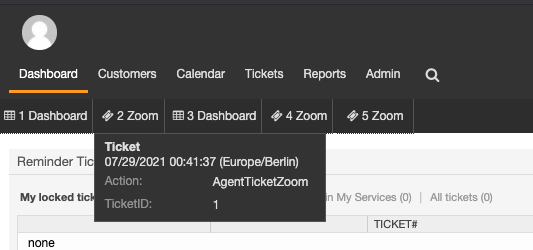
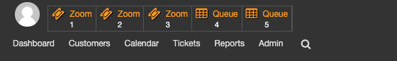

Last views
###########
.. _PageNavigation agentinterface_lastviews_index:

.. versionadded:: 6.1

Last views is a feature to give agents a quick access to recently used objects. 
It is build for power users, to enable fast context switches between the several 
tickets.

The configuration can be found in the "Agent preferences", section "Misc"
For more options check the Sysconfig options below.

.. note:: This feature is disabled by default. Every agent can select the objects one wants to use.

Configuration options - User
--------------------------------

Last view limit
----------------

There is a limit for last view elements. It should be set to a reasonable value, which fits your screen. 

Don't be a tab messie ;) 

Last view position
------------------

The position of the last view can be selected from the following options:

**Avatar**

Shows the last viewed objects, when you click the avatar icon.

.. note:: You may need to log out and log in again, after you change the settings. 

.. image:: images/avatar.png
         :alt: avatar
         :width: 50%

**Menu Bar**

Shows a menu bar right above the menu bar.

**Tool Bar**

Shows a separate toolbar next to the avatar.

**Available objects**:

- Admin Views
- Agent Views
- Appointment Views
- Calendar Views
- Customer Views
- CustomerUser Views
- FAQ Views
- Preferences Views
- Statistics Views
- Ticket creation 
- Ticket overview
- Ticket

Configuration options - Sysconfig (Admin)
--------------------------------------------
