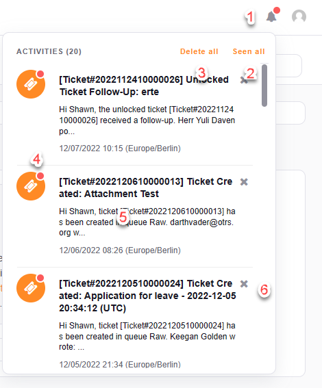

Activity Notifications
######################
.. _PageNavigation agentinterface_activitymenu_index:

The new activity menu in as additional option to receive notifications. In the :ref:`personal settings <PageNavigation agentinterface_personalsettings_index>`.

The activity menu offers you the opportunity to receive notifications directly in the frontend. Usage is as follows

1. Click on the bell to see all notifications.
2. Seen all will mark all notifications as seen.
3. Delete all will delete all notifications.
4. Indicator, that the notification is new.
5. With a click on the notification, navigate to the object of the notification.
6. Delete an individual notification.

