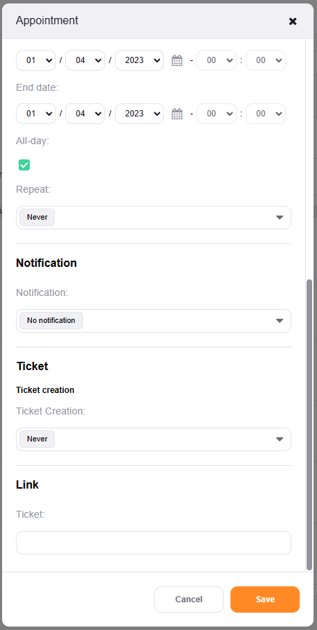
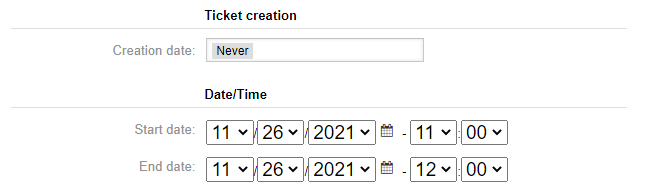
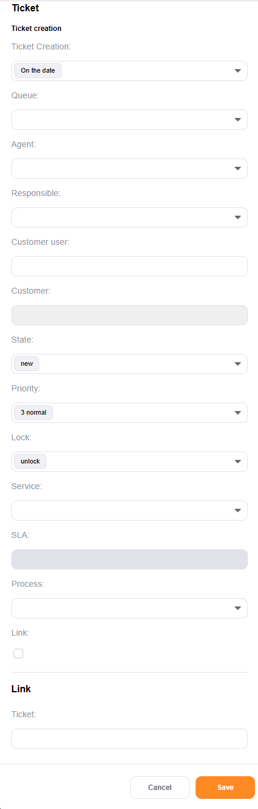

Adding Calendar Events
#######################
.. _PageNavigation agentinterface_appointments_index:

Appointment Create Screen
**************************

Ticket Creation
===============

.. versionadded:: 6.3

Create a ticket based upon the calendar entry with this option.

The options for creating a ticket are:

* Never
* Relative period
* On the date

**Creation Date:**

Never
    Default. The appointment creates no ticket.

Relative period
    This setting creates a ticket relative to the appointment start and end settings.

.. image:: images/AppointmentMaskCreationRelativeDate.png
    :alt: Appointment Mask

Time
    Choosing **relative period** shows this field. 
    
    The increments available are:

    * days
    * hours
    * minutes
    
    The relativity to the appointment can be:

    * before begin
    * after begin 
    * before end
    * after end

on the date
    Create a ticket on this date.

**Ticket Settings:**

Queue
    This setting determines the ticket's destination queue. The list respects user permissions. For multiple selected queues, each queue gets a ticket.

Owner
    Optionally set an owner if only one queue is selected. Setting no user sets the owner to the default user (ID=1.

Customer user
    Optionally set the ticket's customer.

Status
    Optionally set the ticket's status.

Priority
    Optionally set the ticket's priority. Default is 3 normal.

Lock
    Optionally unlock the created ticket if an owner was selected. Use this to unlock tickets assigned to an owner.

Type
    Optionally set the ticket's type. Activate ``Ticket::Type`` in the system configuration.

Service
    Optionally set the ticket's service. Activate ``Ticket::Service`` in the system configuration. The customer selected affects the values shown.

Process
    Start a process by selecting the name of an active process. If the process is deactivated or set to fade away at any time, this results in a non-process. See the logs for information about the error.

Title
    The appointment's title becomes the ticket's title.

Description
    The appointment's description becomes the ticket's first article body.

Link
    Optionally link created tickets to the appointment.
