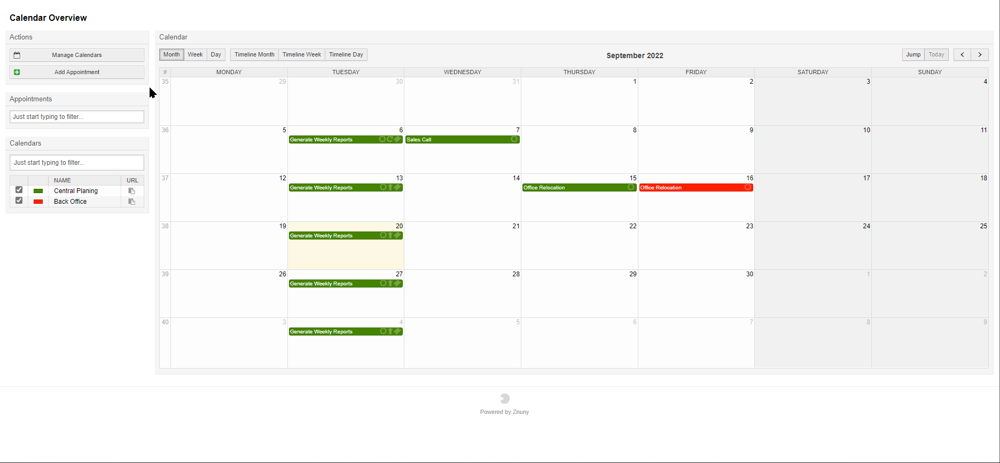
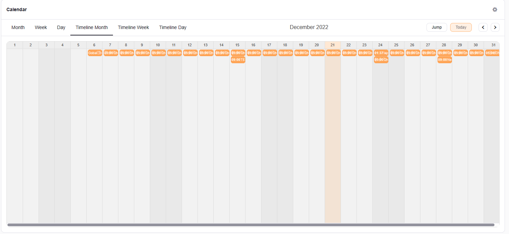

Calendar Overview
#################
.. _PageNavigation agentinterface_appointments_overview:

Overview Types
**************

You may view the appointments of the selected calendars by choosing from one of the following views:

* Month
* Week
* Day

Additionally, you can choose the timeline view of each variation above.

As an administrator, you can use the manage calendar link under the actions menu to create calendars or change calendar settings and permissions.

Overview Filters
****************

Appointment Filter
==================

You may use the appointment filter, to track down important appointments in full calendars. The filter for appointments searches in the comments or title filed. Only the appointments matching the filter will be shown.

.. _CalendarOverview filter_appointment:
.. versionadded:: v6.4.3

    The appointment filter was added to help you filter for your most important appointments.      

Calendar Filter
================

Filter the list of available calendars.

By selecting or deactivating the checkbox, you can view the calendar appointments, or hide them.

Editing Appointments
********************

Edit appointments by double clicking on them (see ::ref:`Adding Calendar Events <PageNavigation agentinterface_appointments_index>` ), or simply dragging and dropping the appointments directly on the calendar.

Navigating The Calendar
***********************

At the top right of the overview, you can use the *Today* link to jump to the current day, week, or month, depending on the selected view type. Use *Jump* to navigate to a certain date, or just page though the days, weeks, and months respectively using the paging arrows.

