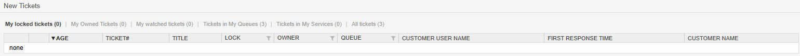
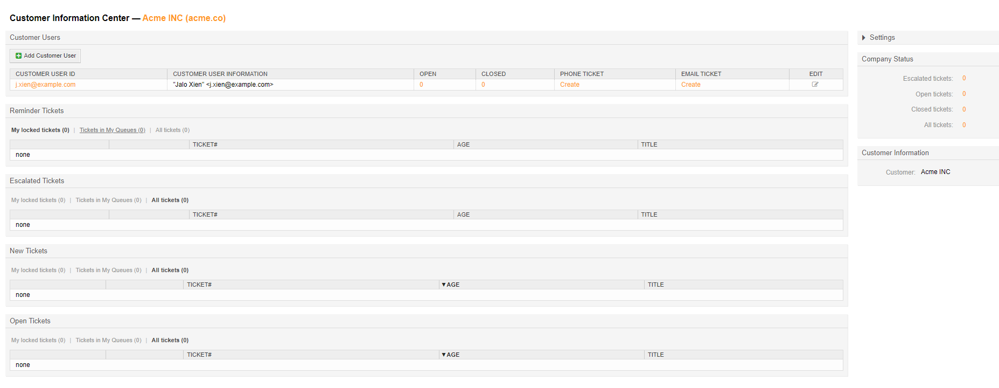

Agent Dashboards
################

.. _PageNavigation agentinterface_dashboards_index:

The default action after login is the user dashboard. This dashboard offers summary information about tickets in the system. The following dashboards are available per default.

Tickets
*******

These are the default dashboard widgets for tickets.

There is also a set of filters in the header of each widget.

* Reminder Tickets = All tickets set to reminder
* Escalated Tickets = All tickets with service times which are escalated
* New Tickets = All new tickets
* Open Tickets = All tickets in an open status
* Last Mentions = Tickets where a the user is mentioned

.. seealso::

    Read more in :ref:`Ticket Mentions View <PageNavigation_agentinterface_ticketviews_ticketmention_index>`

.. versionadded:: 6.4
   Last Mentions

Each ticket widget has a system default set of available ticket and dynamic fields columns, and can individually configured from there.
Additionally, each can be individually configured by the user. Setting a filter allows you to be more specific in which tickets you would like to see based on the shown columns.

* My Locked
* My owned
* Tickets in my queues
* All tickets

.. versionadded:: 6.4
   My owned filter.

Optionally, if the features are enabled, you will see.

* My watched tickets
* Ticket in my services

Customer Information Center
***************************

All the available ticket widgets mentioned above, with the exception or Last Mentions, are available and independently configurable in the customer information center.

The **Customer Information Center** gives you access to all customer user data and tickets for an individual customer. 

A user can create tickets for our customer user directly from this screen and additionally add customer users to the customer via this screen.

Adding a customer user redirects the normal agent to the administration section of the software without having to have administrator access.

When using the add a customer feature the CustomerID will automatically be pre-populated.

.. seealso::

    Read more in :ref:`Manage Customers <PageNavigation usermangement_customer_users_index>`.

Customer User Information Center
*********************************

Like the customer information center, there is a customer user information center, which centers it's dashboards around tickets filtered to an individual customer user. All dashboards are available here as well, with the exception of adding customer user.