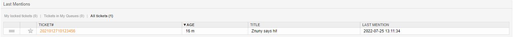

Agent Dashboards
################

.. _PageNavigation agentinterface_dashboards_index:

Recent Mentions
***************

In the recent mentions dashboard, you will see a list of all tickets you're mentioned in.

**You can filter between:**

* Locked Tickets
* In My Queues
* In My Services
* All Tickets

.. seealso::

    Read more in :ref:`Ticket Mentions View <PageNavigation_agentinterface_ticketviews_ticketmention_index>`

Customer Information Center
***************************

The **Customer Information Center** gives you access to all customer user data and tickets for an individual customer. 

.. image:: images/customer_information_center_overview.png
    :alt: Customer User Information Center Image

A user can create tickets for our customer user directly from this screen and additionally add customer users to the customer via this screen.

Adding a customer user redirects the normal agent to the administration section of the software without having to have administrator access.

When using the add a customer feature the CustomerID will automatically be pre-populated.

.. seealso::

    Read more in :ref:`Manage Customers <PageNavigation usermangement_customer_users_index>`.
