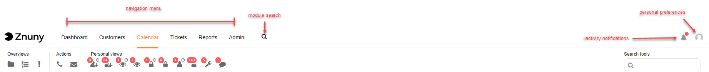

Agent Interface
###############

Your Znuny may differ depending upon modules, permissions, and setup, but the entry point for all agents is by default the **Agent Dashboard**.

Interface
*********

Upon logging in, you will see the **Agent Dashboard**. There are header elements on the screen which are static and allow you to:

* Navigate
* Search
* Set Personal Settings

You see the header elements below.

In the following sections, different parts of the interface will be explained.

Overviews:

.. toctree::
   :maxdepth: 3

   overviews/index

Ticket screens

.. toctree::
   :maxdepth: 3

   ticketviews/index

Module Screens:

.. toctree::
   :maxdepth: 3

   appointments/index

Toolbars:

.. toctree::
   :maxdepth: 3

   toolbars/index

Special Views:

.. toctree::
   :maxdepth: 3

   LastViews/index

Personal Setting:

.. toctree::
   :maxdepth: 3

   personalsettings/index

Dashboards:

.. toctree::
   :maxdepth: 3

   dashboards/index
