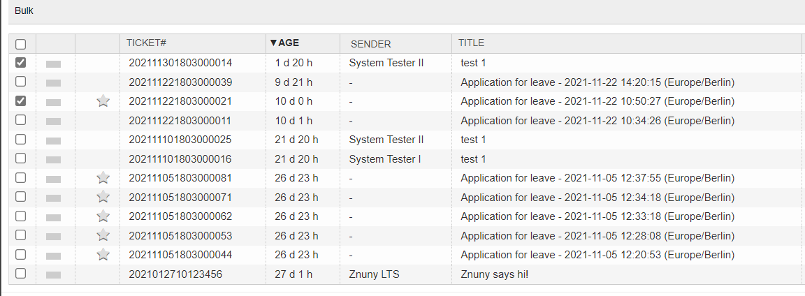
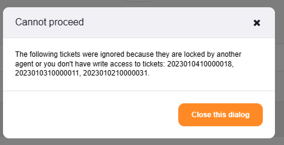
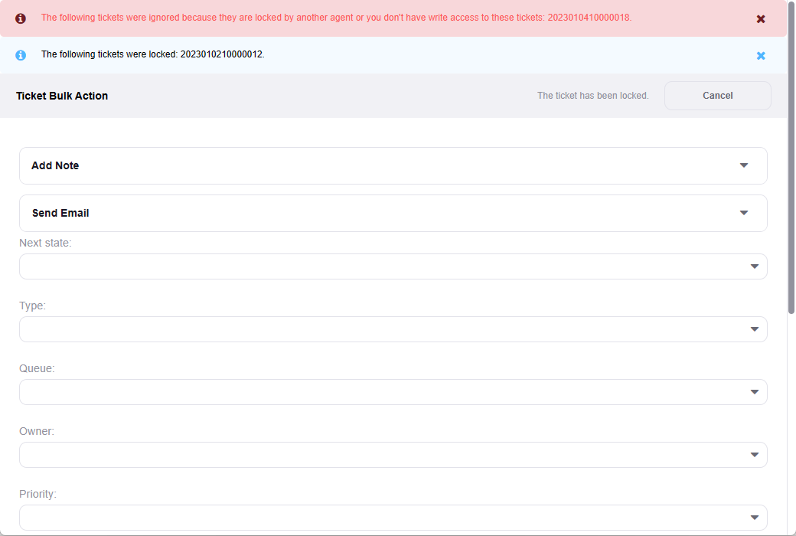
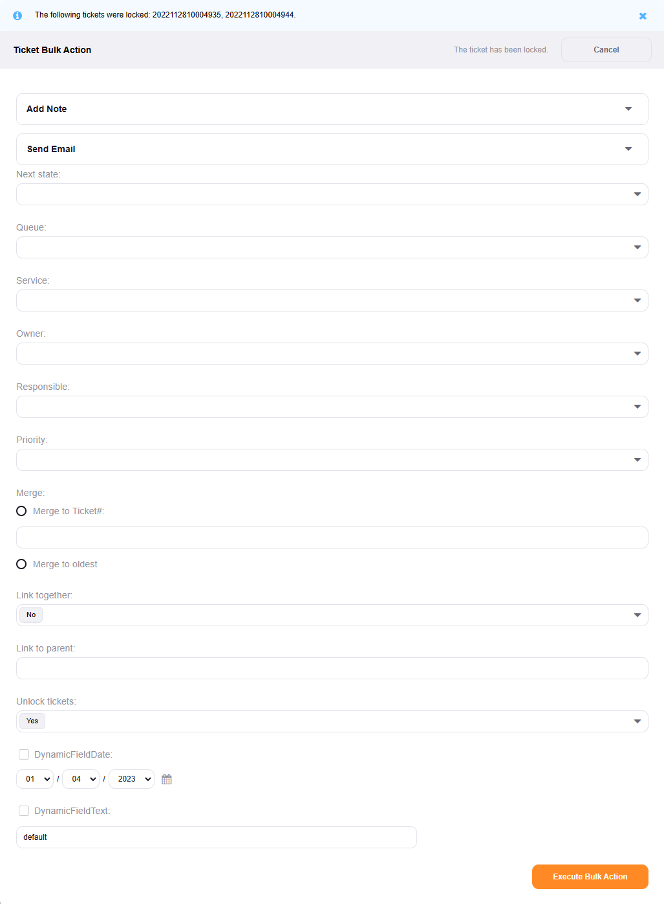

Perform a Bulk Action
#####################
.. _PageNavigation agentinterface_overviews_agentticketbulk:

General Features
****************

In all ticket overviews, there are shared features.

Bulk Actions
=============
.. _Znuny4OTRS-AdvancedBulkAction:

.. versionadded:: 6.3
    
A bulk action performs changes to ticket data for all selected tickets.

Selecting tickets can be done by using the checkbox on the left side of the list of tickets. There is a select-all box at the top of each page.

Tickets must be lockable for the user. To lock a ticket, the user must have RW permissions in the queue and, the ticket must be unlocked.

If no tickets are selectable for bulk action, you see the following error:

If only some of the tickets cannot be selected, you see a notification in the bulk action screen.

Once tickets are selected, and you click on *Bulk*, the screen opens.

The following attributes are available for use:

Next state
    This setting affects all locked tickets (see notification area) by setting the state.
Pending date
    This setting affects all locked tickets (see notification area) by setting the pending date when setting a pending state.
Queue
    This setting affects all locked tickets (see notification area) by setting the queue.
Owner
    This setting affects all locked tickets (see notification area) by setting the owner.
Priority
    This setting affects all locked tickets (see notification area) by setting the priority.
Merge
    The following setting affects all locked tickets (see notification area) by linking them together.
Merge to Ticket#:
    Enter the ticket number of the merge target.
Merge to oldest:
    This option merges all articles, to the oldest ticket, based upon the ticket create-times.

.. warning:: 

   Merging tickets is irreversible.

Link together
    Links all tickets together as *Normal* together.
Link to parent
    Enter the ticket number designated as the *Parent* ticket.
Unlock tickets
    Unlock all tickets after the actions are applied.

.. warning:: 

   Sometimes you want to put all your tickets on pending because of being out-of-office. This default, being *Yes*, could cause you to lose track of your tickets. 
   Be sure to verify this setting at each use of the bulk action feature.

Mark tickets as seen
    This setting affects all locked tickets (see notification area) by flagging them as seen for your user.
Mark tickets as unseen
    This setting affects all locked tickets (see notification area) by flagging them as unseen for your user.

.. note:: 

   Using one of the above options sets the seen/unseen flags on all articles and the ticket.

Article and Email
~~~~~~~~~~~~~~~~~

It is possible to add an article or send an email. By opening the block using the arrow next to the corresponding name, adding an article or sending a mail is possible.

When sending a mail, the customer user of the ticket will receive the mail.

Activation of Special Fields
~~~~~~~~~~~~~~~~~~~~~~~~~~~~

The following fields must be activated.

* Dynamic Fields

.. note:: 

   By default, if your field has a default setting, this value appears. Select the fields box to apply the default - or entered - value, or the check box activated, to apply the field to the tickets.

   This prevents unwanted changes to all tickets by applying an empty or default value when changing other attributes. This is configurable. 

* Services

.. note:: 

   Only services that are available for **all** selected tickets appear in this field. If there is no overlap in selectable services, no services are available for selection. 
   For this reason, it is not possible to configure this field as a mandatory field.

   Activate ``Ticket::Service`` in the system configuration.
   