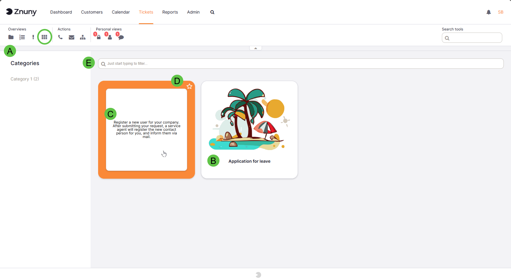

Ticket Process Category Overview
################################

    Process Category Overview

Overview
********

The Ticket Process Category view provides a tile-based gallery of all available ticket processes. It is designed to help agents quickly discover, filter and launch processes that are used to create or categorize tickets. Each tile represents a single process and can contain an image, the process name and a short description.

Key features
************

- Browse and filter process categories to show only tickets assigned to a selected process.
- Visual tiles with optional images and descriptions for fast recognition.
- Favorite processes for quick access.
- Search bar for instant filtering of displayed processes.
- Left-hand categories list that displays available process category groups and counts.

Using the view
**************

A. Selecting a category
=======================

Sidebar categories
~~~~~~~~~~~~~~~~~~

- The left sidebar lists category groups and the number of processes in each group.
- Clicking a group limits the displayed tiles to that group, and the count updates as filters are applied.

- Click a tile to open the selected process and view tickets related to it.
- Selecting a category name in the left sidebar filters the gallery to only processes within that category.

B. Tile components
==================

Each tile typically contains:

- Process image (optional) — a visual representation of the process.
- Process name — displayed beneath the image.
- Description — shown on mouseover or when the card flips to the reverse side.
- Favorite star — toggle to add or remove the process from your favorites.
- Status badges (optional) — e.g., counts or indicators such as "active" or "deprecated".

C. Mouseover and card flip
==========================

Hovering the pointer over a tile will flip the tile (or reveal a tooltip) to show the process description and quick actions (if available).

D. Favorites and personal view
==============================

- Mark a process as a favorite using the star on the top-right of the tile.

- Favorite processes are available in your personal favorite category,

.. note:: 
    
    If no process is marked as a favorite, then the favorite category is not shown.

E. Filtering and searching
==========================

- Use the search bar at the top to quickly find processes; typing filters the tiles in real time.

Related documentation
*********************

- :ref:`pagenavigation admin_processmanagement_categories` - Managing Process Ticket Categories in the Admin Interface