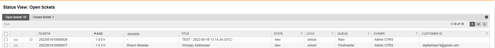

.. meta::
   :description: Browse Znuny tickets grouped by open or closed state — see the last 10,000 tickets across queues you have read access to and drill into any individual ticket.
   :keywords: znuny status view, view by status, open tickets, closed tickets, ticket state, status overview

View by Status
##############
.. _PageNavigation agentinterface_overviews_agentticketstatusview:

Select *Status View* from the *Ticket* navigation menu, use the :fa:`list-ol` toolbar icon if configured.

.. note::

    All ticket are shown for queues with read permissions. Only the last 10_000 are shown. This is a hard limit.

Filter all tickets in the system:

Open
    List of open tickets
Closed
    List of closed

