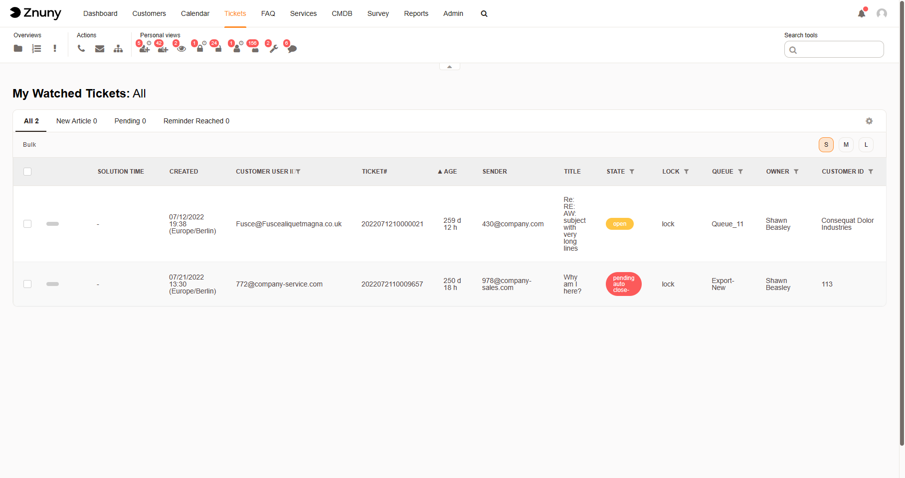

View Watched Tickets
####################
.. _PageNavigation agentinterface_overviews_agentticketwatchview:

Access this view by clicking on the :fa:`eye` in the navigation toolbar.

See ::ref:`Locked View <PageNavigation agentinterface_overviews_agentticketlockview>` for filter details.

Read access is granted to the user on all tickets in this list, regardless of their queue. This option is often used to override queue permissions and give users access to individual tickets of a queue.
