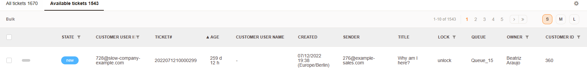
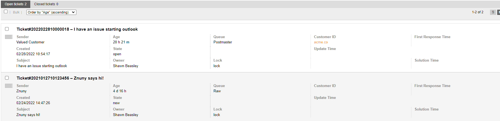
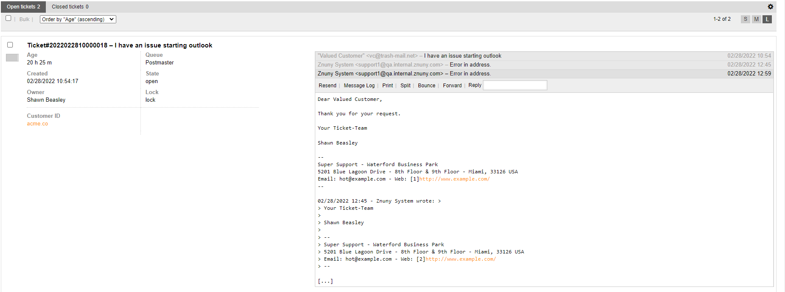
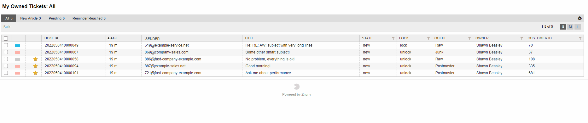

Overviews
#########

Summary
*******

There are overview screens for different objects. Each screen uses a pre-set filter and user-defined filters to aid agents in organizing their day.

Common Overview Settings
************************

Viewing mode
============

Each overview is configurable per user. The viewing mode setting is independent for each of the overviews.

The viewing modes are:

Small
    A table representation of the filtered tickets in which each column contains a piece of ticket data.

Medium
    Medium increases the row height and stacks the rows of information. In this view, you cannot reconfigure the information to be shown.

Large
    Large adds a plain text accordion-style view of the last five articles of the ticket. You may quickly respond to the ticket in this way.

Column Settings
===============

Using the :fa:`cog` at the upper right of any view screen will allow you to set tickets per page and select from available columns to be shown, or reorder columns.

All Overviews
*************

.. toctree::
   :maxdepth: 1

   agentticketqueue/index
   agentticketservice/index
   agentticketlockedview/index
   agentticketresponsibleview/index
   agentticketwatchview/index
   agentticketstatusview/index
   agentticketescalationview/index
   agentticketbulk/index
   agentticketsearch/index
   agentticketmention/index
