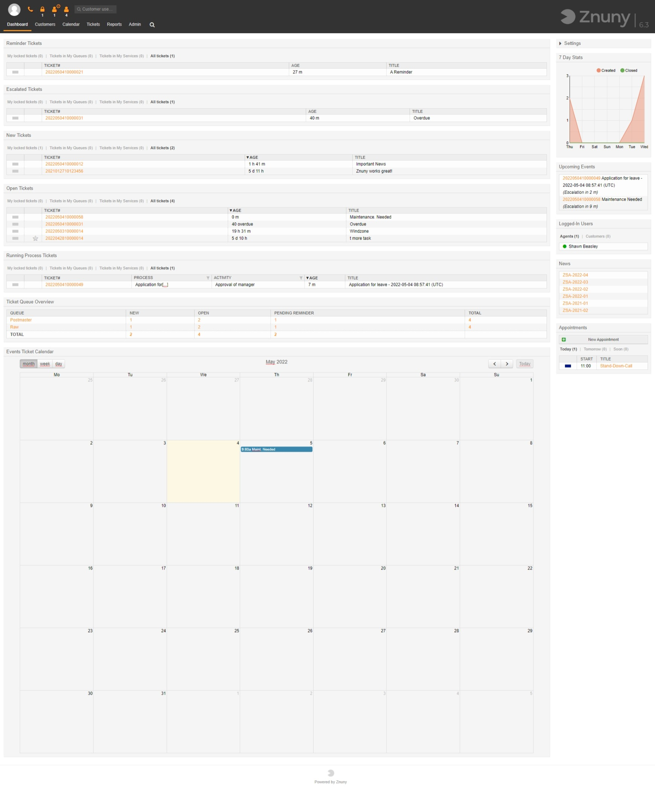
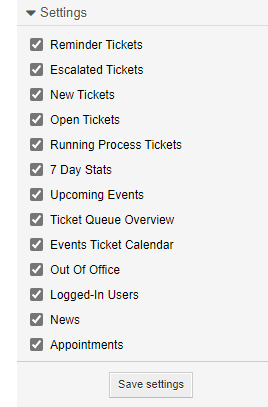

Overviews
#########

Summary
*******

There are overview screens for different objects. Each screen uses a pre-set filter and user-defined filters to aid agents in organizing their day.

Agent Dashboard
***************

The first view an agent has is the dashboard. On the dashboard, there are widgets which can be configured individually for each user.

Widgets can be rearranged by dragging and dropping using the widget title. There are large (left) and small (right) widgets.

.. note::

    Widgets may only be moved top to bottom, not left to right.

Widget Settings
===============

A :fa:`cog` and :fa:`times` appears at the top right-hand side of each widget. The :fa:`times` removes the widget, and the :fa:`gear` takes you to the settings page. Settings are different per module.

You may see some or all of the default modules as configured. Here is a list of the default widgets available and their purpose.

Widgets can be activated or deactivated by opening the settings on the top right-hand side of the screen.

Widget filters
==============

Each widget has filters to help reduce the content to a relevant scope.

My locked tickets
    Tickets I've locked to my user
My responsible tickets
    Tickets for which I'm responsible
Tickets in My Queues
    Tickets in my selected queues
Tickets in My Services
    Tickets in my selected services
All tickets
    All tickets that match the filter criteria

Large Dashboard Widgets
=======================

Reminder Tickets
    A list of tickets that have reached their reminder time
Escalated Tickets
    Tickets with a breached SLA
Open Tickets
    Tickets that are in an open state
New Tickets
    New tickets which have no agent interaction
Running Process Tickets
    Process tickets active in the system.
Ticket Queue Overview
    A count of all tickets and their states in the system
Events Ticket Calendar
    A small calendar showing tickets having a start and end date for an event

Small Dashboard Widgets
=======================

7-Day Stats
    A line chart showing the tickets created and closed per day for the last 7 days
Upcoming Events
    A list of tickets reaching their reminder time or breaching their SLA soon
Logged-In agents
    A list of agents and their session status (active/inactive)
News
    An RSS feed
Appointments
    Shows upcoming events and allows for creating an event from the dashboard

Common Overview Settings
************************

Viewing mode
============

Each overview is configurable per user. The viewing mode setting is independent for each of the overviews.

The viewing modes are:

Small
    A table representation of the filtered tickets in which each column contains a piece of ticket data.

.. image:: images/viewing_mode_small.png
    :alt: View Mode Small Image

Medium
    Medium increases the row height and stacks the rows of information. In this view, you cannot reconfigure the information to be shown.

.. image:: images/viewing_mode_medium.png
    :alt: View Mode Medium Image

Large
    Large adds a plain text accordion-style view of the last five articles of the ticket. You may quickly respond to the ticket in this way.

.. image:: images/viewing_mode_large.png
    :alt: View Mode Large Image

Column Settings
===============

Using the :fa:`cog` at the upper right of any view screen will allow you to set tickets per page and select from available columns to be shown, or reorder columns.

.. image:: images/view_settings.gif
    :alt: Animated Settings Image

All Overviews
*************

.. toctree::
   :maxdepth: 1

   agentticketqueue/index
   agentticketservice/index
   agentticketlockedview/index
   agentticketresponsibleview/index
   agentticketwatchview/index
   agentticketstatusview/index
   agentticketescalationview/index
   agentticketbulk/index
   agentticketsearch/index
