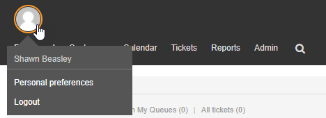

Personal Settings
#################
.. _PageNavigation agentinterface_personalsettings_index:

There are some settings every user can and should make. This page discusses them.

Click on the personal image to access the personal settings menu.

.. note::

    Here is also where you logout.

Settings Groups
***************

There are three groups of settings to choose from.

User Profile :fa:`user`

Change Avatar
    Here you see your Gravatar image and instructions on how to change it.
Change Password
    Here you can change your password if a database source is used.
Change Time Zone
    Here you set your timezone to show offsets from the system time.
Out of Office
    Here you set your next active out of office period.

Notification Settings :fa:`envelope`

My Queue
    Select which queues you will work in.
My Services
    Select which services you will work on.
Ticket Notifications
    Select which ticket notification and method you want to receive.
Appointment Notifications
    Select which calendar notification and method you want to receive.

Miscellaneous Settings :fa:`cog`

Skin
    Which css design will you use.
Overview Refresh Time
    How often should your overview refresh.
Screen After New Ticket
    Your next screen after you submit a new ticket.

.. seealso::

    Look at the full description of :ref:`Last Views <PageNavigation agentinterface_lastviews_index>`

Last view - limit
    How many last views would you like in your list.
Last view - position
    Where will you show the list?
Last view - types
    Which type of views should show in the history.