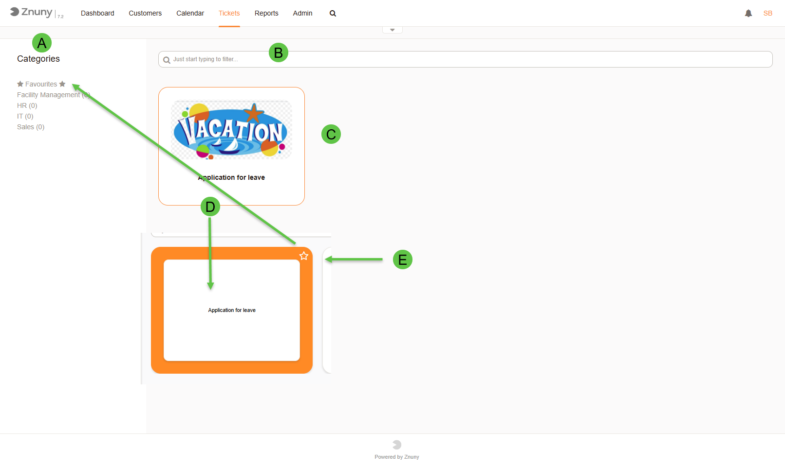
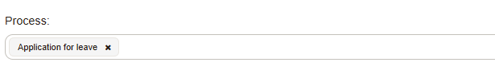

Browse Processes
################
)
If activated, the process categories feature provides a category-based browsing function, making it easier for users to find and select the appropriate process.
This feature is particularly useful in environments with a large number of processes, as it helps streamline the user experience.

   Process Categories

The following functions are available in the overview of process ticket categories:

a. Navigate the categories manually, to filter processes by specific categories.
#. Filter processes across all categories, or in the selected category.
#. Available processes showing either the name of the process, or the name and icon (when configured).
#. On hover, the process description is shown.
#. Mark this process as a favorite, to quickly access it later.

When selecting a process, the process start activity dialog will be opened. Afterwards, the process selected can be manually changed by selecting a different process from the dropdown list of available processes.

   Process List Selection

   