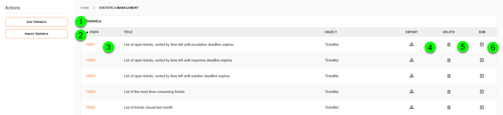
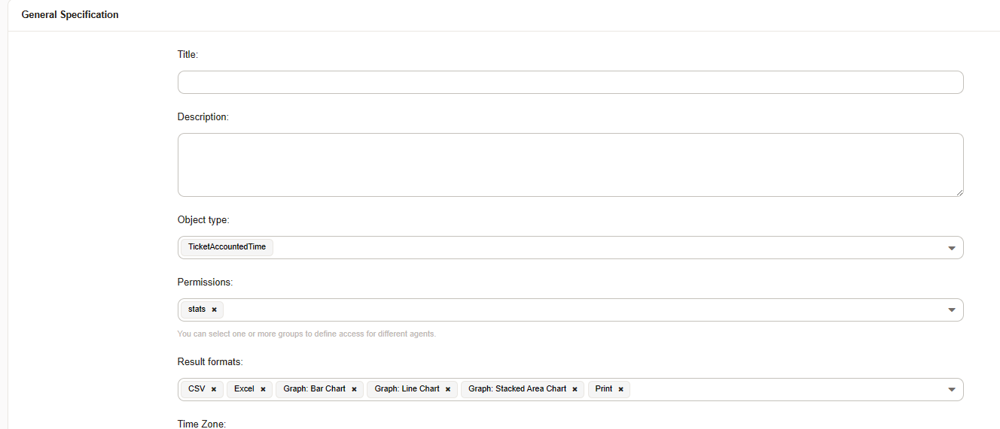
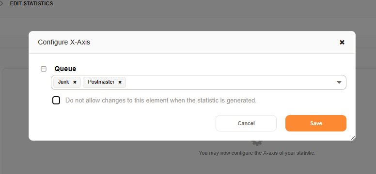
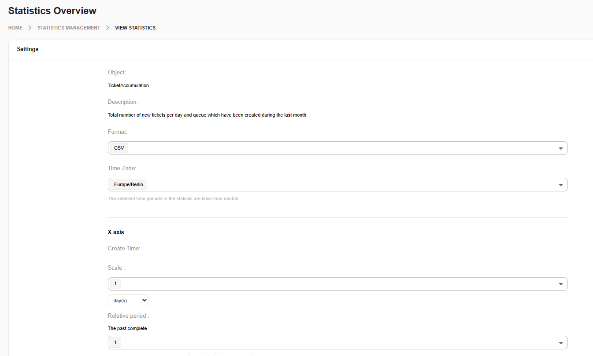

Working with Statistics
#######################

Using the statistics module, it is possible to get reports about different metrics within the system. These reports could be a dynamic matrix, resembling a pivot chart or table, or they can be a list of objects. Additionally, statistics can have designed and implemented, one such is included with the FAQ add-on. These are Perl modules that have a specific use and are not configurable. Depending on which modules or add-ons you have within your system, additional statistics may be available for selection when creating a new statistic.

.. _PageNavigaton agentinterface_statistics_overview:

Statistic Overview
******************

   Statistic Overview

There are many statistics which are preloaded within your system. By navigating to agent statistics using the reports' menu in the navigation area, you will see.a list of these predefined stats and be able to create statistics of your own.

1. Add
2. Import
3. Edit
4. Export
5. Delete
6. Run

.. important:: 
  
  When importing and exporting statistics, IDs are used for entities. Make sure, that you change these in the YAML file, when importing into another system.

Statistic Type
**************

.. figure:: images/stats_agent_types.png

   Type Chooser

Dynamic matrix
  This report returns a bar, line, or pie chart. Also, you can get a CSV, or Excel file. It is possible to configure X and the Y axis, and filters, based on ticket data. These can also be selected for use as dashboard elements.
Dynamic list
  The list returns tickets which meet, filter requirements. On the Y axis, you can set order and sort options. On the X axis, you can choose which attributes are returned.
Static
  Nonconfigurable stats programmed in Pstats_agent_overviewrl can only be used once per time in your system

Module Types
============

For each specific statistic type, you may select from one or more modules. Each module has a specific set of data it returns and calculations that it's using. Depending on the module you have chosen, you may have more or less data included in your report and calculate. Calculations which you can use things like escalation reporting.

+----------------+-------------------------------+----------------------------------------------------------------+
| Statistic Type | Module Name                   | Description                                                    |
+================+===============================+================================================================+
| Matrix         | Ticket Accounted Time         | The values show the total accounted time for matching tickets. |
+----------------+-------------------------------+----------------------------------------------------------------+
| Matrix         | Ticket Accumulation           | The values show the total count of tiets matching tickets.     |
+----------------+-------------------------------+----------------------------------------------------------------+
| Matrix         | Ticket Solution Response Time | The values show the average response time of matching tickets. |
+----------------+-------------------------------+----------------------------------------------------------------+
| List           | Ticket List                   | The list returns tickets and thier data.                       |
+----------------+-------------------------------+----------------------------------------------------------------+

.. note:: 

  For more information about reselts generated by the DynamicList, see :ref:`pagenavigation annex_stat_values` .

Statistic Configuration
***********************

General information
===================

   Edit General Informatoin

General information about the statistic must be added when creating or edtitng statistic.

Title 
  What's the name of the report.
Description 
  Give more details about the report for an explanation about what the report should return.
Object type:
  The object type allows you to choose which module should be used by the statistics to do the calculation and return the values. This can only be modified during statistic creation and cannot be edited.
Permissions 
  Set the groups who will be able to view and/or edit this report.
Results format 
  Choose the available result formats for the statistic module.
Time zone
  Select the time zone for the report.
Create summation row
  Add a summation row.
Create summation column 
  Add a summation column.
Cache results
  Cache the results.
Show as dashboard widget 
  Should the report be available as a dashboard widget? (only charts can be  used)
Validity
  Is the report valid for use?

Configure Axis and Filters
==========================

Configuration is first available after saving the general information. After this, you cannot change the *Object type* anymore. After saving, you can then configure the X and Y axis, and any filters.

.. note:: 
  
  In the Dynamic Ticket List, the Y axis controls order and sorting.

  .. figure:: images/stats_agent_sorting_order.png
  
     Sorting for Lists

<<<<<<< HEAD
When you configure your X and Y axis or filters, you can choose to allow for changes at runtime, or not. If you do allow changes, only the values selected during stat creation will be available. To make all values available, leave the attribute list empty.
=======
When you configure your X and Y axis or fiters, you can choose to allow for changes at runtime, or not. If you do allow changes, only the values selected during stat creation will be available. To make all values available, leave the attribute list empty.
>>>>>>> znuny

   Axis Configuration

.. note:: 

 The shown results in the preview are a dummy dataset and have no relevance to the results you get running the stat.

  .. figure:: images/stats_agent_preview.png
 
     Statistics  Preview

Running a Statistic
*******************

Choose the statistic by selecting the statistic number or run in the :ref:`pagenavigaton agentinterface_statistics_overview`. You'll then be offered the chance to change any settings the designer choose for you, or if you have write permissions you'll be able to do a full edit on the statistic.

   Run a Statistic.

.. important:: Editing the statistic will change the statistic for everyone, whereas modification of the available variables are only temporary.
