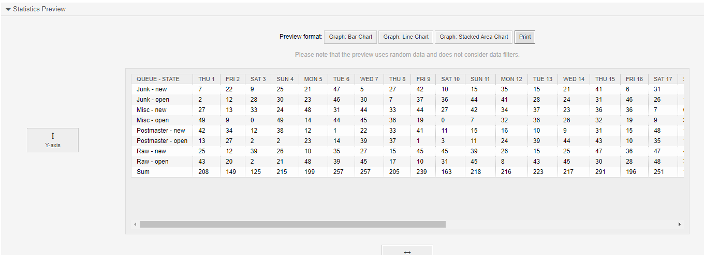
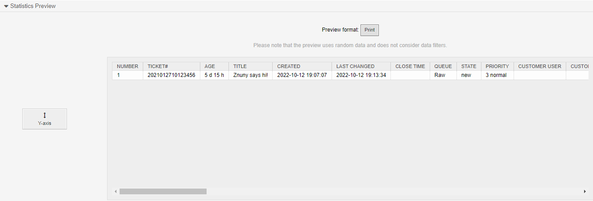

Reporting
#########
.. _PageNavigation agentinterface_statistics_index:

The statistics module can be used to report on the volume and the categorization of tickets within the system.

Types of Statistics
*******************

Static
    These are Perl modules programmed with a single use-case and can only be added once to the system. these are often provided with feature add-ons. They cannot be configured, except at run time.

Dynamic Matrix
    A matrix of values (count of tickets). Each row represents count of tickets, with the successive columns corresponding to the variables and their specific values for that object.

Ticket Lists
    A list of tickets with the desired attributes in CSV or MS Excel format.

Object Types
============

Object types determine the type calculations Y coordinate. Currently this type only differs by the dynamic matrix type of statistic.

The default object types are the following:

TicketAccumulation
    Shows the total count of tickets which meet the criteria.
TicketAccountedTime
    Shows the number of time units added to a ticket in total.shows the number of time units added to a ticket in total.
TicketSolutionResponseTime
    Shows the average response times for tickets within this matrix.

Object Type Keys
~~~~~~~~~~~~~~~~
All ticket data and dynamic fields can be used as the keys X or Y or filter condition. System configuration provides the possible values for each key.

Special Values
^^^^^^^^^^^^^^

For the TicketSolutionResponseTime, the following attributes are available when selecting Evaluation By.

* SolutionAverageAllOver        -   Solution Average
* SolutionMinTimeAllOver        -   Solution Min Time
* SolutionMaxTimeAllOver        -   Solution Max Time
* NumberOfTicketsAllOver        -   Number of Tickets
* SolutionAverage               -   Solution Average (affected by escalation configuration)
* SolutionMinTime               -   Solution Min Time (affected by escalation configuration)
* SolutionMaxTime               -   Solution Max Time (affected by escalation configuration)
* SolutionWorkingTimeAverage    -   Solution Working Time Average (affected by escalation configuration)
* SolutionMinWorkingTime        -   Solution Min Working Time (affected by escalation configuration)
* SolutionMaxWorkingTime        -   Solution Max Working Time (affected by escalation configuration)
* ResponseAverage               -   First Response Average (affected by escalation configuration)
* ResponseMinTime               -   First Response Min Time (affected by escalation configuration)
* ResponseMaxTime               -   First Response Max Time (affected by escalation configuration)
* ResponseWorkingTimeAverage    -   First Response Working Time Average (affected by escalation configuration)
* ResponseMinWorkingTime        -   First Response Min Working Time (affected by escalation configuration)
* ResponseMaxWorkingTime        -   First Response Max Working Time (affected by escalation configuration)
* NumberOfTickets               -   Number of Tickets (affected by escalation configuration)

.. seealso::

    More on :ref:`Escalations <PageNavication generalinformation_ticketescalation_index>`.

For the TicketAccountedTime, the following attributes are available when selecting Evaluation By.

* TotalTime         -   Total Time
* TicketAverage     -   Ticket Average
* TicketMinTime     -   Ticket Min Time
* TicketMaxTime     -   Ticket Max Time
* NumberOfTickets   -   Number of Tickets
* ArticleAverage    -   Article Average
* ArticleMinTime    -   Article Min Time
* ArticleMaxTime    -   Article Max Time
* NumberOfArticles  -   Number of Articles

Creating a Statistic
********************

By creating a new statistic, you will be asked first for the type of statistic and for the general information

Title
    The name for the statistic, as seen in the overview.
Description
    A descriptive text for what the statistic will return.
Object type
    The object type of statistic dictates what calculations will be made for the results.
Permissions
    The group used here defines who can read or edit the statistic.
Results format
    They allowed formats for outputting the statistic. Note that graphs will be useful in a ticket list, and the graph is the only option which can be used by statistics which are to be displayed on the dashboard.
Time zone
    Which time zone should be used if the use of time zone is not set.
Cache
    Cache the Results.
Results as a dashboard widget
    Allow a graph to be displayed in the dashboard and configure by each user individually.
Validity
    The validity of the statistic.

Escalation Breaches
*******************

In statistics, you can report on escalation breeches with two values.

FirstResponseDiffInMin
    Time in minutes between first answer and ticket create time in relation to working hours and first response time.

SolutionDiffInMin
    Time in minutes between first closure and and ticket create time in relation to working hours and first response time.

.. important:: 
    
    The SLA affects this and should be included in your report.

Ticket List Value
*****************

The report returns an integer for each ticket.

Positive numbers indicate the remaining time until escalation, negative numbers indicate the number of minutes above. The numbers can be distorted if an older ticket was merged with a younger one. With an escalation time of 60m' and within working hours, the following examples can be seen:

Ticket A created 08:00 - first response 08:20 (60'-20').
FirstResponseDiffInMin 40 means that the FirstResponse was created 40 minutes before expiration time

Ticket B created 09:00 - first response 09:15
FirstResponseDiffInMin 45 means that the FirstResponse was created 45 min before expiration.

Ticket C created 09:00 - first response 10:15 (60'-75')
FirstResponseDiffInMin is now -15 and means that the FirstResponse was 15 minutes late.

.. note::

    Merging can have side effects.

    If I merge ticket A (younger) into ticket B
    Ticket created 09:00 - first response 08:20 (60'-(-40'))
    FirstResponseDiffInMin B is now 100 and means that ticket B was answered earlier than created.
