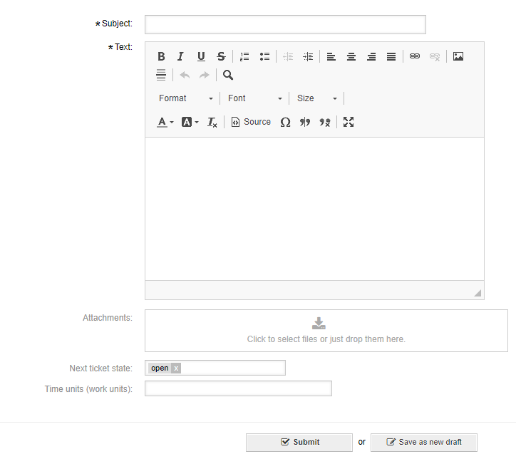
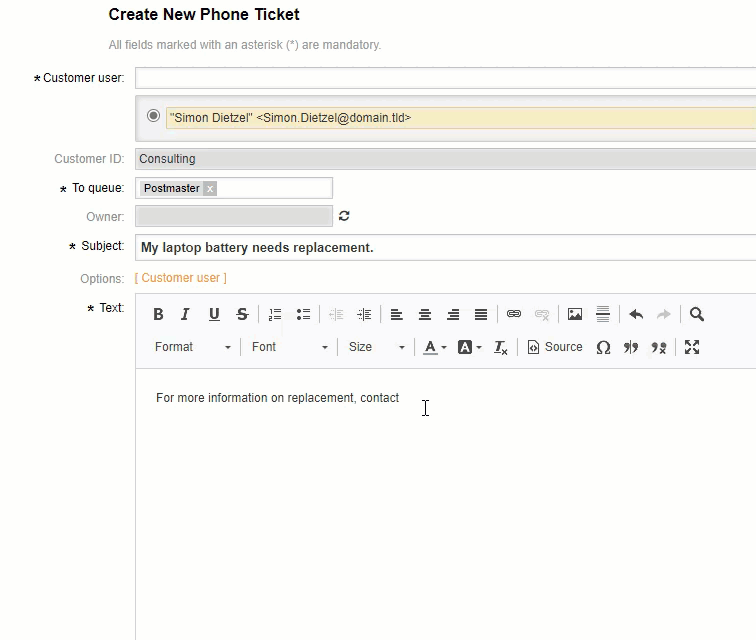
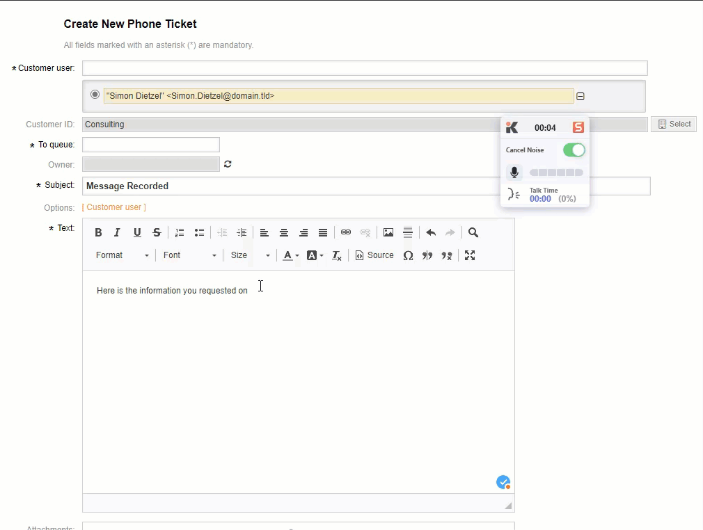
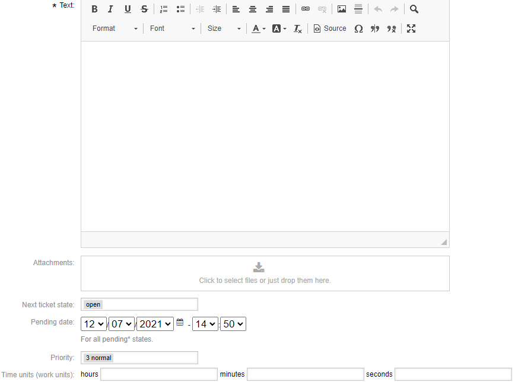
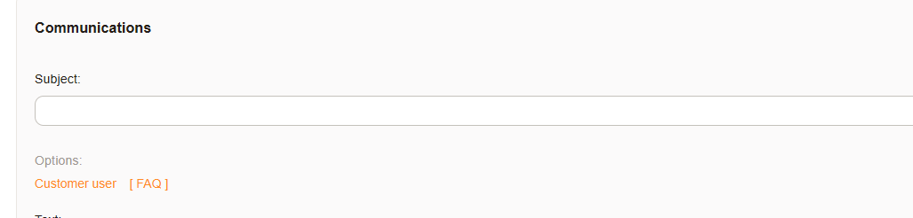

Common Features
###############
.. _PageNavigation ticketviews_agentticketactioncommon:

Article Options
***************

An article may be attached to a ticket. Any time this is an option you must enter a subject and a body. You may add images in-line and other attachments via the upload feature. These may be dragged and dropped or you may select the attachments by browsing (Just click on the attachment icon :fa:`download`.)

Editor Options
==============

Using the CKEditor is mostly self-explanatory. Your administrator can add additional options by activating the *EnhancedMode*. This enables among other options:

* tables
* find and replace
* subscript
* superscript
* paste from word

.. versionadded:: 6.4

    Mentions and Text Snippet.

Mention Someone
~~~~~~~~~~~~~~~
.. _PageNavigation_agentinterface_ticketviews_agentticketactioncommon_mentions:

In the CKEditor, it's now possible to mention a single or group of users. Unlike notifying a user via a note or putting yourself on a watch list, a user or group can be mentioned inline.

A user mention is done by prefixing with a single '@'. A group mention is prefixed by two  '@@'.

**Example: Single User**

Please talk to @sbeasley about this issue.

**Example: User Group**

This is important for the @@developers team.

This will result in the user *sbeasley*, or in the second example all users of the developers group, getting a notification. The user then has read permissions on the ticket, just as with the watcher module. Additionally, any mentioned user will see a mention toolbar icon, and see the tickets in the agent dashboard.

All those receiving a text body with a mention will have a ``mailto:`` link to directly contact the mentioned person via e-mail.

Use a Snippet
~~~~~~~~~~~~~
.. _PageNavigation ticketviews_agentticketactioncommon_snippet:

In order to trigger a text snippet, just prefix your text with `##` and type at least three characters. If a match is found in the text, name, or comment of a configured snippet, you can select if from the list. This applies the snippet in-line. You can add as many snippets as desired. They are also combinable with text templates.

Snippets are available on a queue-by-queue basis. You may therefore not have a snippet available for use.

State Options
*************

State options may be attached to the article, as seen above, or be detached. Available state options can be affected by system configuration options. These include:

* if a state is available
* which state, if any, is preselected

In some cases, the selected state is optional. Removing it keeps the last state unchanged. In cases where the last state is not an available option, set a new state from the available options.

Pending State
=============

If a pending or pending auto type state is selected a date-time selector appears.

Ticket Locking
**************

Communication screens lock the ticket temporarily to a user writing a response to or conducting a phone call with a customer. Canceling the action then returns ownership of the ticket to the original owner, and other users can work on the ticket.

A lock requirement is configurable on all screens. The system configuration option is always. ``Ticket::Frontend::<ScreenName>###RequiredLock`` The screen name can be found in the address bar as the **Action** parameter.

Example:

You would see ``https://znuny.example.com/otrs/index.pl?Action=AgentTicketPriority;TicketID=1`` in the status bar, or by right-clicking the link and copying the URL.

The name of the screen seen in the **Action** parameter is AgentTicketPriority.

If you want to make setting the priority a locking event, then the configuration item would be: ``Ticket::Frontend::AgentTicketPriority###RequiredLock``.

.. note::

    Searching for the **Action** in the system configuration is the quickest way to find available options.

Accounting Time
***************

**Time Accounting**

.. versionadded:: 6.3

It's possible to enter time units in all screens where composing an article. These time units can be a positive or negative number, which will increase or decrease the total time accounted
on the ticket respectively.

Instead of the default text field, you can now select units from a configurable dropdown list of options.
Selectable units are defined system-wide by the system administrator.

This feature can be activated with ``Ticket::Frontend::AccountTimeType`` in the system configuration.

Adding A Customer User At Creation
**********************************

Everywhere you create a ticket it's possible to search for a customer from all data sources. Additionally, if you look at the options link, directly above the editor, you can choose to select a customer user from the database, or add a customer user to a writeable back-end when creating a ticket. When you have added a or selected the customer user, the user will automatically be added to the ticket and the popup will disappear.
