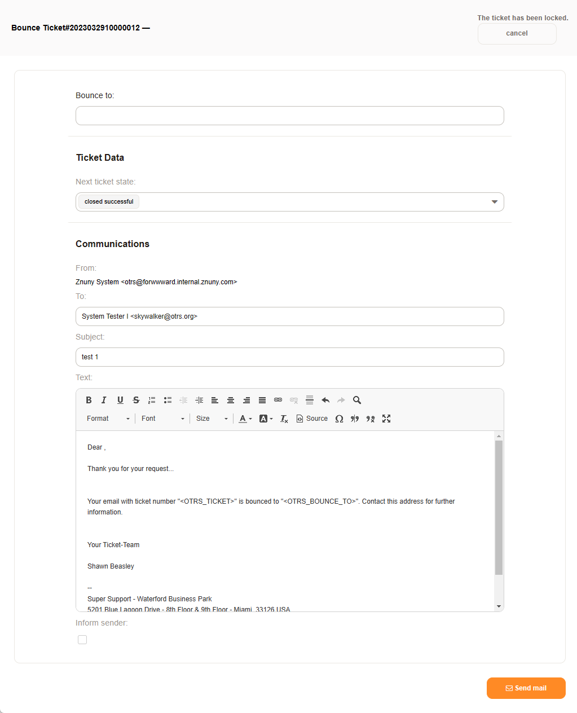

Bounce a Communication
######################
.. _PageNavigation ticketviews_agentticketactionbounce:

When selecting an article of type email, it's possible to redirect (bounce) this message to another mailbox. This action keeps the original sender and offers the possibility to redirect misdirected mail.

Select *Bounce* in the :ref:`article menu <PageNavigation ticketviews_agentticketzoom_articlemenu>` of an email communication.

.. note::

    A bounce is only possible to an external address not configured as a system address. To move communications between teams use the ticket move or article split option.
