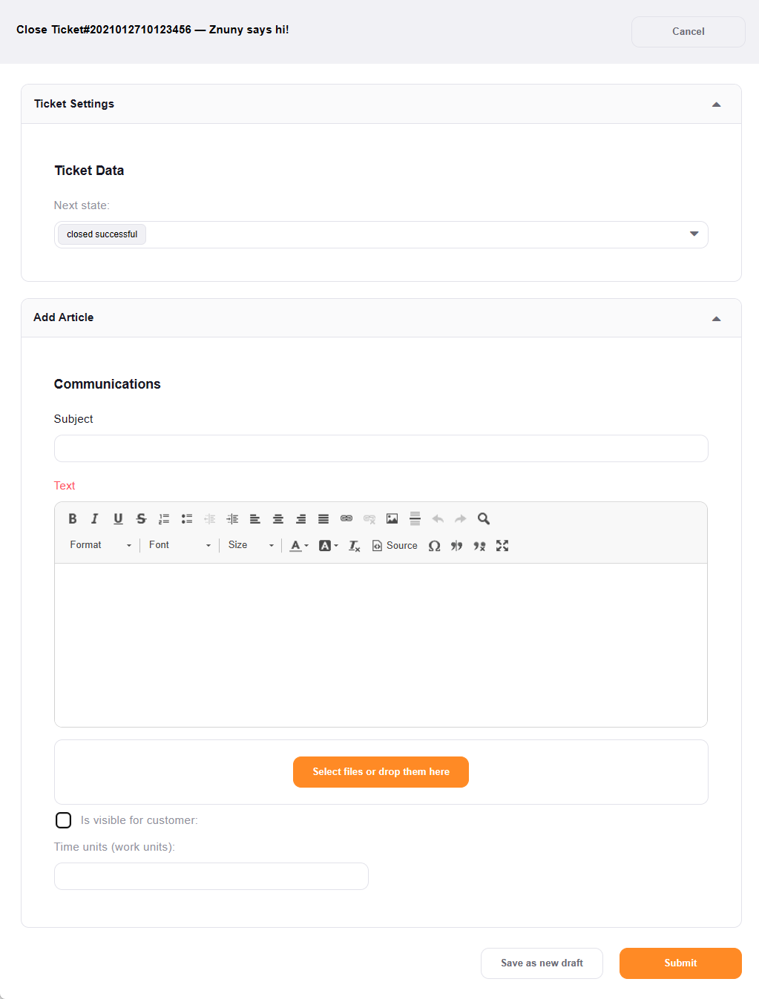

Close a Ticket
##############
.. _PageNavigation ticketviews_agentticketactionclose:

You may use this screen to close a ticket.

Select *Close* in the :ref:`ticket menu <PageNavigation ticketviews_agentticketzoom_ticketmenu>`.

.. note::4

    Only states of type closed are available.
