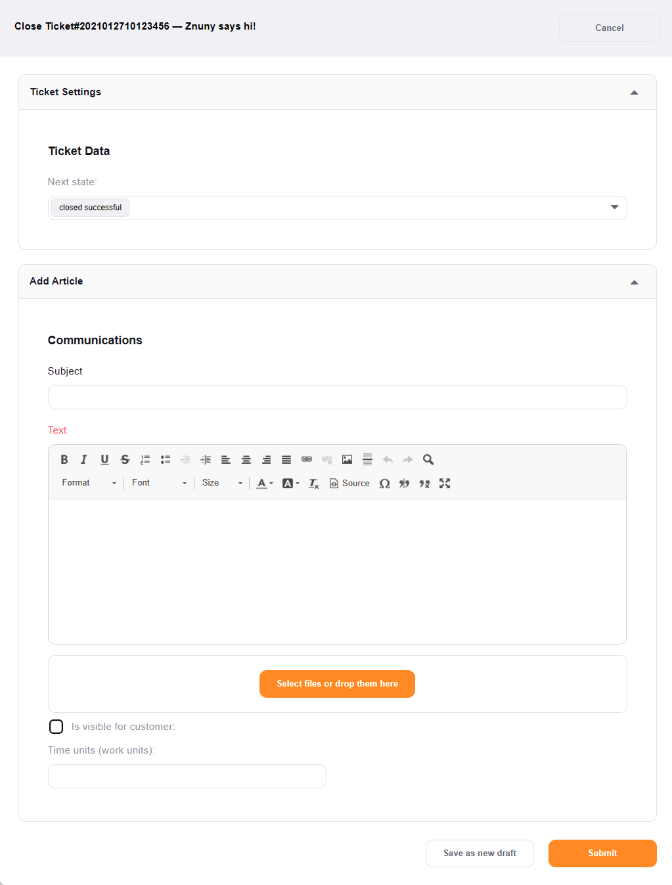

.. meta::
   :description: Close a Znuny ticket from the ticket menu — only states of type closed are offered, with optional note, time accounting and dynamic field updates on submission.
   :keywords: znuny close ticket, ticket close, closed state, close successful, close unsuccessful, ticket resolution

.. _PageNavigation ticketviews_agentticketactionclose:

Close a Ticket
##############

You may use this screen to close a ticket.

Select *Close* in the :ref:`ticket menu <PageNavigation ticketviews_agentticketzoom_ticketmenu>`.

.. note::4

    Only states of type closed are available.
