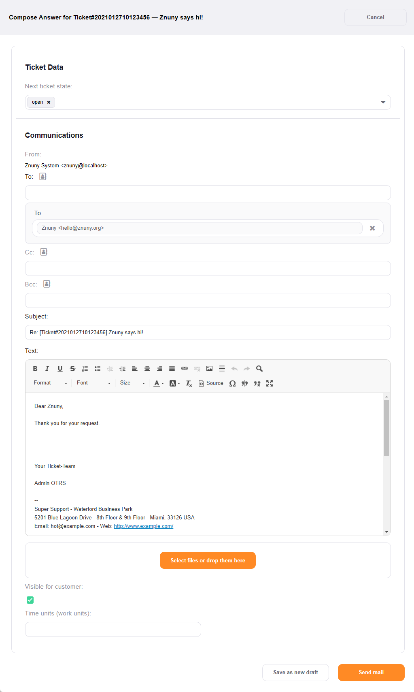
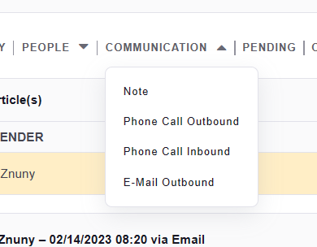

Answering Communications
#########################
.. _PageNavigation ticketviews_agentticketcompose:

Select a response template from the *reply* or *reply all* dropdown menu to respond to an article. This reply function will invoke an email and include template information and quote the conversion from the article being replied used to reply.

Answer Externally
*****************

Select a template from *Reply* or *Reply all* in the :ref:`article menu <PageNavigation ticketviews_agentticketzoom_articlemenu>` of an email communication.

.. note::

    This is the redirect target for :ref:`Resend Message <PageNavigation ticketviews_agentticketmailresend>`

The standard behavior of a reply is to reply to the previous sender.

The "To:" field may, in some cases, not automatically populate. Some examples are there is no MX record for a domain, or a system mail address was the sender.

The "To:" field would be empty in any of the above cases.

Two system configurations are important here:

Ticket::Frontend::ComposeAddCustomerAddress
    This setting is active by default and ensures that the customer user is written to the CC when replying if the article is visible to the customer and the customer user is not in the To field.

Ticket::Frontend::ComposeReplaceSenderAddress
    This setting is inactive by default. It always replaces the "To:" with the current customer user's email address.

.. note::
    These settings are global and only apply to known/set customer users.
    ``Ticket::Frontend::ComposeReplaceSenderAddress`` setting can lead to misdirected communications.

Answer Internally
*****************

Select Choosing *Reply to Note* in the :ref:`article menu <PageNavigation ticketviews_agentticketzoom_articlemenu>` of an internal or external note. This redirects you to the * :ref:`Create a Note <PageNavigation ticketviews_agentticketnote>` screen.

You may also record telephone calls to a ticket. Per default, the *Phone Call Inbound* and *Phone Call Outbound* are under *Communication* in the :ref:`ticket menu <PageNavigation ticketviews_agentticketzoom_ticketmenu>`.

* :ref:`Make a Call <PageNavigation ticketviews_agentticketphoneoutbound>`
* :ref:`Take a Call <PageNavigation ticketviews_agentticketphoneinbound>`
