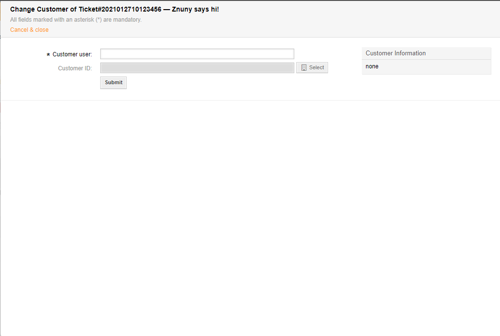

Assign a Customer User
######################
.. _PageNavigation ticketviews_agentticketcustomer:

Use this screen to assign a customer user to a ticket. Select *Customer* under *People* in the :ref:`ticket menu <PageNavigation ticketviews_agentticketzoom_ticketmenu>`.

.. note::

    It's possible to assign the customer independent of the customer user. Consult your system administrator for the configuration of this feature ``Ticket::Frontend::AgentTicketCustomer::CustomerIDReadOnly``.
