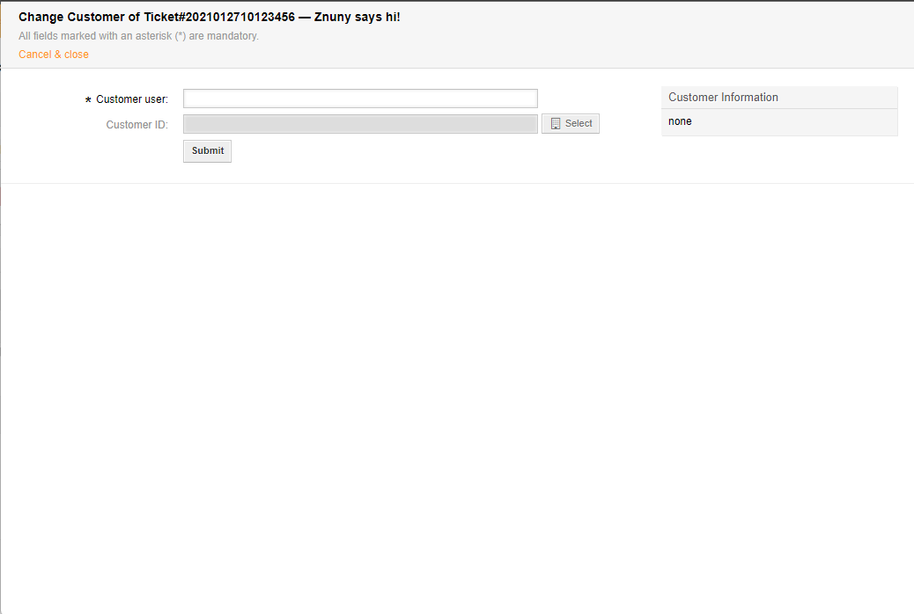

.. meta::
   :description: Assign or change the customer user on a Znuny ticket — optionally keep the CustomerID independent of the customer user through the CustomerIDReadOnly setting.
   :keywords: znuny assign customer, change customer user, ticket customer, customer id, customer assignment, customer user

.. _PageNavigation ticketviews_agentticketcustomer:

Assign a Customer User
######################

Use this screen to assign a customer user to a ticket. Select *Customer* under *People* in the :ref:`ticket menu <PageNavigation ticketviews_agentticketzoom_ticketmenu>`.

.. note::

    It's possible to assign the customer independent of the customer user. Consult your system administrator for the configuration of this feature ``Ticket::Frontend::AgentTicketCustomer::CustomerIDReadOnly``.
