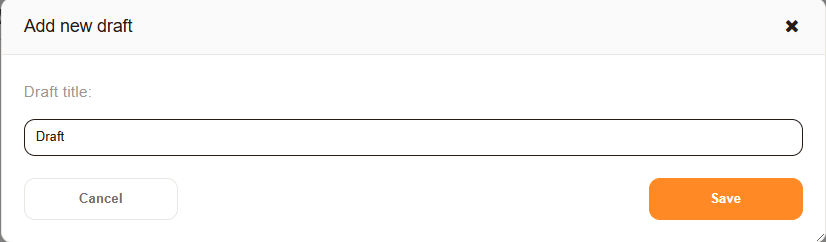

.. _PageNavigation ticketviews_agentticketdraft:

Creating a Draft
################

Performing operations to add information or articles to a ticket opens a pop-up window. When filling out the form, attempting to navigate away from the ticket results in the browser window attempting to close the related pop-up. If opening a new tab is not an option, it is possible to save the information entered into the pop-up as a draft. 

.. figure:: images/save_draft_dialog.png

    Save as a draft

.. note:: 
    This option is not available when creating a new ticket.

To save the form data as a draft, enter a new name for the draft.

   Naming the draft

The name entered creates a named draft, which can be selected when viewing a ticket. Drafts may be selected, or deleted from the ticket detail view.

.. important::

    Each form may only have one draft of the same name. You may use the same name for different forms.

.. figure:: images/drafts_widget.PNG

   Available drafts

The draft created can be applied by any user of the system, based on their permission on the ticket.

.. note:: 
    Applying the draft will may require a lock, meaning you must be the owner, responsible or the ticket must be unlocked.

    .. important:: 
        
        All variables previously filled by any templating tags will not contain the information of the current user, but the information of the user creating the draft.

Drafts can be edited, updated or a new draft can be created upon opening the current draft. 

.. figure:: images/draft_update_new_save.png

   Editing a draft

If any changes have been made to the ticket in the meantime, this will be indicated in the notification area of the draft.

.. figure:: images/draft_warning.png

   Notification warning

.. important:: 
    All drafts have a decay time applied. By default this is seven days and can be modified by the administrator of the system. This decay time, configured with the system setting `FormDraftTTL###Ticket`, is a system wide setting.

   